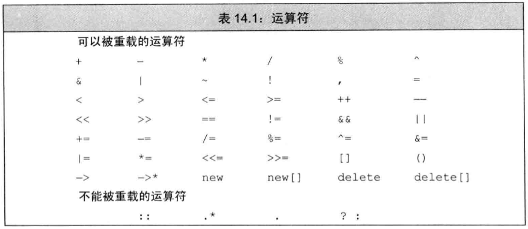

[toc]

# 重载运算与类型转换

<font color='blue'>**为什么要运算符重载？**</font>

通过运算符重载重新定义该运算符的含义，可以使得我们的程序更易于编写和阅读。

<font color='blue'>**重载运算符的参数规定**</font>

* 重载运算符函数的参数数量与该运算符作用的运算数量一样多
* 对于成员函数，重载运算符函数中第一个参数隐式绑定到this指针上，因此此时比运算符的运算数目少一个。
* 对于一个运算符函数来说，至少含有一个类类型的参数。即，无法对内置类型改变运算符的含义。

<font color='blue'>**重载运算符的其他规定**</font>

* 只能重载已有的运算符

* 对于重载的运算符来说，其优先级和结合律与对应的内置运算符保持一致

  

* 逻辑与/或运算符、逗号运算符的运算求值顺序无法保留下来，`&&`和`||`运算符的重载版本也无法保留内置运算符的短路要求，综上，这两个运算符不建议重载。

* 逗号运算符和取地址运算符，已被定义用于类对象时的含义，因此也不能对它们进行重载。

<font color='blue'>**重载运算符的调用**</font>

* 隐式调用`data1+data1;`
* 显式调用`operator+(data1,data2);`
* 显示调用`data1.operator+(data2);`

<font color='blue'>**何时将重载运算符定义为成员函数？**</font>

* `=`、`[]`、`()`和成员访问箭头`->`必须是成员
* 改变对象状态的运算符或者与给定类型密切相关的运算符
* 具有对称性的运算符应当为普通的非成员函数

## 输入输出运算符

注意，输入输出运算符必须是非成员函数，或者友元

### 重载输出运算符`<<`

```C++
// 第一个参数是一个非常量的ostream对象的引用
// 第二个形参一般是一个常量的引用
// 返回函数的ostream的形参
ostream &operator<<(ostream &os, const Sales_data &item)
{
	os << item.isbn() << " " << item.units_sold << " "
        << item.revenue << " " << item.avg_price();
    return os;
}
```

### 重载输入运算符`>>`

```C++
// 第一个参数是一个要读取的流的引用
// 第二个形参一般是一个非常量的引用
// 返回函数的istream的形参
ostream &operator<<(istream &is, Sales_data &item)
{
	double price;
    is >> item.bookNo >> item.units_sold >> price;
    if (is) //检查是否输入成功
        item.revenue = item.units_sold * price;
    else
        item = Sales_data(); // 若输入失败，对象被赋予默认的状态
    return is;
}
```

重载输入运算符时，应当对读取操作发生错误的情况，添加恢复操作。

## 算数和关系运算符

通常情况下，把算数和关系运算符定义成非成员函数以允许对左侧或右侧的运算随想进行转换。因为这些运算符一般不需要改变运算对象的状态，所以形参都是常量的引用。

算数运算符的结构通常会计算它的两个运算对象并得到一个新值，这个值有别于任意一个运算对象，常常位于局部变量之内，操作完成后返回局部变量的副本作为其结果。

如果类定义了算数运算符，一般也会定义一个对应的复合赋值运算符。反过来，如果类同时定义了算数运算符和相关的复合赋值运算符，则通常情况下应该使用复合赋值来实现算数运算符。

```C++
Sales_data
operator+(const Sales_data &lhs, const Sales_data &rhs)
{
	Sales_data sum = lhs; // 把lhs的数据成员拷贝给sum
    sum += rhs; // 将rhs加到sum中
    return sum;
}// 函数返回sum的副本
```

### 相等运算符

```C++
bool operator==(const Sales_data &lhs, const Sales_data &rhs)
{
	return //...
}

bool operator(const Sales_data &lhs, const Sales_data &rhs)
{
    return !(lhs==rhs);
}
```

* 当一个类含有判断两个对象是否相等的操作时，应当添加`==`的重载。
* 如果定义了`==`，应当判断一组给定的对象中是否包含有重复的对象。
* `!=`和`==`只要定义其中一个即可，两者可以相互调用实现功能。

### 关系运算符


## 赋值运算符

赋值运算符都必须是成员函数。

```C++
vector<std::string> v;
v = {"a", "an", "the"};

class StrVec{
public:
    StrVec& operator=(std::initializer_list<std::string>);
    // ...
}

StrVec& StrVec::operator=(std::initializer_list<std::string> il)
{
    // alloc_n_copy 分配内存空间并从给定范围内拷贝元素
	auto data = alloc_n_copy(il.begin(), il.end());
    free();// 销毁对象中的元素并释放内存空间
    elements = data.first;
    first_free = cap = data.second;
    return *this;
}
```

复合赋值运算符通常情况下也应该定义为类的成员

```C++
Sales& Sales_data::operator+=(const Sales_data &rhs)
{
	unit_sold += ths.units_sold;
    revenue += rhs.revenue;
    return *this;
}
```

## 下标运算符

表示容器的类通常可以通过元素在容器中的位置访问元素，这些类一般会定义下标运算符`operator[]`。

**下标运算符必须是成员函数**

```c++
class StrVec{
public:
    std::string& operator[](std::size_t n)
    	{return element[n];}
    const std::string& operator[](std::size_t n) const
    	{return element[n];}
};

// 通过this是否指向常量进行匹配
const StrVec cvec = svec;
if (svec.size() && svec[0].empty()){
    svec[0] = "zero";// 正确，调用第一个版本
    cvec[0] = "zip";// 错误，调用第二个版本
}
```

## 递增和递减运算符

`++`和`--`运算符。

```C++
class StrBlobPtr{
public:
    StrBlobPtr& operator++();//前置运算符
    StrBlobPtr& operator--();//前置运算符
}

StrBlobPtr& StrBlobPtr::operator++()
{
    // 如果curr已经指向了容器的尾后位置，则无法递增它
	check(curr, "increment past end of StrBlobPtr");
    ++curr;
    return *this;
}

StrBlobPtr& StrBlobPtr::operator++()
{
    // 如果curr已经指向了容器的尾后位置，则无法递增它
    --curr;
	check(curr, "decrement past begin of StrBlobPtr");
    return *this;
}
```

如何区分前置后置？

```C++
StrBlobPtr& operator++(int);//后置运算符
StrBlobPtr& operator++();//前置运算符

p++;
p.operator++(0);
++p;
p.operator++();

// 注意返回一份拷贝
StrBlobPtr& StrBlobPtr::operator++(int)//后置运算符
{
    // 无需检查有效性，调用前置递增运算符才需要检查
    StrBlobPtr ret = *this; // 记录当前位置
    ++*this; // 向前移动一个元素，前置需要检查递增的有效性
    return ret; // 返回之前记录的状态
}

StrBlobPtr& StrBlobPtr::operator--(int)//后置运算符
{
    // 无需检查有效性，调用前置递增运算符才需要检查
    StrBlobPtr ret = *this; // 记录当前位置
    --*this; // 向前移动一个元素，前置需要检查递增的有效性
    return ret; // 返回之前记录的状态
}
```

## 成员访问运算符

```C++
class StrBlobPtr{
public:
    std::string& operator*() consts
    {
        auto p = check(curr, "default past end");
        return (*p)[curr];
    }
    
    std::string& operator->() const
    {
        return & this->operator*();
    }
}
```


## 函数调用运算符


## 重载、类型转换与运算符

