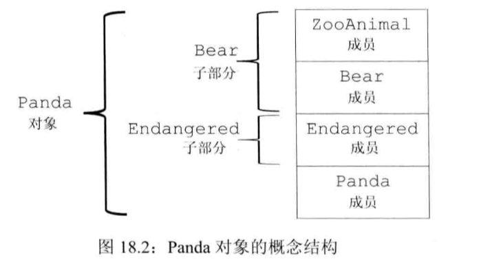
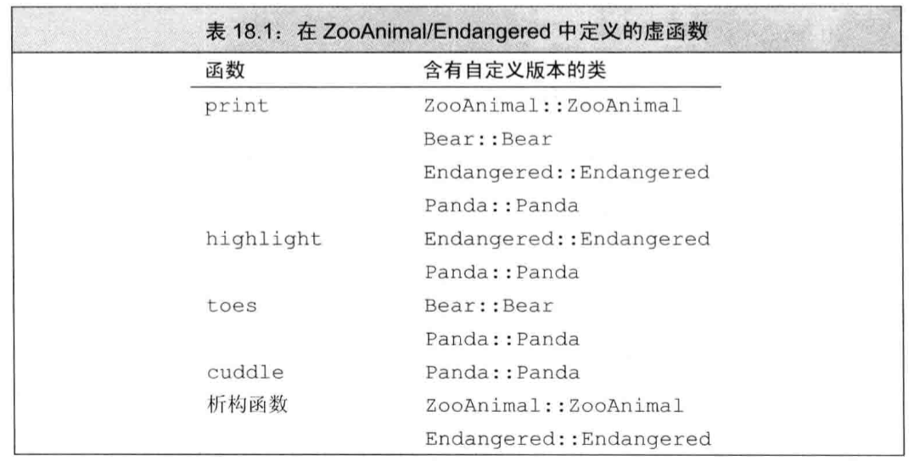
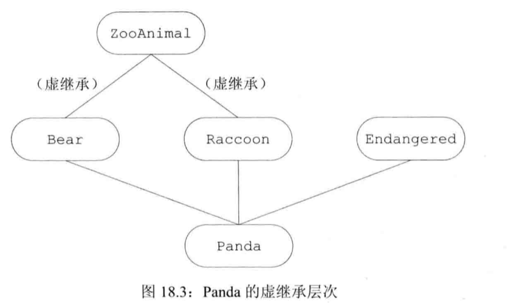

[toc]

# 继承

> [!NOTE]
>
> **三大特性——继承**
>
> * 继承的基本语法
>   * `class 派生类名 : 访问说明符 基类名 { //派生类成员 };`
> * 继承与控制访问
>   * **访问说明符**对派生类访问基类的权限有限制，**派生说明符**则对用户访问基类成员的权限有限制。
>   * 友元和继承，友元关系不能继承。
>   * 使用`using`声明，重新分配可访问性。
>   * `struct`默认`public`继承，`class`默认`private`继承
> * 继承与构造拷贝控制
>   * 派生类对象首先对基类部分进行构造，再构造派生类成员；相反，在析构时，则需先析构派生类成员后再调用基类析构函数析构基类部分。
>   * 构造函数
>   * 拷贝/移动
>   * 析构：析构函数应当定义为虚函数
> * 多重继承：从多个直接基类中产生派生类的能力，派生类继承了所有父类的属性。
> * 虚继承：解决共享基类问题<font color='red'>还没看完</font>

## 继承的基本概念

继承的基本语法如下：

```C++
class 派生类名 : 访问说明符 基类名 {
    // 派生类成员
};
// public：公有继承
// protected：保护继承
// private：私有继承（默认）
```

## 继承与构造拷贝控制

与普通的类一样，位于继承体系中的类也要对创建、拷贝、移动、赋值和析构操作进行定义。

一个派生类对象的构造首先需要对自己基类部分的成员进行构造，再构造自己的派生类成员；相反，在析构时则需析构派生类自己的成员后再调用基类析构函数析构基类部分。

### 构造函数

**每一个类控制它自己的成员初始化过程。**

* 派生类对象在通过构造函数初始化自己的同时，应当**首先**对基类对象进行初始化。
* 派生类**不继承**基类的构造函数，但仍然可用基类的构造函数来初始化基类部分。
* 若**未指定**基类的构造函数，则编译器会**调用**基类的**默认构造**构造函数。
* 如果基类没有默认构造函数，则必须在派生类的构造函数初始化列表中**显式调用**基类的一个构造函数。

```C++
Derived_Class : public Base_Class {
public:
    // ...
    Derived_Class(const std::string & a, double b, int d) :
    Base_Class(a, b), mem1(d): 
private:
    int mem1;
}
// 基类的构造函数负责初始基类部分的成员
// 派生类的构造函数负责初始化派生类的成员
```

**继承的构造函数**

在C++11中，派生类可以重用其直接基类的构造函数。这意味着派生类可以自动获得与基类构造函数参数列表相同的构造函数，而不需要手动编写它们。

通过使用`using`声明，指明要继承的直接基类的构造函数。

每一个类只直接继承其直接基类的构造函数，类**不能继承默认、拷贝和移动构造函数**。如果派生类没有直接定义这些构造函数，则编译器将为派生类合成它们。

```C++
class Base {
public:
    Base(int x) : x_(x) {}
    Base(int x, double y) : x_(x), y_(y) {}
private:
    int x_;
    double y_;
};

class Derived : public Base {
public:
    using Base::Base; // 继承Base的构造函数
private:
    std::string z_; // 这个成员会被默认初始化（即空字符串）
};

Derived d1(10);      // 调用继承的Base(int)，d1的z_是空字符串
Derived d2(10, 3.14); // 调用继承的Base(int, double)，d2的z_是空字符串
```

### 拷贝构造函数/赋值运算符

合成的拷贝操作与继承

* 继承关系中的类对象在使用合成的

基类删除的拷贝控制会对派生类产生链式影响

* 如果基类中的默认构造函数、拷贝构造函数、拷贝赋值运算符或析构函数是被删除的或不可访问，则派生类中对应的成员也将是删除的。
* 如果基类中的析构函数是被删除的或不可访问，则派生类中合成的默认和拷贝构造函数也将是被删除的。
* 如果基类的移动操作被删除，则派生类中的移动操作也将被删除
* 如果基类的析构函数是被删除的或不可访问，则派生类中移动构造函数也将是被删除的。

若想显式拷贝或移动基类部分，则必须在派生类的构造函数列表中显式调用

* 默认下，基类默认构造函数初始化派生类对象的基类部分
* 若想拷贝基类部分，必须在派生类的构造函数初始值列表中显式的使用基类的拷贝构造函数

### 移动构造函数/赋值运算符

- 类似拷贝操作，派生类的移动操作必须显式调用基类的移动操作来移动基类部分。如果不调用，则基类部分将使用拷贝操作（如果移动操作不可用，则使用拷贝操作）。

### 析构函数

基类通常应该定义一个**虚析构函数**：

* 将析构函数指定为虚函数后，基类指针可以根据其动态类型，选择对应继承关系上的类的析构函数，从而防止内存的泄漏。
* 派生类的析构函数会自动调用基类的析构函数。

```C++
class Base {
public:
    virtual ~Base() = default; // 动态绑定析构函数
    // 当我们通过一个基类指针调用一个派生类对象时，会调用该对象的析构函数
    // 如果不将析构函数指定为虚构函数，则会调用基类的析构函数
    // 从而导致派生类的成员没有没删除，导致内存泄漏
private:
    //...
}

class Derive : public Base {
public:
    ~Derive();
private:
}
```

在构造函数和析构函数中调用虚函数时有如下注意事项：

* **构造期间**：对象被视为当前正在构造的类类型
* **析构期间**：对象被视为当前正在析构的类类型
* **虚函数调用**：在构造/析构函数中被**静态绑定**到当前类
* **安全原则**：避免在构造/析构函数中调用可能被派生类重写的虚函数

## 继承与控制访问

### 回顾：`protected`仅对派生类开放

一个类使用protected关键字来说明那些它希望与派生类共享，但是不想被其他公共访问使用的成员。

* 和私有成员类似，受保护的成员对于**类的用户**来说是不可访问的。
* 和公有成员类似，受保护的成员对于**派生类的成员和友元**来说是可访问的。
* 但是，派生类的成员或友元**只能通过派生类对象访问基类**的受保护权限。

```C++
class Base {
protected:
    int prot_mem;
};
class Sneaky : public Base {
    friend void clobber(Sneaky&); //能访问Sneaky::prot_mem
    friend void clobber(Base&); // 不能访问Base::prot_mem
    int j; // 默认是private
}
```

### 继承方式：派生说明符限制用户权限

**访问说明符**对派生类访问基类的权限有限制，**派生说明符**则对用户访问基类成员的权限有限制。

* 派生访问说明符对派生类成员及其友元能否访问其直接基类的成员没有什么影响，对基类成员的访问权限只与基类中的访问说明符有关。

```C++
class Base {
public:
    void pub_mem();
protected:
    int prot_mem;
private:
    char priv_mem; 
}
struct Pub_Derv : public Base{
    int f() {return prot_mem; }// 正确
    char g() { return priv_mem; }// 错误
}
struct Priv_Derv : private Base{
    int f1() const {return prot_mem; }// 正确
}

Pub_Derv d1;
Priv_Derv d2;
d1.pub_mem();// 正确
d2.pub_mem();// 错误

struct Derived_from_Private : private Priv_Derv{
    int use_base() const { return prot_mem; }
    // 错误，prot_mem在Priv_Derv中式private
    // 到Derived_from_Private中已经成为不可用的了
}
```

不同派生类继承的方式对用户的权限如下：

| 继承方式    | 基类 `public` 成员 | 基类 `protected` 成员 | 基类 `private` 成员 |
| ----------- | ------------------ | --------------------- | ------------------- |
| `public`    | `public`           | `protected`           | 不可访问            |
| `protected` | `protected`        | `protected`           | 不可访问            |
| `private`   | `private`          | `private`             | 不可访问            |

### 继承和友元：友元关系不能继承

友元关系不能继承。

```C++
class Base{
    friend class Pal;
};

class Pal {
public:
    int f(Base b) { return b.prot_mem}; //正确
    int f2(Sneaky s) { return s.j;}; //错误
    int f3(Sneaky s) {return s.prot_mem}; //正确prot_mem是基类成员
    // 基类的访问权限由基类本身控制，即使对派生类的基类部分也是如此
};

class D2 : public Pal {
public:
    int mem(Base b) { return b.prot_mem; }
    // 错误，友元关系不能继承
};
```

### 可访问性的改变：`using`声明

使用`using`声明，我们可以将该类的直接或间接基类中的任何可访问成员标记出来，重新分配可访问性。注意，派生类只能为那些它可以访问的名字提供`using`声明。

```C++
class Base {
public:
    std::size_t size() const {return n;}
protected:
    std::size_t n;
};

class Derived : private Base {
public:
    using Base::size;
protected:
    using Base::n;
}
```

### 默认的继承保护级别

```C++
class Base { /*...*/};
struct D1 : Base {}; // 默认public继承
class D2 : Base {}; // 默认private继承
```

## 继承与类作用域

### 基本概念

每个类定义自己的作用域，在这个作用域内我们定义类的成员。当存在继承关系时，派生类的作用域嵌套在其基类的作用域之内。

其将在编译时进行名字查找，一个对象、引用或指针的静态类型决定了该对象的哪些成员是可见的。

```C++
Derived2 d;// Derived2是Derived1的派生类，Derived1是Base的派生类
std::cout << d.fun1();
// 首先，在Derived2内查找fun1()
// 如果没有找到fun1()，接下来在Derived1内查找
// 如果仍然没有找到fun1()，接下来在Base内查找
```

### 同名成员

派生类的成员将隐藏同名的基类成员

```C++
struct Base {
    Base() : mem(0) {}
protected:
    int mem;
};

struct Derived : Base {
    Derived(int i) : mem(i) {}
    int get_mem() {return mem;}
protected:
    int mem;
};

Derived d(42);
cout << d.get_mem() << endl;
// 打印42
```

通过作用域运算符来使用隐藏的成员

```C++
struct Derived : Base{
    int get_base_mem() {return Base::mem;}
};
```

### 同名方法

如果派生类的成员方法和基类的某个成员方法同名，则派生类将在其作用域内隐藏该基类成员。即使派生类成员和基类成员的形参列表不一致。

可以通过作用域运算符来使用隐藏的成员方法。

```C++
struct Base {
    int memfcn();
};
struct Derived : Base {
    int memfcn(int);
};
Derived d; Base b;
b.memfcn();// 调用Base::memfcn()
d.memfcn();// 调用Derived::memfcn()
d.memfcn();// 错误，调用Derived::memfcn()，但是其需要一个int
d.Base::memfcn();// 正确，显式调用Base::memfcn()
```

### 作用域与虚函数

从上述总结可以看出，在没有虚函数提出之前，派生类将对同名的基类方法进行隐藏，除非显式调用，不然将无法调用基类方法。

```C++
class Base {
public:
    virtual int fcn();
};

class D1 : public Base {
public:
    int fcn(int);
    virtual void f2();
}

class D2 : public D1 {
public:
    int fcn(int);// 隐藏了D1的fcn(int)
    int fcn();// 覆盖了Base的虚函数fcn()
    void f2();// 覆盖了D1的虚函数f2()
}

Base bobj; D1 d1objl; D2 d2obj;

Base *bp1 = &bobj, *bp2 = &d1obj, *bp3 = &d2obj;
bp1->fcn(); //调用Base::fcn()
bp2->fcn(); //调用Base::fcn()
bp3->fcn(); //调用D2::fcn()

D1 *d1p = &d1obj; D2 *d2p = &d2obj;
bp2->f2(); // 错误，静态类型为Base,而Base中没有f2
d1p->f2(); // 调用D1::f2()
d2p->f2(); // 调用D2::f2()
```

### 函数的覆盖重载

* **重载（Overloading）**：在同一个作用域内，函数名相同但参数列表不同的函数称为重载函数。
* **覆盖（Overriding）**：派生类中重新定义基类中的虚函数，函数名、参数列表和返回类型都必须相同（协变返回类型除外）。

派生类可以覆盖基类重载函数中的0个，1个或多个。但是，如果派生类希望基类的所有重载版本在派生类中都是可见的（即可以通过派生类对象调用），那么派生类必须覆盖所有的重载版本，或者一个也不覆盖。

* 因为如果派生类只覆盖了基类重载函数中的一部分，那么没有覆盖的那些重载版本会被派生类中的覆盖版本“隐藏”（hide）。也就是说，一旦派生类提供了基类重载函数中某一个版本的覆盖，那么基类中所有同名的重载函数在派生类作用域中都将被隐藏，除非派生类显式地使它们可见。

```C++
class Base {
public:
    virtual void func(int) { /* ... */ }
    virtual void func(double) { /* ... */ }
    virtual void func(const char*) { /* ... */ }
};

class Derived : public Base {
public:
    // 只覆盖了一个版本
    void func(int) override { /* ... */ }
};

int main() {
    Derived d;
    d.func(10);      // 正确，调用Derived::func(int)
    d.func(3.14);    // 错误，Base::func(double)被隐藏了
    d.func("hello"); // 错误，Base::func(const char*)被隐藏了
}
```

使用`using`声明将基类的重载函数引入派生类作用域，然后选择性地覆盖，如下：

```C++
class Derived : public Base {
public:
    using Base::func; // 将Base中所有func的重载版本引入Derived作用域
    void func(int) override { /* ... */ } // 只覆盖int版本，其他版本通过using可见
};

int main() {
    Derived d;
    d.func(10);      // 正确，调用Derived::func(int)
    d.func(3.14);    // 正确，调用Base::func(double)
    d.func("hello"); // 正确，调用Base::func(const char*)
}
```

## 多重继承

### 多重继承概念

多重继承指从多个直接基类中产生派生类的能力。多重继承的派生类继承了所有父类的属性。

```C++
class Bear : public ZooAnimal {/*...*/}
class Panda : public Bear, public Endangered {/*...*/}
```

* 每个基类可以带一个访问说明符（`public`，`protected`,`private`）
* 若基类没有带访问说明符，struct默认为public，class默认为private
* C++引入final作为类修饰词，被final修饰的类不能被派生
* 多重继承的派生类列表只能包含已经定义过的类，且不能是final的类
* 在同一个派生类的继承列表中，同一个基类只能出现一次，不能重复继承

### 多重继承与构造函数

- 允许从一个或多个基类继承构造函数，可以直接使用基类的构造函数，减少重复代码。
- 限制：如果多个基类中存在签名完全相同的构造函数（比如参数列表完全一样），派生类不能直接继承这些同名同参数的构造函数，否则会产生编译错误。
- 解决方法是：派生类必须自己显式定义一个对应的构造函数版本，并在其初始化列表中分别调用各基类对应的构造函数。

```C++
struct Base1 {
    Base1() = default;
    Base1(const std::string&);
    Base1(std::shared_ptr<int>);
};

struct Base2 {
    Base2() = default;
    Base2(const std::string&);
    Base2(int);
};

// 错误：D1试图从两个基类中都继承D1::D1(const string&)
struct D1:public Base1, public Base2 {
    using Base1::Base1;
    using Base2::Base2;
}
```

改正如下：

```C++
struct D2:public Base1, public Base2 {
    using Base1::Base1;
    using Base2::Base2;
    // 必须自定义个接受string的构造函数
    D2(const string& s) : Base1(s),Base(s) {}
    D2() = default;
}
```

### 多重继承与析构函数

析构函数的调用顺序正好与构造函数相反，先最底层的派生类开始，逐次向基类析构。

### 多重继承与拷贝与移动操作

1. **基本原则**
   多重继承的派生类如果定义了自己版本的拷贝构造函数、移动构造函数或赋值运算符，在对完整的派生类对象进行拷贝/移动/赋值操作时，必须**显式**执行派生类和所有基类的对应操作。
2. **合成版本的特殊性**
   只有当派生类的拷贝、移动或赋值成员是**编译器合成（自动生成）的版本**时，才会自动调用每个基类的对应操作。
3. **操作顺序示例**
   假设 `Panda` 类继承了 `Bear`、`Endangered`、`ZooAnimal` 等多个基类，拷贝构造 `Panda ling_ling = ying_yang;` 的过程是：
   * 先调用 `Bear` 的拷贝构造，
   * 再调用 `ZooAnimal` 的拷贝构造，
   * 接着调用 `Endangered` 的拷贝构造，
   * 最后调用 `Panda` 自身的拷贝构造。
4. **赋值运算符类似**
   合成的拷贝赋值运算符会依次给各基类部分赋值，然后给派生类的成员赋值。移动操作的机制与拷贝操作类似。

```C++
struct ZooAnimal {
    ZooAnimal(const ZooAnimal&) { /*...*/ }
};

struct Endangered : public ZooAnimal {
    Endangered(const Endangered&) { /*...*/ }
};
struct Bear : public Endangered {
    Bear(const Bear&) { /*...*/ }
};
struct Panda : public Bear {
    Panda(const Panda& other) : Bear(other) { /*...*/ }
};

Panda ying_yang("ying_yang");
Panda ling_ling = ying_yang;  // 触发拷贝构造过程
```

### 多重继承与类型转换

可以令某个可访问基类的指针或引用指向一个派生类对象。编译器不会再派生类向基类的几种转换中进行比较和选择，因为在它看来转换到任意一种基类都一样好。

使用某一基类的指针或引用访问对象时，只能访问该基类（及其基类）定义的成员，派生类或其它基类中特有的成员不可见。

```C++
Bear* pb = new Panda("ying_yang");
pb->print();    // 正确，Panda::print()
pb->cuddle();   // 错误，cuddle() 不属于 Bear
pb->highlight(); // 错误，highlight() 不属于 Bear
delete pb;      // 正确，调用正确析构顺序

Endangered* pe = new Panda("ying_yang");
pe->print();    // 正确，Panda::print()
pe->toes();     // 错误，toes() 不属于 Endangered
pe->cuddle();   // 错误，cuddle() 不属于 Endangered
pe->highlight(); // 正确，Panda::highlight()
delete pe;      // 正确，调用正确析构顺序
```





### 多重继承下的类作用域

多重继承时名字查找过程

* 查找在所有直接基类中并行进行。
* 如果多个基类都有同名成员，则在派生类中使用该名时产生**二义性**，必须进行限定。
* 在访问该成员时，指明使用哪一个基类的版本。

```C++
struct ZooAnimal {
    double max_weight() const { return 100.0; }
};
struct Endangered {
    double max_weight() const { return 80.0; }
};

struct Panda : public ZooAnimal, public Endangered {
    // 如果不重定义 max_weight，这里会二义性
    double max_weight() const {
        // 显式限定调用基类版本，解决二义性
        return ZooAnimal::max_weight();
    }
};

Panda p;
double w = p.max_weight();      // 调用 Panda::max_weight，解决二义性
double w1 = p.ZooAnimal::max_weight();   // 显式调用基类 ZooAnimal
double w2 = p.Endangered::max_weight();  // 显式调用基类 Endangered
}
```

## 虚继承



### 虚继承概念

虚继承的目的是令某个类做出声明，承诺愿意共享他的基类。其中，共享的基类子对象称为虚基类。在这种机制下，无论虚基类在继承体系中出现多少次，在派生类中都只包含唯一一个共享的虚基类子对象。

```C++
class Raccoon : public virtual ZooAnimal {/*...*/};
class Bear : virtual public ZooAnimal {/*...*/};
```

上述代码将`ZooAnimal`定义为`Raccoon`和`Bear`的虚基类。

由于每一个共享的虚基类只有唯一一个共享的子对象，所以该基类的成员可以被直接访问，并且不会产生二义性。

### 虚继承与构造函数

* 虚基类（virtual base class）只能由继承体系中**最底层的派生类**的构造函数负责初始化。

```C++
Panda::Panda(std::string name, bool onExhibit)
    : ZooAnimal(name, onExhibit, "Panda"),
	Bear(name, onExhibit),
	Raccoon(name, onExhibit),
	Endangered(Endangered::critical),
	flag(false) {}
```

构造顺序有所区别：

* 首先构造最底层派生类对象
* 接下来按照直接基类在派生列表中出现的次序一次对其进行初始化

若未显式地初始化虚基类，则虚基类的默认构造韩素华将被调用。

### 虚继承与析构函数

* 一个类可以有多个虚基类，此时，这些虚的子对象按照它们在派生列表中出现的顺序从左向右依次构造。

```C++
class Character{}
class BookCharacter : public Character {};
class ToyAnimal {};
class TeddyBear : public BookCharacter,
				public Bear, public Virtual ToyAnimal {};
```

编译器按照直接基类的声明顺序对其一次进行检查，以确定其中是否含有虚基类。如果有，则先构造虚基类，然后按照声明的顺序逐一构造其他非虚基类：

```C++
ZooAnimal();
ToyAnimal();
Character();
BookCharacter();
Bear();
TeddyBear();
```

析构的顺序与构造顺序相反。
