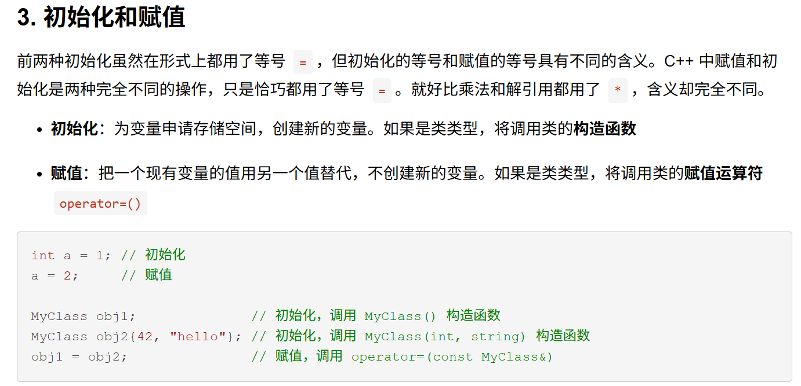

[toc]

## 智能指针

> [!NOTE]
>
> C++11的新标准库提供两种智能指针(smart pointer)模板来管理动态内存。
>
> * `shared_ptr`允许**多个指针**指向同一个对象；
> * `unique_ptr`则独占所指向的对象；
> * `weak_ptr`为一种弱引用，指向`shared_ptr`所管理的对象。

### `shared_ptr`类

#### `shared_ptr`创建与初始化

```c++
shared_ptr<string> p1; // 指向string
shared_ptr<list<int>> p2; // 指向int的list
```

默认初始化的智能指针中保存着一个空指针。

最安全的分配和使用动态内存的方法是调用一个名为make_shared的标准库函数。此函数在动态内存中分配一个对象并初始化它，返回指向此对象的`shared_ptr`，与智能指针一样，`make_shared`也定义在头文件`memory`中。

```C++
shared_ptr<int> p3 = make_shared<int>(42);
shared_ptr<string> p4 = make_shared<string>(10, '9');
shared_ptr<int> p5 = make_shared<int>();
```

注意`make_shared`传递的参数是用来构造给定类型的对象的，也就是说传递的参数必须与对应类型对象的某个构造函数相匹配。如果不传递任何参数，对象就会进行值初始化。

也可以用auto类型推理来定义一个对象

```c++
auto p6 = make_shared<vector<string>>();
```

<font color='red' >这边需要回过头再学习一下 </font>



#### `shared_ptr`拷贝和赋值

当进行拷贝或赋值操作时，每个`shared_ptr`都会记录有多少个其他`shared_ptr`指向相同的对象：

```C++
auto p = make_shared<int>(42); // p指向的对象只有p一个引用值
auto q(p); // 将p的值赋给q，此时p和q指向相同对象，此对象有两个引用值
```

可以认为每个`shared_ptr`都有一个关联的计数器，通常称其为引用计数(reference count)。

* 计数器递增。拷贝，用于初始化其他变量，作为参数传递，作为函数值返回。

* 计数器递减。被赋予新值，被销毁（局部的`shared_ptr`离开作用域）

一旦，一个`shared_ptr`的计数器变为0，它就会自动释放自己所管理的对象。

#### `shared_ptr`自动销毁所管理的对象

当指向一个对象的最后一个`shared_ptr`被销毁时，`shared_ptr`类会自动销毁此对象。它是通过另一个特殊的成员函数——析构函数完成销毁工作的。

`shared_ptr`的析构函数会递减它所指向的对象的引用计数。如果引用计数变为0，`shared_ptr`的析构函数就会销毁对象，并释放它占用的内存。

#### `shared_ptr`自动释放相关联的内存

```C++
void use_factory(T arg)
{
    shared_ptr<Foo> p = factory(arg);
    return p; // 当我们返回p时，引用计数进行了递增操作
} // p离开了作用域，但它指向的内存不会被释放掉
```

通过智能指针`shared_ptr`分配动态内存完成。动态内存可以允许程序员自主决定对象的消亡的条件。对于`shared_ptr`只有当其指向对象的引用计数变为0时，所指向的对象才会被销毁。因此动态内存可以使得在多个对象之间共享数据，而智能指针`shared_ptr`只是实现动态内存分配的一种更加智能的手段。

**`shared_ptr`和`new`结合使用**

接受指针参数的智能指针构造函数是`explicit`的，因此，我们不能将一个内置指针隐式转换为一个智能指针，必须使用初始化形式来初始化一个智能指针：

```C++
shared_ptr<int> p1 = new int(1024);
shared_ptr<int> p2(new int(1024));
```

**不要混合使用`shared_ptr`和`new`**

### `unique_ptr`类

- 相比于 `shared_ptr`（需要引用计数等），`unique_ptr` 实现简单，开销极小。
- 适用于不需要共享所有权的场景，提升效率。

**是智能指针的一种，独占所有权，任何时刻只能由一个 `unique_ptr` 拥有资源**

**不允许拷贝构造和拷贝赋值，只支持移动构造和移动赋值**

**在析构时自动释放所管理的对象**

**支持自定义删除器**

### `weak_ptr`类

是一种**弱引用智能指针**，与 `std::shared_ptr` 配合使用。

**不拥有资源**，不会影响资源的生命周期（不会增加引用计数）。

用于监控由 `shared_ptr` 管理的对象状态，但不控制其释放。

主要用于解决 `shared_ptr` 导致的循环引用问题，避免内存泄漏。