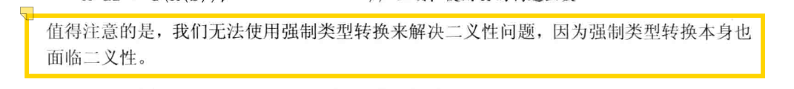

[toc]

# 类型转换

> [!NOTE]
>
> 类型转换：2025/10/13
>
> * 隐式转换：
>   * 算数转换：尽可能保持数据的精度
>   * 数组转指针、转布尔、转常量......
> * 显示转换
>   * 命名的强制类型转换：`cast-name<type>(expression)`
>     * `static_cast`：值类型的转换。
>     * `const_cast`：常量/非常量的转换。
>     * `reinterpret_cast`：在较低层次上的重新解释。
>     * `dynamic_cast`：运行时进行检查，**需要进一步学习**。
>   * C风格强制类型转换：与命名的强制类型转换相比，意思表达不明确，容易造成编程错误
>
> * 类类型的转换的实现
>   * 转换构造函数：
>     * 通过构造函数实现。
>     * `explicit`禁止隐式转换，防止无意中的类型转换。
>     * 类类型的转换只能进行一次，但是内置类的转换可以进行多次。
>   * 类型转换运算符：
>     * 一个类型转换函数必须**是类的成员函数**；它**不能声明返回类型**，**形参列表**也必须为空。类型转换函数**通常为`const`**。
>     * `explicit`禁止隐式转换，防止无意中的类型转换。
>     * 与构造函数产生二义性问题，通过显式调用可以解决，但无法通过强制类型转换解决。

## <font color='ADFF2F'>隐式类型转换</font>

### <font color='90EE90'> 隐式类型转换的含义</font>

无需程序员介入，编译器自行决定的转换。

### <font color='90EE90'> 隐式类型转换的场景？</font>

当在程序的某处我们使用了一种类型而其实对象应该取另一种类型时，程序会自动进行类型转换：

* 在大多数表达式中的整型提升
* 在条件表达式中，非布尔值转换成布尔类型
* 在初始化过程中，初始值转换成变量的类型
* 在赋值语句中，右侧运算对象转换成左侧运算对象的类型
* 在算术运算或关系运算中的，算术转换
* 在函数调用时

**整型提升**

整型提升负责把小整数类型转换成较大的整数类型。对于`bool`、`char`、`signed char`、`unsigned char`、`short`和`unsigned short`等类型来说，只要它所有可能的值都存在`int`里，它们就会提升成int类型；否则，提升成`unsigned int`类型。

**算术转换**

算术转换指把一种算数类型转换成另一种算数类型，目的是让不同类型的数值能够在一起进行算术运算。其中运算符的运算对象将转换成最宽的类型。

> [!NOTE]
>
> **"最宽的类型"** 指的是在数值表示能力和精度上**更强大、范围更大**的数据类型。

算术运算符不接受小于`int`类型的变量，所以会存在以下操作：

* 先进行整型提升
* 整型提升后，类型一致，进行运算
* 整型提升后，类型不一致
  * 符号性相同：同为有符号或无符号的，向高精度转换
  * 符号性不同：为一个有符号和一个无符号的
    * 若无符号的大于等于带符号的，则转换为无符号
    * 若无符号的小于带符号的，则依赖于机器
  * 进行运算

```C++
// 一份算术转换的例子：
bool      flag;        char           cval; 
short     sval;        unsignedshort  usval;
int       ival;        unsigned int   uival;
long      lval;        unsigned long  ulval;
float     fval;        double         dval;

3.14159L + 'a';          // 'a'提升成int，然后该int值转换成 long double
dval + ival;             // ival 转换成 double
dval + fval;             // fval 转换成 double
ival = dval;             // dval 转换成（切除小数部分后）int
flag = dval;             // 如果 dval 是 0，则 flag 是 false，否则 flag 是 true
cval + fval;             // cval 提升成 int，然后该 int值转换成 float
sval + cval;             // sval 和 cval 都提升成 int
cval + lval;             // cval 转换成 long
ival + ulval;            // ival 转换成 unsigned long
usval + ival;            // 根据 unsigned short 和 int 所占空间的大小进行提升
uival + lval;            // 根据 unsigned int 和 long 所占空间的大小进行转换
```

**数组转换成指针**

大多数用到数组的表达式中，数组自动转化成指向数组首元素的指针：

```C++
int ia[10];
int* ip = ia;
// ia转换成指向数组首元素的指针
```

**转换成常量**

允许将指向非常量的类型的指针转换成指向相应的常量类型的指针。

```C++
int i;
const int &j = i;
const int *p = &i;
int &r = j, *q = p;//错误，常量不可以转换成非常量
```

**类类型定义的转换**

一次只能执行一次类类型转化能。

## <font color='ADFF2F'>显式类型转换</font>

显示地将对象强制转换成另一种类型。一个C++风格的**命名的强制类型转换**具有如下形式：

```C++
cast-name<type>(expression):
```

其中：

* `type`：是转换的目标类型，如果type是引用类型，则结果是左值。
* `expression`：是要转换的值。

### <font color='90EE90'> `static_cast<type>(expression)`</font>

任何具有明确意义的类型转换，只要不包含底层const，都可以使用`static_cast`进行类型转换。

```C++
void *p = &d;
// 任何非常量对象的地址都能存入void*类型的指针中
double *dp = static_cast<double*>(p);
// 必须保证&d是一个double类型的地址
// 也就是确保转换后所得的类型就是指针所指的类型
// 一旦类型不符，将产生未定义的后果
```

### <font color='90EE90'> `const_cast<type>(expression)`</font>

只能改变运算对象的底层`const`属性。

```C++
const char *pc;
char *p = const_cast<char*>(pc);
// 正确，但是通过p写值是未定义的行为
// 对已经是常量的对象，再执行const_cast操作时未定义的后果
```

```C++
const char* cp;
char *q = static_cast<char*>(cp);
// 错误，不能去掉const性质
static_cast<string>(cp);// 正确
const_cast<string>(cp);// 错误
```

### <font color='90EE90'> `reinterpret_cast<type>(expression)`</font>

为运算对象的位模式提供较低层次上的重新解释。

```C++
int *ip;
char *pc = reinterpret_cast<char*>(ip);

string str(pc);
// 上述代码可能导致异常行为，因为pc指针实际存放的是指向char的指针
// 故上述操作将一个int值用于初始化str，可能导致异常
```

### <font color='90EE90'> `dynamic_cast<type>(expression)`</font>

`dynamic_cast`在运行时进行检查，并且支持向下转换（将基类指针/引用转换为派生类指针/引用）使用形式如下：

* `dynamic_cast<type*>(e)`，`e`必须是一个有效的指针
* `dynamic_cast<type&>(e)`，`e`必须是一个左值
* `dynamic_cast<type&&>(e)`，`e`必须不能是左值

`dynamic_cast`的使用条件如下：

* `type`必须是一个类类型，并且该类型应当含有虚函数
* 满足`e`的类型是目标`type`的公有基类，或`e`的类型就是目标`type`的类型

如果转换目标是指针类型，且转换失败，则结构为0；如果转换目标是引用类型，且转换失败，则将抛出一个`bad_cast`异常。

```C++
if (Derived *dp = dynamic_cast<Derived*>(bp))
	{ /*使用dp指向的Derived对象*/} 
else 
	{/*使用bp指向的Derived对象*/}

void f(const Base &b)
{
    try {const Derived &d = dynamic_cast<const Derived&>(b);}
    catch (bad_cast) {}
}
```

###  <font color='90EE90'> C风格的强制类型转换</font>

与命名的强制类型转换相比，旧式的强制类型转换从表现形式上来说不那么清晰明了，容易被漏看。

```C++
// type (expr); 函数形式的强制类型转换
// (type) expr; C语言风格的强制类型转换

char *pc = (char*) ip;// ip是指向整数的指针
```

如果将旧式的表达用`const_cast`和`static_cast`表示也合法，则与它们就有相同的意义。否则将执行`reinterpret_cast`类似的功能。

## <font color='ADFF2F'>类类型的转换</font>

### <font color='90EE90'>他类向本类的转换：单实参构造函数</font>

通过只接受一个实参的构造函数实现类类型的隐式转换机制。

```c++
string null_book = "9-999-99999-9";
item.combine(null_book);
```

### <font color='90EE90'>本类向他类的转换：类型转换运算符</font>

类型转换运算符是类的一种特殊成员函数，可以实现用户定义的类型转换，它负责将一个类类型的值转换成其他类型，形式如下：

```c++
operator class_name() const;
```

* 一个类型转换函数必须**是类的成员函数**
* 它**不能声明返回类型**，**形参列表**也必须为空
* 类型转换函数**通常为`const`**

```c++
class SmallInt{
public:
	SmallInt(int i = 0) : val(i){
		//...控制i在0-255之间，不然则报错
	};
	// 构造函数将定义了从int到本类的转换
	operator int() const {return val;}
	// 类型转换运算符定义了从本类到int的转换
private:
	std::size_t val;
};


```

上述`SmallInt`类既定义了向类类型的转换，也定义了从类类型向其他类型的转换。

### <font color='90EE90'>单步类类型转换：内置类型可多步</font>

注意是类类型转换，内置的类型转换可以进行多步。

```c++
item.combine("9-999-99999-9");
// 错误
item.combine(string("9-999-99999-9"));
// 正确
item.combine(Sales_data("9-999-99999-9"));
// 正确
```

### <font color='90EE90'>抑制类的隐式转换：关键字`explicit`</font>

**可以通过将构造函数声明为`explicit`阻止通过单参数构造函数的隐式转换。**

```c++
class Sales_data{
public:
	Sales_data() = default;
	Sales_data(const std::string &s, unsigned n, double p):
				bookNo(s), units_sold(n), revenue(p*n) {};
	explicit Sales_data(const std::string &s): bookNo(s) {};
	explicit Sales_data(std::istream&);
}
//...
string null_book = "9-999-99999-9";
item.combine(null_book);
// 错误，使用string进行类对象的构造是explicit的
item.combine(Sales_data(null_book));
// 正确，使用构造函数创建一个Sales_data临时对象
item.combine(cin);
// 错误，使用istream进行类对象的构造是explicit的
item.combine(static_cast<Sales_data>(cin));
// 正确，通过static_cast执行显示的而非隐式的转换
```

注意：

* 关键字`explicit`只对一个实参的构造函数有效。需要多个实参的构造函数不能用于隐式转换，所以无需将这些构造函数指定为`explicit`。
* 同时，`explicit`关键字只需要在类内声明时使用即可，在类外定义时不需要添加。

```c++
int i = 42;
cin << i;
// 这一段中由于istream本身并没有定义<<，
// 但是编译器会使用istream的bool类型转换运算符将cin转换成bool，
// 而这个bool值会紧接着被提升成int，
// 并用作内置的左移运算符的左侧运算对象，
// 这样一来提升后的bool值会被左移42个单位
```

**通过`explicit`关键字，可以实现显示的类型转换运算符。**

```c++
class SmallInt {
public:
	explicit operator int() const{ return val;}
}
SmallInt si = 3;
// 正确，调用构造函数，而构造函数不是显式的
si+3;
// 错误，需要显示调用
static_cast<int>(si)+3;
// 正确，显示调用
```

但是该规定存在一个例外，如果表示式被用作条件，则编译器将会将显式的强制类型转换自动作用于它。

* `if`,`while`,`do`语句的条件部分
* `for`语句头的条件表达式
* 逻辑非运算符、逻辑或运算符、逻辑与运算符的运算对象
* 条件运算符

### <font color='90EE90'>避免具有二义性的类型转换</font>

如果类中包含一个或多个类型的转换，则必须确保在类类型和目标类型之间只存在唯一一种转换方式，否则编写的代码将很可能具有二义性。

```c++
struct B;
struct A {
	A() = default;
	A(const B&);
};
struct B {
	operator A() const;
};

A f(const A&);//函数声明，接受一个A，输出一个A
B b;
A a = f(b);
// 二义性：含义是f(B::operator A())
// 还是f(A::A(const B&))?
```

如上，同时存在两种由B获得A的方法，所以对f的调用产生二义性。

```c++
struct A {
	A(int = 0);
	A(double);
	operator int() const;
	operator double() const;
}

void f2(long double);
A a;
f2(a);
// 二义性错误，f(A::operator int()) or f(A::operator doube*())

long lg;
A a2(lg);
// 二义性错误，A::A(int) or A::A(double)
```

如上，由于编译器对内置类型之间的相互转换没有限制，因此当转换目标为内置类型的多重类型转换出现时，就有可能产生二义性。

**根本原因：转换的内置类型转换级别一致。**



```c++
// 例1：重载函数与转换构造函数
struct C {
	C(int);
};
struct D {
	D(int);
};

void mainip(const C&);
void mainip(const D&);
mainip(10); // 错误，mainip(D(int)) or mainip(C(int))
mainip(C(10)); // 正确，void mainip(const C&)
mainip(D(10))； // 正确，void mainip(const D&)
```

```c++
// 例2：重载函数与用户定义的类型转换
struct E {
	E(double);
};
void mainip2(const C&);
void mainip2(const E&);

mainip2(10);
// 错误，mainip2(C(int)) or mainip2(E(double))
```

## 类型转换与模板类型参数

与非模板函数相比，模板函数的实参类型转换有以下特殊几点：

* 顶层const会被忽略
* **const转换**：可以将一个非const对象的引用（或指针）传递给一个const的引用（或指针）形参
* **数组或函数指针转换**：一个数组实参可以转换为一个指向其首元素的指针
* **算术转换**不适用于模板函数
* **派生类向基类的转换**不适用于模板函数
* **用户自定义的转换**不适用于模板函数

```C++
template <typename T> T fobj(T, T);
template <typename T> T fref(const T&, const T&);
std::string s1("another value");
const string s2("another value");
fobj(s1, s2);
// fobj的值传递会忽略const，导致模板参数T推断为string
// 匹配为fobj(string, string)，const被忽略
fref(s1, s2);
// fref 以const T&形式接收参数修饰，所以T推断为string，但参数类型是 const 
// 调用fref(const string&, const string&)
int a[10], b[42];
fobj(a, b); // 调用f(int*, int*)
fref(a, b); // 错误，数组不能被转换为引用
```

## 类型转换的标准库模板类

| `Mod<T>`                   | 若 T 为            | 则`Mod<T>::type`为 |
| -------------------------- | ------------------ | ------------------ |
| **`remove_reference`**     | X& 或 X&&          | X                  |
|                            | 否                 | T                  |
| **`add_const`**            | X&，const X 或函数 | T                  |
|                            | 否                 | const T            |
| **`add_lvalue_reference`** | X&                 | T                  |
|                            | X&&                | X&                 |
|                            | 否                 | T&                 |
| **`add_rvalue_reference`** | X& 或 X&&          | T                  |
|                            | 否                 | T&&                |
| **`remove_pointer`**       | X*                 | X                  |
|                            | 否                 | T                  |
| **`add_pointer`**          | X& 或 X&&          | X*                 |
|                            | 否                 | T*                 |
| **`make_signed`**          | unsigned X         | X                  |
|                            | 否                 | T                  |
| **`make_unsigned`**        | 带符号类型         | unsigned X         |
|                            | 否                 | T                  |
| **`remove_extent`**        | X[n]               | X                  |
|                            | 否                 | T                  |
| **`remove_all_extents`**   | X[n1][n2]...       | X                  |
|                            | 否                 | T                  |
