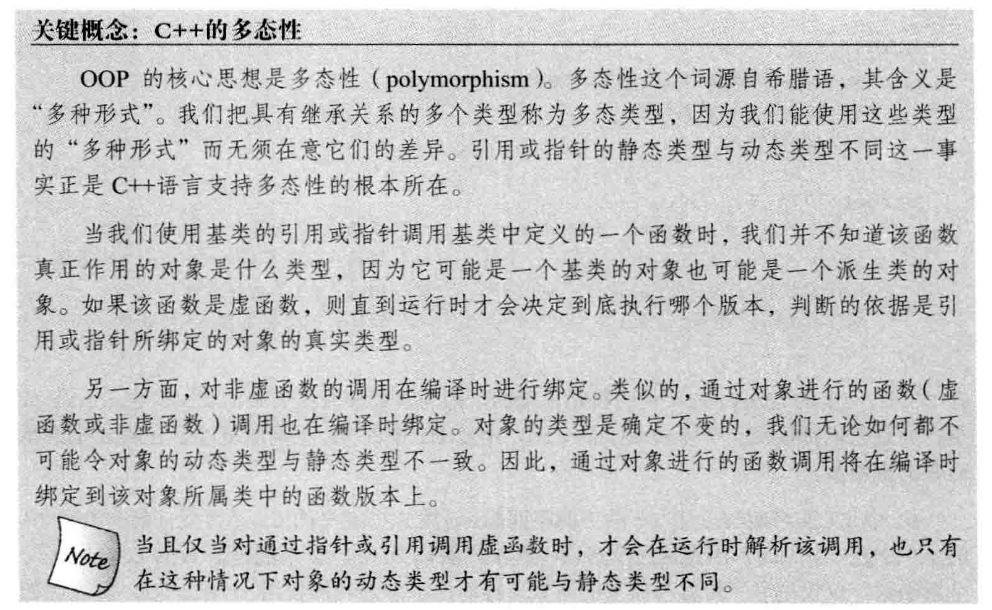
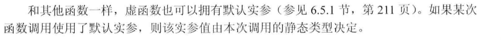
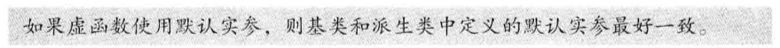
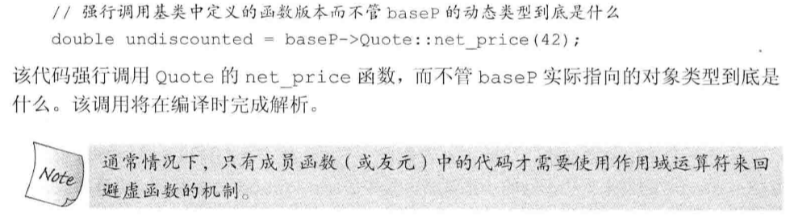
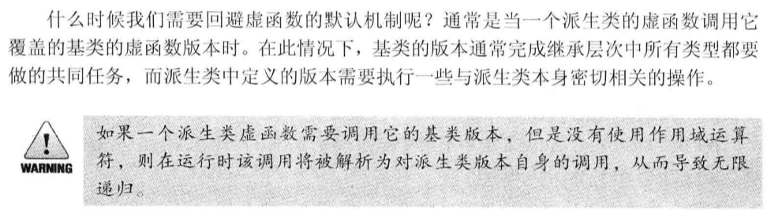

[toc]


# 虚函数



## 基本概念

虚函数是在基类中使用关键字`virtual`声明的成员函数，它允许**派生类**对其进行重写(override)实现**运行时**的多态。当通过**基类**指针或引用调用虚函数时，实际调用的是与对象的**动态类型**匹配的虚函数，这个过程称为**动态绑定**：

```C++
class B {
public:
    vitural void method{}; 
    // virtual只能出现在类内部的声明语句之前
    // 不能用于类外部的函数定义
private:
    int a;
    // ...
}

class D : public B {
public:
    void method{};
    // 不需要重复写关键字virtual，默认时虚函数
}
B b(); print(cout, b, 10);// 调用B::method
D d(); print(cout, d, 10); // 调用D::method
```

## 实现原理

1. 当一个类中包含虚函数时:
   * 编译器会为该类生成虚函数表，表中包含着该类包含的虚函数的地址
   * 该类的对象将会拥有虚函数表指针，指向该类的虚函数表。
2. 对于某个派生类，其重写了基类的某个虚函数，则在派生类虚函数表中将基类中对应虚函数的位置替换称重写的虚函数的地址。
3. 类自己定义的虚函数，也要将其追加到某一张虚函数表上。
4. 一个包含虚函数的类，至少有1张虚函数表。
5. 一个类继承了n个有虚函数的基类，就有n张虚函数表。
6. 类有n张虚函数表，类的对象就有n个虚指针，每一个指针指向1张虚函数表。
7. 虚函数表在编译时生成，虚函数表指针在对象创建时生成。

**最终，在运行时，找到动态绑定到基类指针上的对象，然后根据该对象的虚函数表指针找到对应的虚函数表，然后确定调用哪个版本的虚函数。**


## 派生类中的虚函数

一旦某一个函数被声明称虚函数，则在所有派生类中，就算其不使用关键字`virtual`进行声明，它都是虚函数。

一个派生类的函数如果覆盖了某个继承而来的虚函数，则其的**形参类型、返回值**都必须与被覆盖的基类函数完全一致。

* 注意，当返回是类本身的指针或引用时，上述规则无效。<font color='red'>必须保证基类和派生类之间的类型转换是可访问的</font>

## 虚析构函数

**哪些函数不能是虚函数？**

- 构造函数：虚函数指针是在构造函数中初始化的，执行构造函数前虚表指针尚未初始化，无法正确调用构造函数
- 内联函数：内联函数在编译阶段进行函数体的替换操作，而虚函数意味着在运行期间进行类型确定，所以内联函数不能是虚函数
- 静态函数：静态函数不属于对象属于类，静态成员函数没有this指针，因此静态函数设置为虚函数没有任何意义
- 友元函数：友元函数不属于类的成员函数，不能被继承。对于没有继承特性的函数没有虚函数的说法
- 普通函数：普通函数不属于类的成员函数，不具有继承特性，因此普通函数没有虚函数

析构函数应当为虚函数，如果析构函数不是虚函数，则派生类在析构时只会调用基类的析构函数去释放基类的成员对象，导致派生类成员无法被析构，导致内存泄漏。

## 纯虚函数

纯虚函数时虚函数的一种特殊形式，其语法是在函数声明后面加上`=0`。纯虚函数只有声明没有实现，含有纯虚函数的类称为抽象类，不能被实例化。它的派生类如果像被实例化，就必须实现所有的纯虚函数。

## `final`和`override`说明符

关键字`override`：保证在派生类中声明的虚函数，与基类的虚函数具有相同的参数和返回值，以成功覆盖已存在的虚函数，否则报错。

```C++
virtual void func() override;
```

关键字`final`：将某个函数用关键字`final`标记，之后任何尝试覆盖该函数的操作都将引发错误。

```C++
virtual void func() final;
```

## 虚函数与默认实参

因为如果基类和派生类提供了不同的默认实参，那么通过基类指针或引用调用虚函数时，将使用基类中定义的默认实参，即使实际对象是派生类。





## 回避虚函数的机制



