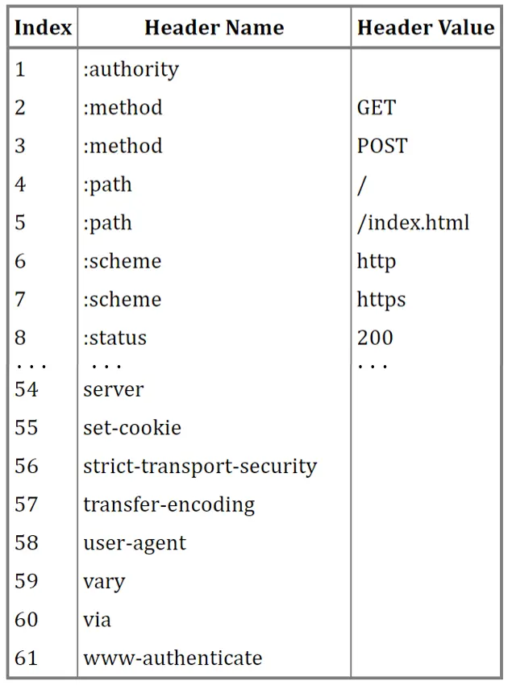
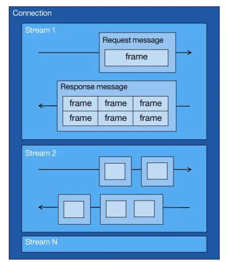
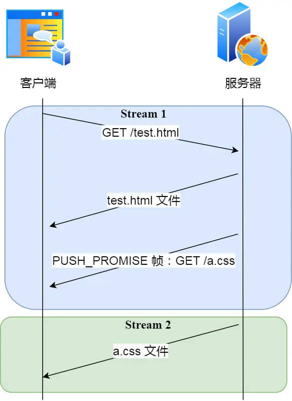

# HTTP 协议特性
**目录**

- [HTTP 协议特性](#http-协议特性)
- [HTTP/1.0](#http10)
- [HTTP/1.1](#http11)

**图解速览：HTTP1.1 到 HTTP2.0 的核心演进**


## HTTP/1.0


## HTTP/1.1

### HTTP/1.1 的优点

- **HTTP/1.1 简单**。HTTP 基本的报文格式就是 header + body，头部信息也是 key-value 简单文本的形式，易于理解，降低了学习和使用的门槛。
- **HTTP/1.1 灵活和易于扩展。**HTTP 协议里的各类请求方法、URI/URL、状态码、头字段等每个组成要求都没有被固定死，都允许开发人员自定义和扩充。同时 HTTP 由于是工作在应用层（ OSI 第七层），则它下层可以随意变化，
- **HTTP/1.1 应用广泛和跨平台，天然具有跨平台的优越性。**
- HTTP/1.1 使用**长连接**代替 HTTP/1.0 的短连接，使得多个 HTTP 连接可以复用一个 TCP 连接。
- HTTP/1.1 支持以**管道**的方式进行网络通信，解决了请求的队头阻塞。发送方不再需要等待接受发响应报文，可以直接发送。


### HTTP/1.1 的缺点

- HTTP/1.1 是无状态的。虽然，无状态可以使得服务器不需要记录报文的状态，使得更多的 CPU 和内存资源用来对外提供服务；但是，在成有关联性的操作时，会带来重复操作的麻烦。HTTP 可以通过 Cookie 技术解决这个问题。
- HTTP/1.1 明文通信，带来不安全的问题，出现篡改、泄露、冒充等风险。
- HTTP/1.1 虽然解决了请求的队头阻塞，但是没有解决响应的队头阻塞。实际上 HTTP/1.1 管道化技术不是默认开启，而且浏览器基本都没有支持，所以后面讨论的 HTTP/1.1 都是建立在没有使用管道化的前提。
- HTTP/1.1 只能压缩 Body 的部分， 但是对于请求与响应头部（Header）未经压缩就发送，因此导致首部信息越多延迟越大。进而导致资源浪费。
- HTTP/1.1 缺少请求优先级控制。
- HTTP/1.1 请求只能从客户端开始，服务器只能被动响应。

### HTTP/1.1 如何优化

对于 HTTP/1.1 的优化，可以从如下三个角度入手：
- 尽量避免发送 HTTP 请求；
- 在需要发送 HTTP 请求时，考虑如何减少请求次数；
- 减少服务器的 HTTP 响应的数据大小；

**减少发送 HTTP 请求**
在 HTTP 协议中，对于一些具有重复性的 HTTP 请求，比如每次请求得到的数据都一样的，可以把这对请求-响应的数据都缓存在本地，那么下次就直接读取本地的数据，不必在通过网络获取服务器的响应了，这样的话 HTTP/1.1 的性能肯定肉眼可见的提升。

具体可以参考 HTTP 缓存机制中的强制缓存和协商缓存。

**减少发送 HTTP 请求次数**

- **减少重定向请求次数。**
由于服务器上的一个资源可能由于迁移、维护等原因从 url1 移至 url2 后，而客户端不知情，它还是继续请求 url1，这时服务器不能粗暴地返回错误，而是通过 302 响应码和 Location 头部，告诉客户端该资源已经迁移至 url2 了，于是客户端需要再发送 url2 请求以获得服务器的资源。另外，服务端这一方往往不只有一台服务器，比如源服务器上一级是代理服务器，然后代理服务器才与客户端通信，这时客户端重定向就会导致客户端与代理服务器之间需要 2 次消息传递。
- **合并请求次数。**
如果把多个访问小文件的请求合并成一个大的请求，虽然传输的总资源还是一样，但是减少请求，也就意味着减少了重复发送的 HTTP 头部。在 HTTP/1.0 中，如果为了避免队头阻塞，因此在发送多个请求的时候，需要为每个请求建立对应的 TCP 连接，那么如果合并了请求，也就会减少 TCP 连接的数量，因而省去了 TCP 握手和慢启动过程耗费的时间。但是这样的合并请求会带来新的问题，当大资源中的某一个小资源发生变化后，客户端必须重新下载整个完整的大资源文件，这显然带来了额外的网络消耗。
- **延迟发送请求。**
不要一口气吃成大胖子，一般 HTML 里会含有很多 HTTP 的 URL，当前不需要的资源，我们没必要也获取过来，于是可以通过「按需获取」的方式，来减少第一时间的 HTTP 请求次数。
请求网页的时候，没必要把全部资源都获取到，而是只获取当前用户所看到的页面资源，当用户向下滑动页面的时候，再向服务器获取接下来的资源，这样就达到了延迟发送请求的效果。

**减少响应 HTTP 报文的大小**

对于 HTTP 的请求和响应，通常 HTTP 的响应的数据大小会比较大，也就是服务器返回的资源会比较大。于是，我们可以考虑对响应的资源进行压缩，这样就可以减少响应的数据大小，从而提高网络传输的效率。压缩的方式一般分为 2 种，分别是：
- 有损压缩。与无损压缩相对的就是有损压缩，经过此方法压缩，解压的数据会与原始数据不同但是非常接近。有损压缩主要将次要的数据舍弃，牺牲一些质量来减少数据量、提高压缩比，这种方法经常用于压缩多媒体数据，比如音频、视频、图片。可以通过 HTTP 请求头部中的 Accept 字段里的 q 质量因子，告诉服务器期望的资源质量。
  - 图片压缩： Webp 压缩。
  - 视频压缩：静态的关键帧，使用增量数据来表达后续的帧，这样便减少了很多数据，视频编码格式有 H264、H265 等。
  - 音频压缩：每个帧都有时序的关系，通常时间连续的帧之间的变化是很小的，音频编码格式有 AAC、AC3。
- 无损压缩。无损压缩是指资源经过压缩后，信息不被破坏，还能完全恢复到压缩前的原样，适合用在文本文件、程序可执行文件、程序源代码。


## HTTP/2.0

### 回顾：HTTP/1.1 性能问题

首先需要回顾 HTTP/1.1 的性能问题，因为 HTTP/2.0 主要根据 HTTP/1.1 的性能问题进行了改善。 HTTP/1.1 在性能上有如下问题：
- HTTP/1.1 的头部没有压缩。
- HTTP/1.1 会出现发送/响应队头阻塞。
- HTTP/1.1 中请求只能从客户端开始，服务端只能被动响应。

针对上述性能问题， HTTP/2.0 进行了相应的改进：
- HTTP/2.0 对报文头部进行压缩。
- HTTP/2.0 使用二进制帧进行传输。
- HTTP/2.0 支持并发传输。
- HTTP/2.0 允许服务端主动推送资源。

### HTTP/2.0的改进：头部压缩

HTTP 协议的报文时由： Header 和 Body 组成的，对于 Body 部分， HTTP/1.1 可以使用头部中的字段： Conetend-Encoding 指定压缩方式，从而节约带宽，但是报文中另一部分 Header 是没有进行压缩的，而 Header 部分常常存在：
- 含有很多固定字段。比如 Cookie、User、Agent、Accept 等，这些字段高达几百字节，甚至上千字节，所以有必要压缩。
- 大量的请求和响应的报文里有很多字段值是重复的。通过降低重复性可以节约带宽，所以有必要压缩。
- 字段是 ASCII 编码的，虽然可读性高，但是传输效率低，所以有必要改成二进制编码。

HTTP/2.0 使用 HPACK 算法，对 HTTP 头部进行压缩，其由如下实现：
- 静态字典
- 动态字典
- Huffman 编码压缩算法

**静态表编码**

HTTP/2.0 为高频出现在头部的字符串和字段建立了一张静态表，它是写入到 HTTP/2 框架里的，不会变化的，静态表里共有 61 组，如下图：



表中的：
- `Index`： 表示索引。
- `Header Value`： 表示索引对应的 Value ，这些 Value 是变化的，经过 Huffman 编码后，才会发送出去。
- `Header Name`： 表示字段的名字。

根据 RFC7541 规范，如果 HTTP 报文头部字段属于静态表范围，并且 Value 是变化的，那么它的 HTTP/2.0 头部固定为 01 ，因此整个头部格式如下：

```
  0   1   3   4   5   6   7
+---+---+---+---+---+---+---+
| 0 | 1 |     Index (6+)    |
+---+---+-------------------+
| H |                       |
+---+---+-------------------+
|                           |
+---------------------------+
```
**动态表编码**

静态表只包含了 61 种高频出现在头部的字符串，不在静态表范围内的头部字符串就要自行构建动态表，它的 Index 从 62 起步，会在编码解码的时候随时更新。

比如，第一次发送时头部中的 User-Agent 字段数据有上百个字节，经过 Huffman 编码发送出去后，客户端和服务器双方都会更新自己的动态表，添加一个新的 Index 号 62。那么在下一次发送的时候，就不用重复发这个字段的数据了，只用发 1 个字节的 Index 号就好了，因为双方都可以根据自己的动态表获取到字段的数据。

所以，使得动态表生效有一个前提：必须同一个连接上，重复传输完全相同的 HTTP 头部。如果消息字段在 1 个连接上只发送了 1 次，或者重复传输时，字段总是略有变化，动态表就无法被充分利用了。

因此，随着在同一 HTTP/2 连接上发送的报文越来越多，客户端和服务器双方的「字典」积累的越来越多，理论上最终每个头部字段都会变成 1 个字节的 Index，这样便避免了大量的冗余数据的传输，大大节约了带宽。

但是，动态表越大，占用的内存也就越大，如果占用了太多内存，是会影响服务器性能的，因此 Web 服务器都会提供类似 http2_max_requests 的配置，用于限制一个连接上能够传输的请求数量，避免动态表无限增大，请求数量到达上限后，就会关闭 HTTP/2 连接来释放内存。


### HTTP/2.0的改进：二进制帧

HTTP/2.0 厉害之处在于将 HTTP/1.0 的文本格式改成二进制个数传输数据，极大提高了 HTTP 的传输效率，而且二进制数据能够使用位运算，提高解析。

HTTP/2.0 把响应报文划分成了两类帧（Frame）， HEADERS（首部）帧和 DATA（消息负载）帧。对于一条 HTTP 响应，其被划分成了两类帧来传输，并且采用二进制来编码。 HTTP/2.0 的二进制帧的结构如下图：


首先是帧头，帧头很小，只有 9 个字节：
- 帧长度（24 bits）：前 3 个字节表示帧数据（Frame Playload）的长度。
- 帧类型（8 bits）：帧长度后面的一个字节是表示帧的类型，HTTP/2 总共定义了 10 种类型的帧，一般分为数据帧和控制帧两类，如下图：
  |帧类型|类型编码|用途|
  |---|---|---|
  | DATA | 0x0 | 传递 HTTP 包体 |
  | HEADERS | 0x1 | 传递 HTTP 头部 |
  | PRIORITY | 0x2 | 指定 STREAM 的优先级|
  | RST_STREAM | 0x3 | 终止 STREAM 流|
  | SETTINGS | 0x4 | 修改连接或者 STREAM 的配置 |
  | PUSH_PROMISE | 0x5 | 服务端推送资源时的描述请求的帧 |
  | PING | 0x6 |心跳检测，兼具计算 RTT 往返时延的功能|
  | GOAWAY | 0x7 | 优雅的终止连接或者通知错误 |
  | WINDOW_UPDATE | 0x8 | 实现流量控制 |
  | CONTINUATION | 0x9 | 传递较大 HTTP 头部时的持续帧 |

- 标志位（8 bits）：用于携带简单的控制信息
- 流标识符（31 bits）：帧头的最后 4 个字节是流标识符（Stream ID），但最高位被保留不用，只有 31 位可以使用，因此流标识符的最大值是 2^31，大约是 21 亿，它的作用是用来标识该 Frame 属于哪个 Stream，接收方可以根据这个信息从乱序的帧里找到相同 Stream ID 的帧，从而有序组装信息。
- 帧数据（? bits）：最后，就是帧数据了，其存放的是通过 HPACK 压缩过的 HTTP 头部和包体。

### HTTP/2.0的改进：并发传输

HTTP/1.1 的实现是基于请求-响应模型的。同一个连接中，HTTP 完成一个事务（请求与响应），才能处理下一个事务，也就是说在发出请求等待响应的过程中，是没办法做其他事情的，如果响应迟迟不来，那么后续的请求是无法发送的，也造成了队头阻塞的问题。

HTTP/2.0 通过 Stream 这个设计，使得多个 Stream 复用一条 TCP 连接，达到并发的效果，解决了 HTTP/1.1 队头阻塞的问题，提高了 HTTP 传输的吞吐量。



如上图：
- 1 个 TCP 连接包含一个或者多个 Stream，Stream 是 HTTP/2 并发的关键技术。
- Stream 里可以包含 1 个或多个 Message，Message 对应 HTTP/1 中的请求或响应，由 HTTP 头部和包体构成。
- Message 里包含一条或者多个 Frame，Frame 是 HTTP/2 最小单位，以二进制压缩格式存放 HTTP/1 中的内容（头部和包体）。

因此，我们可以得出个结论：多个 Stream 跑在一条 TCP 连接，同一个 HTTP 请求与响应是跑在同一个 Stream 中，HTTP 消息可以由多个 Frame 构成， 一个 Frame 可以由多个 TCP 报文构成。

在 HTTP/2.0 连接上，不同 Stream 的帧是可以乱序发送的，因此可以并发不同的 Stream 。因为每一个帧的头部会携带 Stream ID 信息。所以接收端可以通过 Stream ID 有序组装层 HTTP 消息，而同一 Stream 内部的帧必须是严格有序的。

客户端和服务器双方都可以建立 Stream，因为服务端可以主动推送资源给客户端， 客户端建立的 Stream 必须是奇数号，而服务器建立的 Stream 必须是偶数号。

同一个连接中的 Stream ID 是不能复用的，只能顺序递增，所以当 Stream ID 耗尽时，需要发一个控制帧 GOAWAY，用来关闭 TCP 连接。

在 Nginx 中，可以通过 http2_max_concurrent_Streams 配置来设置 Stream 的上限，默认是 128 个。

**HTTP/2 还可以对每个 Stream 设置不同优先级，帧头中的「标志位」可以设置优先级。**

### HTTP/2.0的改进：服务器主动推送资源

HTTP/1.1 不支持服务器主动推送资源给客户端，都是由客户端向服务器发起请求后，才能获取到服务器响应的资源。而 HTTP/2.0 支持服务端主动推送。

客户端发起的请求，必须使用的是奇数号 Stream，服务器主动的推送，使用的是偶数号 Stream。服务器在推送资源时，会通过 PUSH_PROMISE 帧传输 HTTP 头部，并通过帧中的 Promised Stream ID 字段告知客户端，接下来会在哪个偶数号 Stream 中发送包体，如下：




## HTTP/3.0

### 回顾：HTTP/2.0 性能问题

首先 HTTP/2.0 通过头部压缩、二进制编码、 Stream 复用、服务器推送大幅度提升了 HTTP/1.0 的性能，但是美中不足的是 HTTP/2.0 是通过 TCP 实现的，于是存在如下缺陷：
- 队头阻塞
- TCP 与 TLS 握手时延
- 网络迁移需要重新连接

**队头阻塞**

由于 HTTP/2.0 的多个请求是跑在一个 TCP 连接中的，那么当 TCP 丢包时，整个 TCP 都要等待重传，那么就会阻塞该 TCP 连接中的所有请求。因为 TCP 协议是字节流协议，必须保证收到的字节数据是完整且有序的，对于 HTTP/2.0 来说是多路传输，但是对于 TCP 协议仍然是单路传输，会在传输层出现队头阻塞问题。

**握手时延**

发起 HTTP 请求时，如果对应的 HTTP 协议是使用了 HTTPS 的，则需要经过 TCP 三次握手和 TLS 四次握手（TLS 1.2）的过程，因此共需要 3 个 RTT 的时延才能发出请求数据。

另外，TCP 由于具有拥塞控制的特性，所以刚建立连接的 TCP 会有个「慢启动」的过程，它会对 TCP 连接产生“减速”效果。

**重新连接**

一个 TCP 连接是由四元组（源 IP 地址，源端口，目标 IP 地址，目标端口）确定的，这意味着如果 IP 地址或者端口变动了，就会导致需要 TCP 与 TLS 重新握手，这不利于移动设备切换网络的场景，比如 4G 网络环境切换成 WiFi。

这些问题都是 TCP 协议固有的问题，无论应用层的 HTTP/2 在怎么设计都无法逃脱。要解决这个问题， HTTP/3.0 提出把传输层协议替换成 UDP。

### QUIC 协议

为了追求更快的连接速度， HTTP/3.0 将底层的 TCP 协议替换为 UDP 协议，但是由于 UDP 协议是不可靠传输的，因此 HTTP/3 还基于 UDP 协议在应用层实现了 QUIC 协议，它具有类似 TCP 的连接管理、拥塞窗口、流量控制的网络特性，相当于将不可靠传输的 UDP 协议变成“可靠”的了，所以不用担心数据包丢失的问题。QUIC 协议的优点有很多，例如：
- 无队头阻塞。
- 更快的连接建立。
- 连接迁移。

**无队头阻塞**

QUIC 协议也有类似 HTTP/2 Stream 与多路复用的概念，也是可以在同一条连接上并发传输多个 Stream，一个 Stream 可以认为就是一条 HTTP 请求。由于 QUIC 使用的传输协议是 UDP，UDP 不关心数据包的顺序，如果数据包丢失，UDP 也不关心。

不过 QUIC 协议会保证数据包的可靠性，每个数据包都有一个序号唯一标识。当某个流中的一个数据包丢失了，即使该流的其他数据包到达了，数据也无法被 HTTP/3 读取，直到 QUIC 重传丢失的报文，数据才会交给 HTTP/3。而其他流的数据报文只要被完整接收，HTTP/3 就可以读取到数据。这与 HTTP/2 不同，HTTP/2 只要某个流中的数据包丢失了，其他流也会因此受影响。

所以，QUIC 连接上的多个 Stream 之间并没有依赖，都是独立的，某个流发生丢包了，只会影响该流，其他流不受影响，这是由于 QUIC 的底层是 UDP 实现的。

**更快的连接建立**

对于 HTTP/1.0 和 HTTP/2.0 来说，TLS 和 TCP 协议是分层的，它们难以合并在一起，需要分批次来握手，先 TCP 握手，再 TLS 握手。

HTTP/3 在传输数据前虽然需要 QUIC 协议握手，这个握手过程只需要 1 RTT，握手的目的是为确认双方的「连接 ID」，连接迁移就是基于连接 ID 实现的。

但是 HTTP/3 的 QUIC 协议并不是与 TLS 分层，而是 QUIC 内部包含了 TLS，它在自己的帧会携带 TLS 里的“记录”，再加上 QUIC 使用的是 TLS 1.3，因此仅需 1 个 RTT 就可以同时完成建立连接与密钥协商，甚至在第二次连接的时候，应用数据包可以和 QUIC 握手信息（连接信息 + TLS 信息）一起发送，达到 0-RTT 的效果。

**连接迁移**

QUIC 协议没有用四元组的方式来“绑定”连接，而是通过连接 ID 来标记通信的两个端点，客户端和服务器可以各自选择一组 ID 来标记自己，因此即使移动设备的网络变化后，导致 IP 地址变化了，只要仍保有上下文信息（比如连接 ID、TLS 密钥等），就可以“无缝”地复用原连接，消除重连的成本，没有丝毫卡顿感，达到了连接迁移的功能。

### HTTP/3.0 的改进

HTTP/3.0 同 HTTP/2.0 一样采用二进制帧的结构，不同的地方在于 HTTP/2.0 的二进制帧里需要定义 Stream，而 HTTP/3.0 自身不需要再定义 Stream，直接使用 QUIC 里的 Stream，于是 HTTP/3.0 的帧的结构也变简单了。