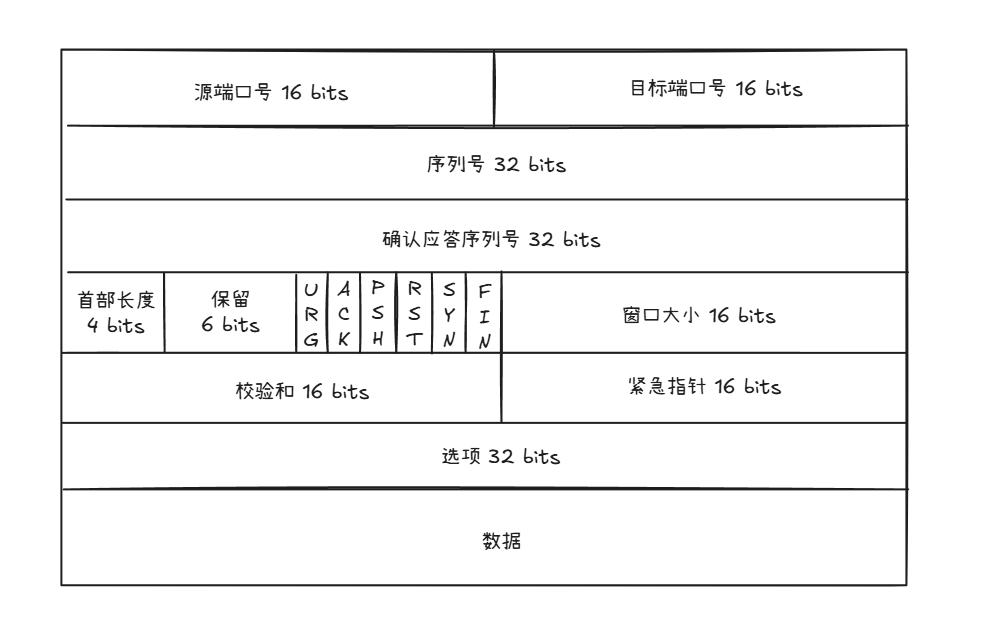
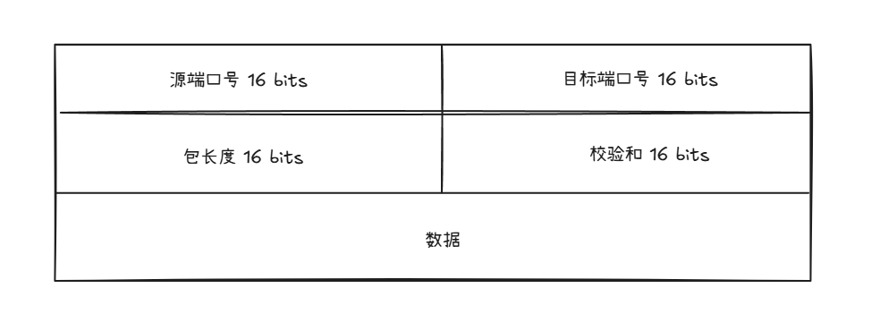

# TCP 基础认识

## TCP 报文头部格式？

各字段说明：
- 源端口、目标端口：分别表示发送方和接收方的端口号。
- 序号：本报文段发送的数据的第一个字节的序号。
- 确认号：期望收到对方下一个数据字节的序号。
- 数据偏移：TCP 头部长度（以 4 字节为单位）。
- 标志位（URG、ACK、PSH、RST、SYN、FIN）：控制连接状态和数据传输。
- 窗口大小：接收方的接收窗口大小。
- 校验和：用于差错检测。
- 紧急指针：配合 URG 标志使用。
- 选项：如 MSS、窗口扩大、SACK 等。
- 数据：实际传输的数据内容。

## 为什么需要 TCP 协议？

TCP 协议是工作在传输层的协议。对于采用 IP 协议的网络层，其不保证网络包的交付、不保证网络包的按序交付、也不保证网络包中的数据完整性。如果需要保障网络数据包的可靠性，那么就需要由上层（传输层）的 TCP 协议来负责。因为 TCP 是一个工作在传输层的可靠数据传输的服务，它能确保接收端接收的网络包是无损坏、无间隔、非冗余和按序的。

## 什么是 TCP 协议？

TCP 协议是面向连接的、可靠的、基于字节流的传输层协议。
- 面向连接。一定是**一对一**才能连接，不能像 UDP 协议可以一个主机同时向多个主机发送消息，也就是一对多是无法做到的；
- 可靠的。无论的网络链路中出现了怎样的链路变化，TCP 都可以保证一个报文一定能够到达接收端；
- 基于字节流的。用户消息通过 TCP 协议传输时，消息可能会被操作系统分组成多个的 TCP 报文，如果接收方的程序如果不知道消息的边界，是无法读出一个有效的用户消息的。并且 TCP 报文是有序的，当前一个TCP 报文没有收到的时候，即使它先收到了后面的 TCP 报文，那么也不能扔给应用层去处理，同时对重复的 TCP 报文会自动丢弃。

## 什么是 TCP 连接？

*Connections: The reliability and flow control mechanisms described above require that TCPs initialize and maintain certain status information for each data stream. The combination of this information, including sockets, sequence numbers, and window sizes, is called a connection.*

RFC 793 认为用于保证可靠性和流量控制维护的某些状态信息，这些信息的组合，包括 Socket、序列号和窗口大小称为连接。所以我们可以知道，建立一个 TCP 连接是需要客户端与服务端达成上述三个信息的共识。
- Socket：由 IP 地址和端口号组成
- 序列号：用来解决乱序问题等
- 窗口大小：用来做流量控制

## 如何唯一确定一个 TCP 连接呢？

TCP 四元组可以唯一的确定一个连接，四元组包括如下：
- 源 IP 地址
- 源端口
- 目的 IP 地址
- 目的端口

## TCP 和 UDP 协议的区别？

**UDP 报文**

各个内容如下：
- 目标和源端口：主要是告诉 UDP 协议应该把报文发给哪个进程。
- 包长度：该字段保存了 UDP 首部的长度跟数据的长度之和。
- 校验和：校验和是为了提供可靠的 UDP 首部和数据而设计，防止收到在网络传输中受损的 UDP 包。

**TCP 和 UDP 协议的区别？**
- 连接
    TCP 是面向连接的传输层协议，传输数据前先要建立连接。
    UDP 是不需要连接，即刻传输数据。
- 服务对象
    TCP 是一对一的两点服务，即一条连接只有两个端点。
    UDP 支持一对一、一对多、多对多的交互通信
- 可靠性
    TCP 是可靠交付数据的，数据可以无差错、不丢失、不重复、按序到达。
    UDP 是不可靠的传输协议，不保证可靠交付数据，数据发送之后，丢失了就丢失了。但是我们可以基于 UDP 传输协议实现一个可靠的传输协议，比如 QUIC 协议。
- 拥塞控制、流量控制
    TCP 有拥塞控制和流量控制机制，保证数据传输的安全性。
    UDP 则没有，即使网络非常拥堵了，也不会影响 UDP 的发送速率。
- 首部开销
    TCP 首部长度较长，会有一定的开销，首部在没有使用选项字段时是 20 个字节，如果使用了「选项」字段则会变长的。
    UDP 首部只有 8 个字节，并且是固定不变的，开销较小。
- 传输方式
    TCP 是流式传输，没有边界，但保证顺序和可靠。
    UDP 是一个包一个包的发送，是有边界的，但可能会丢包和乱序。
- 分片不同
    TCP 的数据大小如果大于 MSS 大小，则会在传输层进行分片，目标主机收到后，也同样在传输层组装 TCP 数据包，如果中途丢失了一个分片，只需要传输丢失的这个分片。
    UDP 的数据大小如果大于 MTU 大小，则会在 IP 层进行分片，目标主机收到后，在 IP 层组装完数据，接着再传给传输层。

**为什么 UDP 头部没有首部长度字段，而 TCP 头部有首部长度字段呢？**

原因是 TCP 有可变长的「选项」字段，而 UDP 头部长度则是不会变化的，无需多一个字段去记录 UDP 的首部长度。

**为什么 UDP 头部有包长度字段，而 TCP 头部则没有包长度字段呢？**

先说说 TCP 是如何计算负载数据长度：

其中 IP 总长度 和 IP 首部长度，在 IP 首部格式是已知的。TCP 首部长度，则是在 TCP 首部格式已知的，所以就可以求得 TCP 数据的长度。

大家这时就奇怪了问：“UDP 也是基于 IP 层的呀，那 UDP 的数据长度也可以通过这个公式计算呀？ 为何还要有「包长度」呢？”

这么一问，确实感觉 UDP 的「包长度」是冗余的。

我查阅了很多资料，我觉得有两个比较靠谱的说法：

第一种说法：因为为了网络设备硬件设计和处理方便，首部长度需要是 4 字节的整数倍。如果去掉 UDP 的「包长度」字段，那 UDP 首部长度就不是 4 字节的整数倍了，所以我觉得这可能是为了补全 UDP 首部长度是 4 字节的整数倍，才补充了「包长度」字段。
第二种说法：如今的 UDP 协议是基于 IP 协议发展的，而当年可能并非如此，依赖的可能是别的不提供自身报文长度或首部长度的网络层协议，因此 UDP 报文首部需要有长度字段以供计算。

**TCP 和 UDP 应用场景**
由于 TCP 是面向连接，能保证数据的可靠性交付，因此经常用于：
- FTP 文件传输；
- HTTP / HTTPS；
由于 UDP 面向无连接，它可以随时发送数据，再加上 UDP 本身的处理既简单又高效，因此经常用于：
- 包总量较少的通信，如 DNS 、SNMP 等；
- 视频、音频等
- 广播通信

## TCP 和 UDP 可以共用一个端口吗？

## 如何理解 TCP 协议是基于字节流的？

