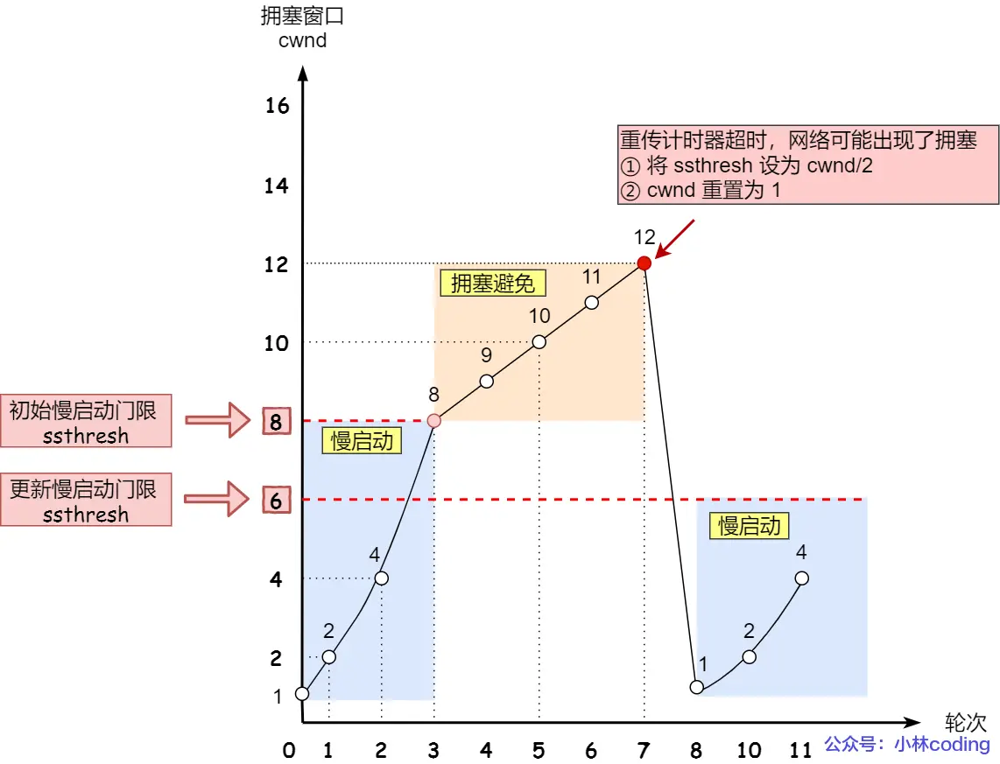
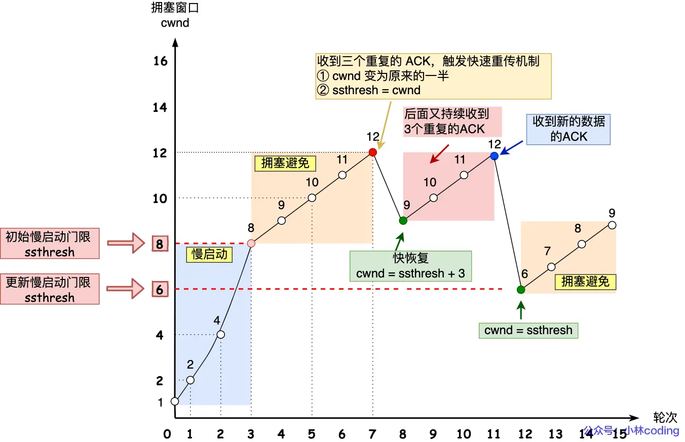

# 拥塞控制
## 目录
- [技术背景](#技术背景)
- [相关概念](#相关概念)
    - [拥塞窗口和发送窗口](#拥塞窗口和发送窗口)
    - [拥塞窗口变化的规则](#拥塞窗口变化的规则)
    - [网络拥塞判断](#网络拥塞判断)
- [实现算法](#实现算法)
    - [慢启动](#慢启动)
    - [拥塞避免](#拥塞避免)
    - [拥塞发生](#拥塞发生)
    - [快速恢复](#快速恢复)

## 技术背景
前面的流量控制是避免发送方的数据填满接收方的缓存，但是并不知道网络的中发生了什么。但是，当网络中的数据包总量超过了路由器和链路的处理或转发能力时，导致数据包延迟增加、丢失率上升、整体吞吐量下降的现象。

**例如**，当网络出现拥堵时，如果继续发送大量数据包，可能会导致数据包时延、丢失等，这时 TCP 就会重传数据，但是一重传就会导致网络的负担更重，于是会导致更大的延迟以及更多的丢包，这个情况就会进入恶性循环被不断地放大....

所以，TCP 不能忽略网络上发生的事，它被设计成一个无私的协议，当网络发送拥塞时，TCP 会自我牺牲，降低发送的数据量。

于是，就有了拥塞控制，控制的目的就是避免发送方的数据填满**整个网络**。

## 相关概念
### 拥塞窗口和发送窗口

拥塞窗口 `cwnd` 是发送方维护的一个的状态变量，它会根据网络的拥塞程度动态变化的。

之前流量控制中的发送窗口 `swnd` 和接收窗口 `rwnd` 是约等于的关系，那么由于加入了拥塞窗口的概念后，此时发送窗口的值是 `swnd = min(cwnd, rwnd)`，也就是拥塞窗口和接收窗口中的最小值。

### 拥塞窗口变化的规则

拥塞窗口变化的基本规律如下：
- 只要网络中没有出现拥塞，`cwnd` 就会增大；但网络中出现了拥塞，`cwnd` 就减少。

### 网络拥塞判断

其实只要发送方没有在规定时间内接收到 ACK 应答报文，也就是发生了**超时重传**，就会认为网络出现了拥塞。

## 实现算法
### 慢启动
TCP 在刚建立连接完成后，首先是有个慢启动的过程，这个慢启动的意思就是一点一点的提高发送数据包的数量。

慢启动的算法记住一个规则就行：当发送方每收到一个 ACK，拥塞窗口 cwnd 的大小就会加 1。

那慢启动涨到什么时候是个头呢？

有一个叫慢启动门限 `ssthresh` （slow start threshold）状态变量。
- 当 `cwnd < ssthresh` 时，使用慢启动算法。
- 当 `cwnd >= ssthresh` 时，就会使用「拥塞避免算法」。

### 拥塞避免
拥塞窗口 `cwnd` 超过慢启动门限 `ssthresh` 就会进入拥塞避免算法。

一般来说 ssthresh 的大小是 65535 字节。

那么进入拥塞避免算法后，它的规则是：每当收到一个 ACK 时，cwnd 增加 1/cwnd。

当 8 个 ACK 应答确认到来时，每个确认增加 1/8，8 个 ACK 确认 cwnd 一共增加 1，于是这一次能够发送 9 个 MSS 大小的数据，变成了线性增长。

### 拥塞发生
当触发了重传机制，也就进入了「拥塞发生算法」。
**发生超时重传的拥塞发生算法**
这个时候，ssthresh 和 cwnd 的值会发生变化：
- ssthresh 设为 cwnd/2，
- cwnd 重置为 1 （是恢复为 cwnd 初始化值，我这里假定 cwnd 初始化值 1）

接着，就重新开始慢启动，慢启动是会突然减少数据流的。这真是一旦「超时重传」，马上回到解放前。但是这种方式太激进了，反应也很强烈，会造成网络卡顿。

**发生快速重传的拥塞发生算法**
还有更好的方式，前面我们讲过「快速重传算法」。当接收方发现丢了一个中间包的时候，发送三次前一个包的 ACK，于是发送端就会快速地重传，不必等待超时再重传。

TCP 认为这种情况不严重，因为大部分没丢，只丢了一小部分，则 ssthresh 和 cwnd 变化如下：

cwnd = cwnd/2 ，也就是设置为原来的一半;
ssthresh = cwnd;
进入快速恢复算法

## 快速恢复
快速重传和快速恢复算法一般同时使用，快速恢复算法是认为，你还能收到 3 个重复 ACK 说明网络也不那么糟糕，所以没有必要像 RTO 超时那么强烈。

然后，进入快速恢复算法如下：

- 拥塞窗口 cwnd = ssthresh + 3 （ 3 的意思是确认有 3 个数据包被收到了）；
- 重传丢失的数据包；
- 如果再收到重复的 ACK，那么 cwnd 增加 1；
- 如果收到新数据的 ACK 后，把 cwnd 设置为第一步中的 ssthresh 的值，原因是该 ACK 确认了新的数据，说明从 duplicated ACK 时的数据都已收到，该恢复过程已经结束，可以回到恢复之前的状态了，也即再次进入拥塞避免状态；
