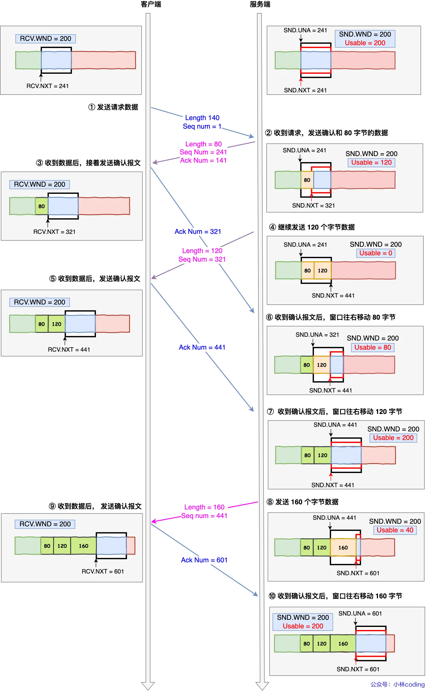
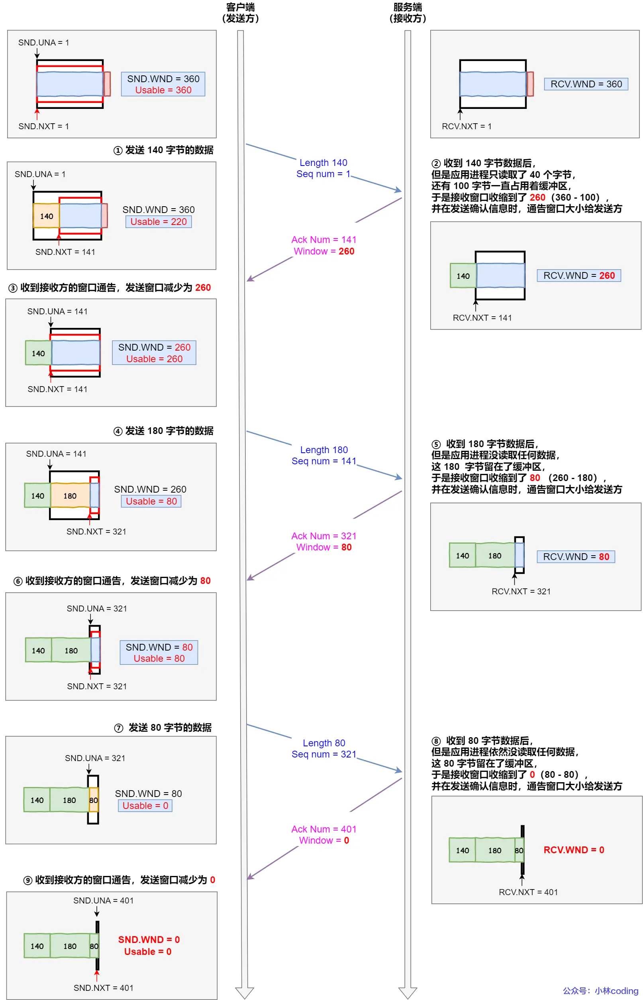
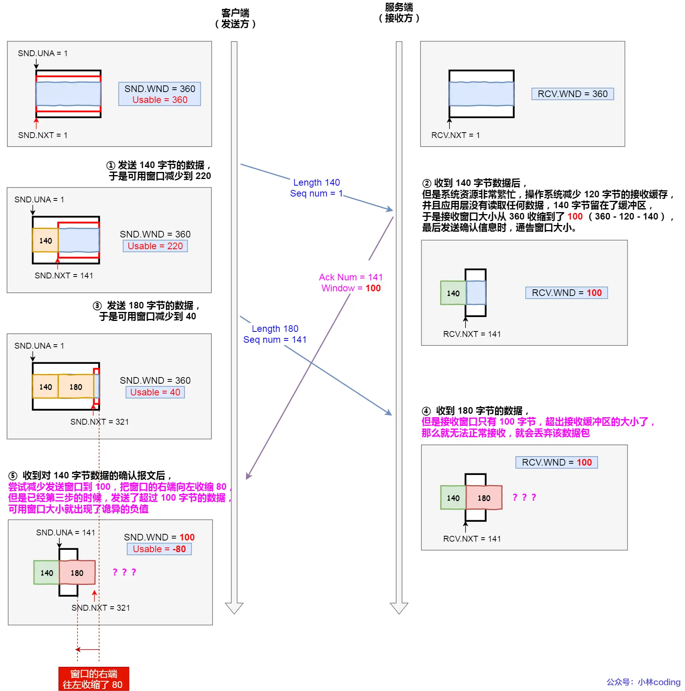
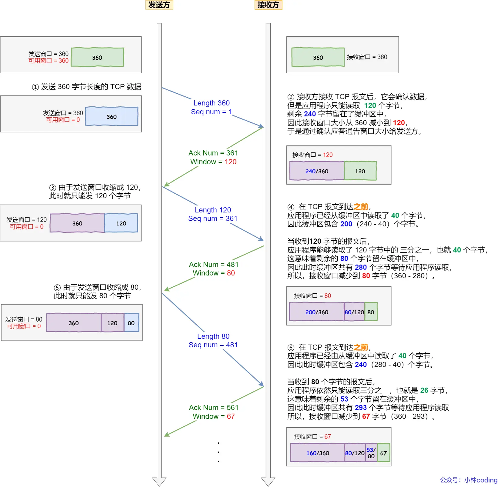

# 流量控制
发送方不能无脑的发数据给接收方，要考虑接收方处理能力。

如果一直无脑的发数据给对方，但对方处理不过来，那么就会导致触发重发机制，从而导致网络流量的无端的浪费。

为了解决这种现象发生，TCP 提供一种机制可以让发送方根据接收方的实际接收能力控制发送的数据量，这就是所谓的流量控制，而流量控制是依靠**滑动窗口**机制实现的。

## 滑动窗口实现流量控制
 
假定：
- 客户端是接收方，服务端是发送方
- 假设接收窗口和发送窗口相同，都为 200
- 假设两个设备在整个传输过程中都保持相同的窗口大小，不受外界影响

- 当服务端收到请求报文后，发送确认报文和 80 字节的数据，于是可用窗口 Usable 减少为 120 字节，同时 SND.NXT 指针也向右偏移 80 字节后，指向 321，这意味着下次发送数据的时候，序列号是 321。
- 客户端收到 80 字节数据后，于是接收窗口往右移动 80 字节，RCV.NXT 也就指向 321，这意味着客户端期望的下一个报文的序列号是 321，接着发送确认报文给服务端。
- 服务端再次发送了 120 字节数据，于是可用窗口耗尽为 0，服务端无法再继续发送数据。
- 客户端收到 120 字节的数据后，于是接收窗口往右移动 120 字节，RCV.NXT 也就指向 441，接着发送确认报文给服务端。
- 服务端收到对 80 字节数据的确认报文后，SND.UNA 指针往右偏移后指向 321，于是可用窗口 Usable 增大到 80。
- 服务端收到对 120 字节数据的确认报文后，SND.UNA 指针往右偏移后指向 441，于是可用窗口 Usable 增大到 200。
- 服务端可以继续发送了，于是发送了 160 字节的数据后，SND.NXT 指向 601，于是可用窗口 Usable 减少到 40。
- 客户端收到 160 字节后，接收窗口往右移动了 160 字节，RCV.NXT 也就是指向了 601，接着发送确认报文给服务端。
- 服务端收到对 160 字节数据的确认报文后，发送窗口往右移动了 160 字节，于是 SND.UNA 指针偏移了 160 后指向 601，可用窗口 Usable 也就增大至了 200。

## 操作系统缓冲区与滑动窗口的关系
前面的流量控制例子，我们假定了发送窗口和接收窗口是不变的，但是实际上，发送窗口和接收窗口中所存放的字节数，都是放在操作系统内存缓冲区中的，而操作系统的缓冲区，会被操作系统调整。

### 例子1
当应用程序没有及时读取缓存时，发送窗口和接收窗口的变化。

可见最后窗口都收缩为 0 了，也就是发生了窗口关闭。当发送方可用窗口变为 0 时，发送方实际上会定时发送窗口探测报文，以便知道接收方的窗口是否发生了改变，这个内容后面会说，这里先简单提一下。
### 例子2
当服务端系统资源非常紧张的时候，操作系统可能会直接减少了接收缓冲区大小，这时应用程序又无法及时读取缓存数据，那么这时候就有严重的事情发生了，会出现数据包丢失的现象。

所以，如果发生了先减少缓存，再收缩窗口，就会出现丢包的现象。

为了防止这种情况发生，TCP 规定是不允许同时减少缓存又收缩窗口的，而是采用先收缩窗口，过段时间再减少缓存，这样就可以避免了丢包情况。

## 窗口关闭
如果窗口大小为 0 时，就会阻止发送方给接收方传递数据，直到窗口变为非 0 为止，这就是窗口关闭。

接收方向发送方通告窗口大小时，是通过 ACK 报文来通告的。

那么，当发生窗口关闭时，接收方处理完数据后，会向发送方通告一个窗口非 0 的 ACK 报文，如果这个通告窗口的 ACK 报文在网络中丢失了，那麻烦就大了。

这会导致发送方一直等待接收方的非 0 窗口通知，接收方也一直等待发送方的数据，如不采取措施，这种相互等待的过程，会造成了死锁的现象。

为了解决这个问题，TCP 为每个连接设有一个持续定时器，只要 TCP 连接一方收到对方的零窗口通知，就启动持续计时器。

如果持续计时器超时，就会发送窗口探测 ( Window probe ) 报文，而对方在确认这个探测报文时，给出自己现在的接收窗口大小
- 如果接收窗口仍然为 0，那么收到这个报文的一方就会重新启动持续计时器；
- 如果接收窗口不是 0，那么死锁的局面就可以被打破了。

## 糊涂窗口综合症
如果接收方太忙了，来不及取走接收窗口里的数据，那么就会导致发送方的发送窗口越来越小。

到最后，如果接收方腾出几个字节并告诉发送方现在有几个字节的窗口，而发送方会义无反顾地发送这几个字节，这就是糊涂窗口综合症。

所以，糊涂窗口综合症的现象是可以发生在发送方和接收方：
- 接收方可以通告一个小的窗口
- 而发送方可以发送小数据

于是，要解决糊涂窗口综合症，就要同时解决上面两个问题就可以了：
- 让接收方不通告小窗口给发送方
- 让发送方避免发送小数据

### 怎么让接收方不通告小窗口呢？
接收方通常的策略如下:

当「窗口大小」小于 min( MSS，缓存空间/2 ) ，也就是小于 MSS 与 1/2 缓存大小中的最小值时，就会向发送方通告窗口为 0，也就阻止了发送方再发数据过来。

等到接收方处理了一些数据后，窗口大小 >= MSS，或者接收方缓存空间有一半可以使用，就可以把窗口打开让发送方发送数据过来。
### 怎么让发送方避免发送小数据呢？

发送方通常的策略如下:

使用 Nagle 算法，该算法的思路是延时处理，只有满足下面两个条件中的任意一个条件，才可以发送数据：
- 条件一：要等到窗口大小 >= MSS 并且 数据大小 >= MSS；
- 条件二：收到之前发送数据的 ack 回包；
只要上面两个条件都不满足，发送方一直在囤积数据，直到满足上面的发送条件。

另外，Nagle 算法默认是打开的，如果对于一些需要小数据包交互的场景的程序，比如，telnet 或 ssh 这样的交互性比较强的程序，则需要关闭 Nagle 算法。

可以在 Socket 设置 TCP_NODELAY 选项来关闭这个算法（关闭 Nagle 算法没有全局参数，需要根据每个应用自己的特点来关闭）