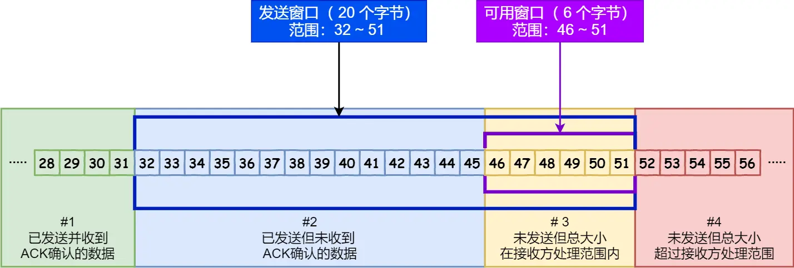
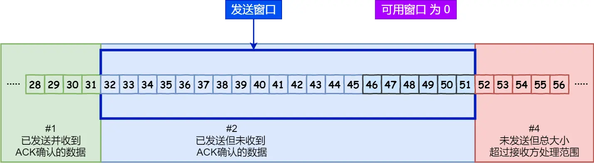
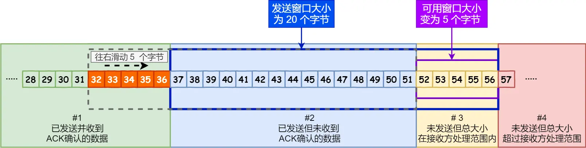
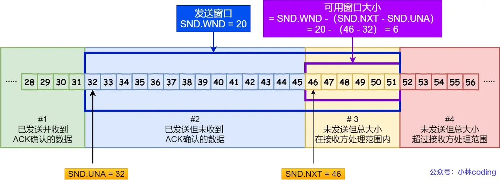
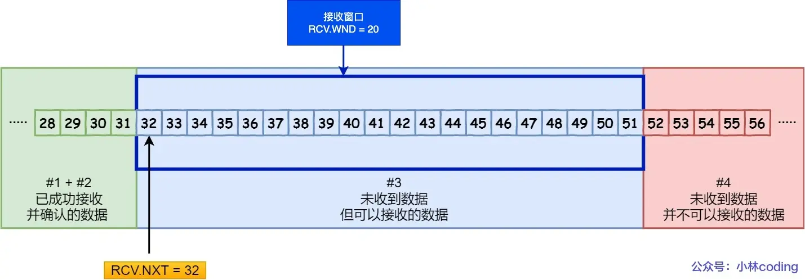

# 滑动窗口

## 目录

- [引入窗口的原因](#引入窗口的原因)
- [窗口的含义](#窗口的含义)
- [窗口大小的决定](#窗口大小的决定)
- [发送方的滑动窗口](#发送方的滑动窗口)
- [接收方的滑动窗口](#接收方的滑动窗口)
- [接收窗口和发送窗口的大小是相等的吗？](#接收窗口和发送窗口的大小是相等的吗？)

## 引入窗口的原因
TCP 是每发送一个数据，都要进行一次确认应答。当上一个数据包收到了应答了， 再发送下一个。这种方式的缺点是效率比较低的，特别是当数据包的往返时间越长，通信的效率就越低。

为解决这个问题，TCP 引入了窗口这个概念。即使在往返时间较长的情况下，它也不会降低网络通信的效率。
## 窗口的含义
那么有了窗口，就可以指定窗口大小，窗口大小就是指无需等待确认应答，而可以继续发送数据的最大值。

窗口的实现实际上是操作系统开辟的一个缓存空间，发送方主机在等到确认应答返回之前，必须在缓冲区中保留已发送的数据。如果按期收到确认应答，此时数据就可以从缓存区清除，其有以下特性：
- 连续发送：在窗口大小之内的数据，无需等待确认应答，可以立刻发送。
- 累计确认：接收方在接受 ACK 确认报文时，确认“到某个序号为止的所有数据都已经成功接收”，而不是对每个数据段单独确认。

## 窗口大小的决定
TCP 头里有一个字段叫 **Window** ，也就是窗口大小。

这个字段是接收端告诉发送端自己还有多少缓冲区可以接收数据。于是发送端就可以根据这个接收端的处理能力来发送数据，而不会导致接收端处理不过来。

**所以，通常窗口的大小是由接收方的窗口大小来决定的。**

发送方发送的数据大小不能超过接收方的窗口大小，否则接收方就无法正常接收到数据。

## 发送方的滑动窗口

### 程序是如何表示发送方的四个部分的呢？

TCP 滑动窗口方案使用三个指针来跟踪在四个传输类别中的每一个类别中的字节。其中两个指针是绝对指针（指特定的序列号），一个是相对指针（需要做偏移）。
- `SND.WND`：表示发送窗口的大小（大小是由接收方指定的）；
- `SND.UNA`（Send Unacknoleged）：是一个绝对指针，它指向的是已发送但未收到确认的第一个字节的序列号，也就是 #2 的第一个字节。
- `SND.NXT`：也是一个绝对指针，它指向未发送但可发送范围的第一个字节的序列号，也就是 #3 的第一个字节。
- 指向 #4 的第一个字节是个相对指针，它需要 SND.UNA 指针加上 SND.WND 大小的偏移量，就可以指向 #4 的第一个字节了。

## 接收方的滑动窗口

其中三个接收部分，使用两个指针进行划分:

- `RCV.WND`：表示接收窗口的大小，它会通告给发送方。
- `RCV.NXT`：是一个指针，它指向期望从发送方发送来的下一个数据字节的序列号，也就是 #3 的第一个字节。
- 指向 #4 的第一个字节是个相对指针，它需要 RCV.NXT 指针加上 `RCV.WND` 大小的偏移量，就可以指向 #4 的第一个字节了。
## 接收窗口和发送窗口的大小是相等的吗？
并不是完全相等，接收窗口的大小是约等于发送窗口的大小的。

因为滑动窗口并不是一成不变的。比如，当接收方的应用进程读取数据的速度非常快的话，这样的话接收窗口可以很快的就空缺出来。那么新的接收窗口大小，是通过 TCP 报文中的 Windows 字段来告诉发送方。那么这个传输过程是存在时延的，所以接收窗口和发送窗口是约等于的关系