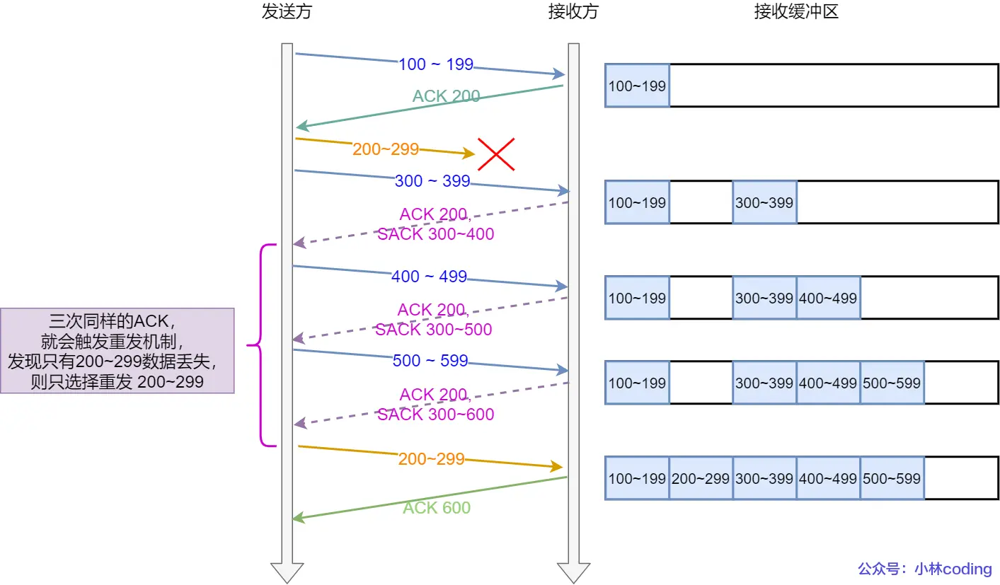
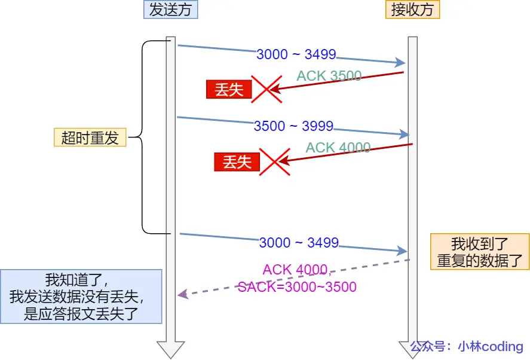
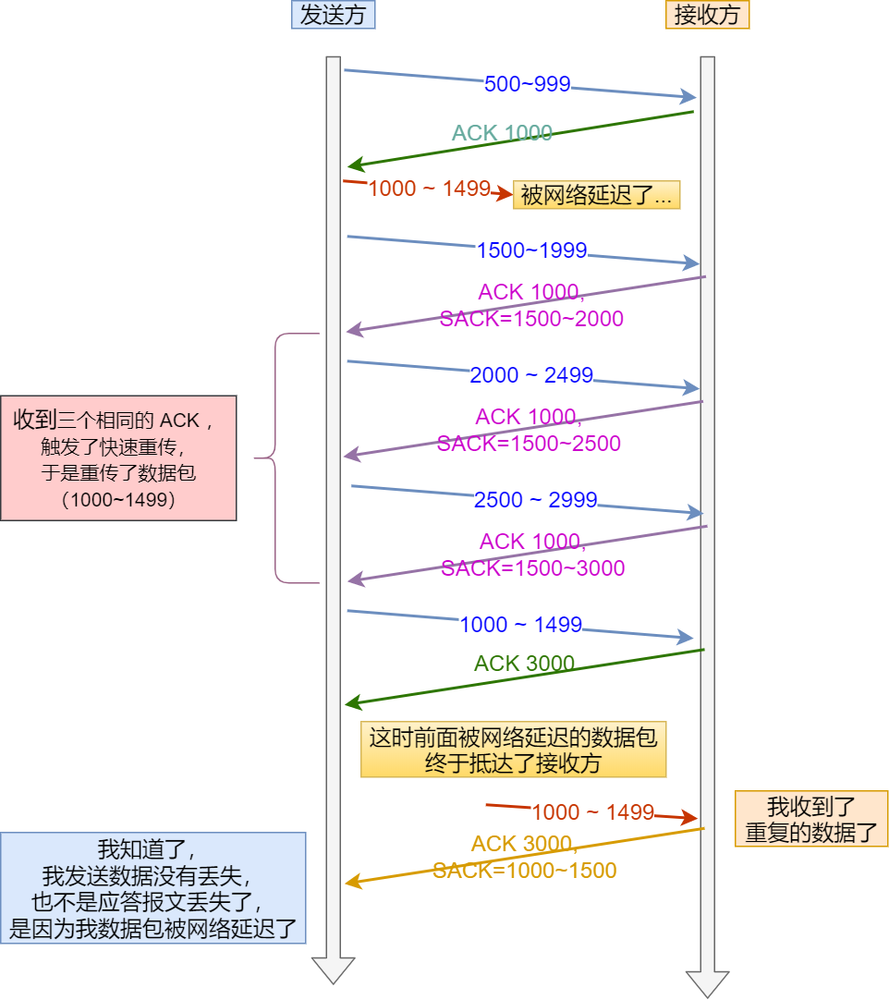

# tcp-重传机制
TCP 针对数据包丢失的情况，会用重传机制解决：
- [超时重传](#超时重传)
    - [超时重传的时间设定](#超时重传的时间设定)
    - [Linux 系统超时时间的计算](#linux-系统超时时间的计算)
- [快速重传](#快速重传)
    - [快速重传的问题](#快速重传的问题)
- [SACK](#sack)
- [D-SACK](#d-sack)
    - [发生 ACK 丢包](#发生-ack-丢包)
    - [发生网络延时](#发生网络延时)

## 超时重传
重传机制的其中一个方式，就是在发送数据时，设定一个定时器，当超过**指定的时间**后，没有收到对方的 ACK 确认应答报文，就会重发该数据，也就是我们常说的超时重传。

一般情况下，**数据包丢失**，或者 **ACK 确认应答丢失**都会导致超时重传，但**数据包丢失**导致重传本质上是没有收到对方的 ACK 确认应答报文。

### 超时重传的时间设定
RTT（Round-Trip Time）
- 指往返时延，是数据发送时刻到接收到确认的时刻的差值，也就是包的往返时间。

RTO （Retransmission Timeout ）
- 指超时重传时间。

精确的测量超时时间 RTO 的值是非常重要的，这可让我们的重传机制更高效：
- 当超时时间 RTO 较大时，重发就慢，丢了老半天才重发，没有效率，性能差；
- 当超时时间 RTO 较小时，会导致可能并没有丢就重发，于是重发的就快，会增加网络拥塞，导致更多的超时，从而导致更多的重发。

因此，超时重传时间 RTO 的值应该略大于报文往返 RTT 的值。

但是，实际上**报文往返 RTT 的值**是经常变化的，因为我们的网络也是时常变化的。也就因为**报文往返 RTT 的值**是经常波动变化的，所以**超时重传时间 RTO 的值**应该是一个动态变化的值。

###  Linux 系统超时时间的计算
估计往返时间，通常需要采样以下两个：

- 需要 TCP 通过采样 RTT 的时间，然后进行加权平均，算出一个**平滑 RTT** 的值，而且这个值还是要不断变化的，因为网络状况不断地变化。
- 除了采样 RTT，还要采样 **RTT 的波动范围**，这样就避免如果 RTT 有一个大的波动的话，很难被发现的情况。

根据 RFC6298 ，TCP 推荐使用以下公式动态计算超时重传时间 RTO：
```
1. 首次测量到 RTT 时：
    - SRTT（平滑往返时间） = RTT
    - RTTVAR（RTT 偏差） = RTT / 2
    - RTO = SRTT + max (G, 4 * RTTVAR)
      - 其中 G 为时钟粒度，通常可忽略

2. 之后每次收到新的 RTT 样本时：
    - SRTT = (1 - α) * SRTT + α * RTT
    - RTTVAR = (1 - β) * RTTVAR + β * |SRTT - RTT|
    - RTO = SRTT + max (G, 4 * RTTVAR)
    - 推荐 α = 1/8，β = 1/4

3. RTO 下限通常为 1 秒，上限为 60 秒。
```

如果超时重发的数据，再次超时的时候，又需要重传的时候，TCP 的策略是超时间隔加倍。

这种算法可以让 RTO 更加灵敏地反映网络状况，既能避免过早重传，也能防止重传过慢。

## 快速重传
TCP 还有另外一种快速重传（Fast Retransmit）机制，它不以时间为驱动，而是以数据驱动重传。

当收到三个相同的 ACK 报文时，会在定时器过期之前，重传丢失的报文段。
### 快速重传的问题
快速重传的问题就是重传的时候，是重传一个，还是重传所有的问题。

举个例子，假设发送方发了 6 个数据，编号的顺序是 Seq1 ~ Seq6 ，但是 Seq2、Seq3 都丢失了，那么接收方在收到 Seq4、Seq5、Seq6 时，都是回复 ACK2 给发送方，但是发送方并不清楚这连续的 ACK2 是接收方收到哪个报文而回复的， 那是选择重传 Seq2 一个报文，还是重传 Seq2 之后已发送的所有报文呢（Seq2、Seq3、 Seq4、Seq5、 Seq6） 呢？

如果只选择重传 Seq2 一个报文，那么重传的效率很低。因为对于丢失的 Seq3 报文，还得在后续收到三个重复的 ACK3 才能触发重传。

如果选择重传 Seq2 之后已发送的所有报文，虽然能同时重传已丢失的 Seq2 和 Seq3 报文，但是 Seq4、Seq5、Seq6 的报文是已经被接收过了，对于重传 Seq4 ～Seq6 折部分数据相当于做了一次无用功，浪费资源。

## SACK
SACK（ Selective Acknowledgment）重传机制，也叫选择性确认。

这种方式需要在 TCP 头部「选项」字段里加一个 SACK 的东西，它可以将已收到的数据的信息发送给「发送方」，这样发送方就可以知道哪些数据收到了，哪些数据没收到，知道了这些信息，就可以只重传丢失的数据，其格式如下：
- SACK 选项的 Kind 字段为 5，后面紧跟 Length 字段和若干个 SACK 块（每个 SACK 块由两个 32 位的序号组成，分别表示已收到的连续数据段的左边界和右边界）。
- D-SACK 的本质是 SACK，只不过 SACK 块中描述的是“已重复收到的数据段”。
    ```
    +----------------+----------------+----------------+----------------+
    |   Kind = 5     |   Length = 10  |  Left Edge     |  Right Edge    |
    +----------------+----------------+----------------+----------------+
    |      5         |      10        |     3000       |     3500       |
    +----------------+----------------+----------------+----------------+
    ```

如果要支持 SACK，必须双方都要支持。在 Linux 下，可以通过 net.ipv4.tcp_sack 参数打开这个功能（Linux 2.4 后默认打开）。


## D-SACK
Duplicate SACK 又称 D-SACK，其主要使用了 SACK 来告诉「发送方」有哪些数据被重复接收了。

### 发生 ACK 丢包

- 接收方发给发送方的两个 ACK 确认应答都丢失了，所以发送方超时后，重传第一个数据包（3000 ~ 3499）
- 于是接收方发现数据是重复收到的，于是回了一个 SACK = 3000~3500，告诉发送方 3000~3500 的数据早已被接收了，因为 ACK 都到了 4000 了，已经意味着 4000 之前的所有数据都已收到，所以这个 SACK 就代表着 D-SACK。
- 这样发送方就知道了，数据没有丢，是接收方的 ACK 确认报文丢了。
### 发生网络延时

- 数据包（1000~1499） 被网络延迟了，导致「发送方」没有收到 Ack 1500 的确认报文。
- 而后面报文到达的三个相同的 ACK 确认报文，就触发了快速重传机制，但是在重传后，被延迟的数据包（1000~1499）又到了「接收方」；
- 所以「接收方」回了一个 SACK=1000~1500，因为 ACK 已经到了 3000，所以这个 SACK 是 D-SACK，表示收到了重复的包。
- 这样发送方就知道快速重传触发的原因不是发出去的包丢了，也不是因为回应的 ACK 包丢了，而是因为网络延迟了。

可见，D-SACK 有这么几个好处：
- 可以让发送方知道，是发出去的包丢了，还是接收方回应的 ACK 包丢了;
- 可以知道是不是发送方的数据包被网络延迟了;
- 可以知道网络中是不是把发送方的数据包给复制了;

在 Linux 下可以通过 net.ipv4.tcp_dsack 参数开启/关闭这个功能（Linux 2.4 后默认打开）。