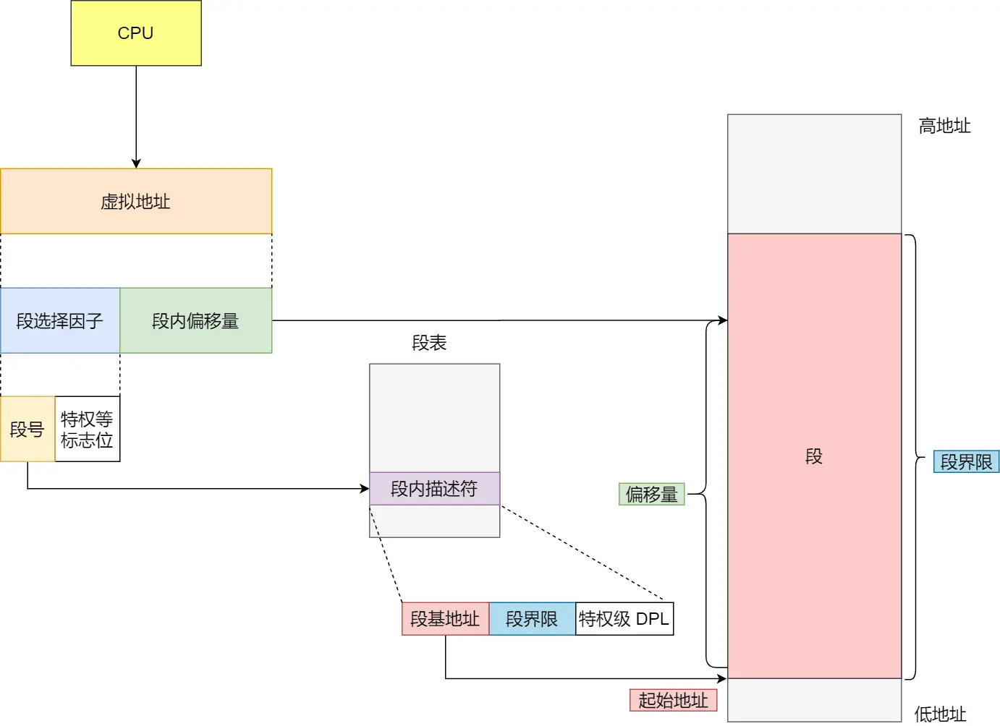
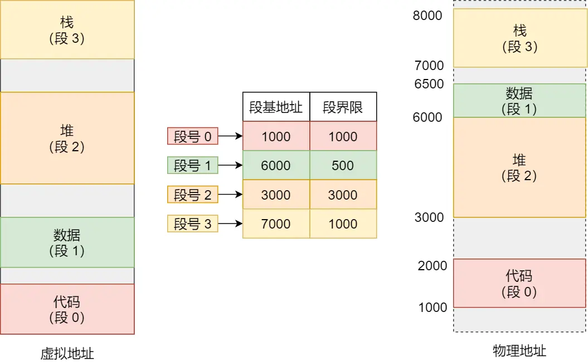

# 内存映射

操作系统主要通过两种方式进行虚拟内存和物理内存之间的映射，分别是内存分段和内存分页，分段是比较早提出的。

## 内存分段
程序是由若干个逻辑分段组成的，如可由代码分段、数据分段、栈段、堆段组成。不同的段是有不同的属性的，所以就用分段（Segmentation）的形式把这些段分离出来。
### 内存分段下的虚拟地址
分段机制下的虚拟地址由两部分组成，段选择因子和段内偏移量。

段选择因子和段内偏移量：
- 段选择子就保存在段寄存器里面。段选择子里面最重要的是段号，用作段表的索引。段表里面保存的是这个段的基地址、段的界限和特权等级等。
- 虚拟地址中的段内偏移量应该位于 0 和段界限之间，如果段内偏移量是合法的，就将段基地址加上段内偏移量得到物理内存地址。

### 内存分段与内存碎片
内存分段会带来内存碎片的问题，和内存交换的效率低的问题。

## 内存分页
分段的好处就是能产生连续的内存空间，但是会出现「外部内存碎片和内存交换的空间太大」的问题。

分页是把整个虚拟和物理内存空间切成一段段固定尺寸的大小。这样一个连续并且尺寸固定的内存空间，我们叫页（Page）。在 Linux 下，每一页的大小为 4KB。

页表是存储在内存里的，内存管理单元 （MMU）就做将虚拟内存地址转换成物理地址的工作。

而当进程访问的虚拟地址在页表中查不到时，系统会产生一个缺页异常，进入系统内核空间分配物理内存、更新进程页表，最后再返回用户空间，恢复进程的运行。

### 内存分页下的虚拟地址

### 内存分页与内存碎片

## 内存段页式管理