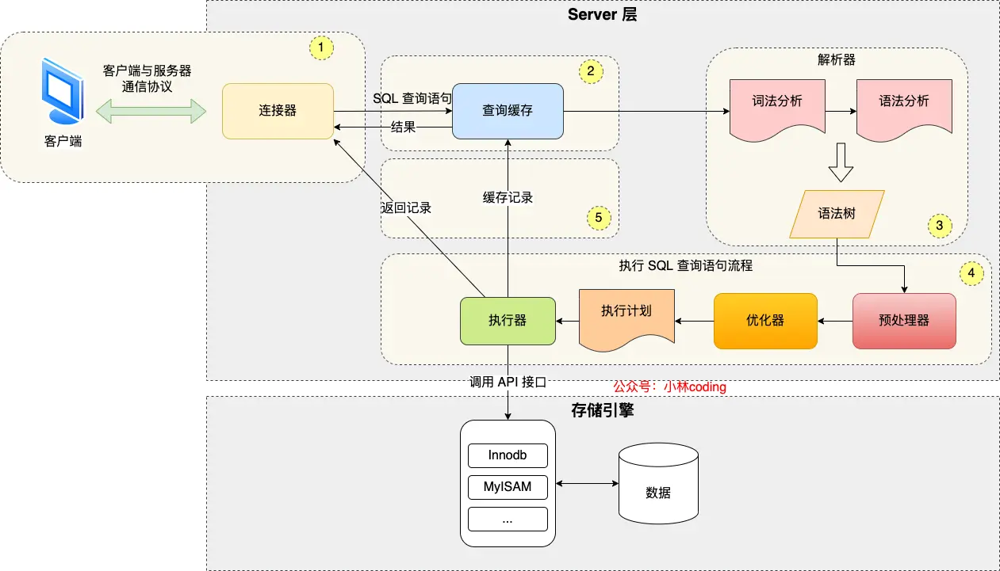

# mysql-执行流程

**目录：**
- [连接 SQL](#连接-sql)
    - [连接器](#连接器)
    - [问题1：如何 mysql查看连接数量？](#问题1如何-mysql查看连接数量)
    - [问题2：mysql 空闲连接会一直占用着吗？](#问题2mysql-空闲连接会一直占用着吗)
    - [问题3：mysql 的连接数有限制吗？](#问题3mysql-的连接数有限制吗)
    - [问题4：怎么解决长连接占用内存的问题？](#问题4怎么解决长连接占用内存的问题)
- [查询缓存](#查询缓存)
- [解析 SQL](#解析-sql)
    - [解析器](#解析器)
- [执行 SQL](#执行-sql)
    - [预处理器](#预处理器)
    - [优化器](#优化器)
    - [执行器](#执行器)

```sql
// 在 table 中查找 id 为 1 的记录
select * from table where id = 1;
```



可以看到，mysql 架构可以分为两部分：Server 服务层，存储引擎层
- Server 服务层负责建立连接、分析和执行 sql 语句。MySQL 大多数的核心功能都在这里实现，主要包括连接器、查询缓存、解析器、预处理器、优化器、执行器等。另外，所有的内置函数和所有跨存储引擎的功能都在这里实现。
- 存储引擎层负责数据的存储和提取。支持 InnoDB、MyISAM、Memory 等多个存储引擎，不同的存储引擎共用一个 Server 层。目前，最常用的存储引擎是 InnoDB，从 MySQL5.5 版本开始，InnoDB 成为了 MySQL 默认的存储引擎。

## 连接 SQL
### 连接器
使用 mysql 的前提，肯定是要与 mysql 服务器建立连接，普遍使用如下命令建立连接：
```sql
mysql -h$ip -u$user -p
```
连接过程需要先经过 TCP 三次握手，因为 mysql 是基于 TCP 协议进行传输的，会经过如下流程：
- 如果 mysql 服务运行不正常，会收到一个“Can't connect to local MySQL server through socker”的错误。
- 如果 mysql 服务运行正常。
    - 如果用户名或密码验证错误，会收到一个“Access denied for user”的错误，然后客户端程序结束运行。
    - 如果用户名或密码验证正确。连接器会获得该用户的权限，然后将其保存起来，后续该用户在此连接里的任何操作，都会基于连接开始时读到的权限进行权限逻辑的判断。

所以，如果一个用户已经建立了连接，即使管理员中途修改了该用户的权限，也不会影响已经存在连接的权限，修改完成后，只有再新建的连接才会使用新的权限设置。

### 问题1：如何 mysql查看连接数量？
```sql
show processlist;
```
式样上述命令查看连接数量。
### 问题2：mysql 空闲连接会一直占用着吗？
当然不会，mysql 定义了空闲连接的最长空闲时长，由 wait_timeout 参数控制，默认值时 8 小时，如果空闲连接超过了这个时间，连接器就会自动将其断开。
当然也可以手动断开空闲的连接，使用如下命令：
```sql
kill connection + 6;
// kill connection + id;
```
### 问题3：mysql 的连接数有限制吗？
当然有限制，mysql 服务支持的最大连接数由 max_connections 参数控制，当连接数量超过这个值，系统就会拒绝接下来的连接请求，并报错提示“Too many connections”。
### 问题4：怎么解决长连接占用内存的问题？
mysql 的连接和 http 一样，也有短连接和长连接的概念，区别如下：
- 短连接每执行一次 sql 语句，都要重新建立一次 TCP 连接
- 长连接下，多个 sql 语句可以复用一个 TCP 连接

可以看到，使用长连接的好处就是可以减少建立连接和断开连接的过程，所以一般 mysql 都推荐使用长连接。

**但是**，使用长连接后，可能会导致系统占用内存增多，因为 mysql 再执行查询过程中临时使用内存管理连接对象，这些连接对象资源只有再连接断开时才会释放。如果长连接累计很多，将导致 mysql 服务占用内存太大，有可能会被系统强制杀死，这样会发生 mysql 服务异常重启的现象。

**对于**，上述问题，可以有两种解决方法：
- 方法1：定义断开长连接。
- 方法2：客户端主动重置连接。mysql5.7 版本实现了 `mysql_reset_connection()` 函数的接口，当客户端执行一个很大的操作后，在代码里调用 `mysql_reset_connection()` 函数来重置连接，达到释放内存的效果。这个过程不需要重连和重新做权限验证，但是会将连接恢复到刚刚创建完时的状态。
## 查询 SQL 缓存
### 查询缓存
连接器完成连接后，客户端可以向 mysql 服务端发送 sql 语句，mysql 服务端在收到 sql 语句后，就会解析出 sql 语句的第一个字段，看看是什么类型的语句。

如果 sql 语句是查询语句，mysql 就会先去查询缓存里查找数据，这个查询缓存是以键值对的方式存储在内存中的，键为 sql 查询语句，值为 sql 语句的查询结果。

如果查询的语句命中缓存，那么就会直接返回查询结果给客户端；如果没有命中缓存，那么就会继续执行，等执行完成后，查询的结果就会被存入查询缓存中。

由于对于更新很频繁的表，查询缓存的命中率很低，因为只要有一个表有更新草错，那么这个表的查询缓存就会被清空。

所以，mysql8.0 版本直接将查询缓存删除了，而对于 mysql8.0 之前的版本，可以通过将 `query_cache_type` 设置为 `DEMAND` 关闭查询缓存。
## 解析 SQL
### 解析器
在正式执行 sql 语句前，会先对 sql 语句做解析。
解析器一般会做两件事情：
- 词法分析：mysql 会根据你输入的字符串识别出关键字
- 语法分析：根据词法分析的结果，语法解析器会根据语法规则，判断你输入的这个 sql 语句是否满足 mysql 语法，如果没有问题就会构建出 sql 语法树。

但是，如果我们输入的 sql 语句不正确，就会在解析器这个阶段报错，“You have an error in your SQL syntax; check the manual ...”。
## 执行 SQL
经过解析器后，接着就会进入执行 sql 查询语句的流程了，每条 select 查询语句流程主要分为下面三个阶段：
- 预处理阶段
- 优化阶段
- 执行阶段
### 预处理器
在预处理器中，mysql 会：
- 检查 sql 查询语句中的表或者字段是否存在；
- 将 `select *` 中的 `*` 符号，扩展为表上的所有列； 
### 优化器
经过预处理阶段后，还需要为 sql 查询语句先指定一个执行计划，这个工作交由优化器来完成。

优化器主要将 sql 查询语句的执行方案确定下来，比如在表里面有很多个索引的时候，优化器就会基于查询成本的考虑，来决定选择使用哪个索引，常见的索引方式有：主键索引、全表索引、覆盖索引等等，这些方式可以通过 `explain` 语句进行查询。
### 执行器
最后，mysql 通过执行器真正开始执行语句。
