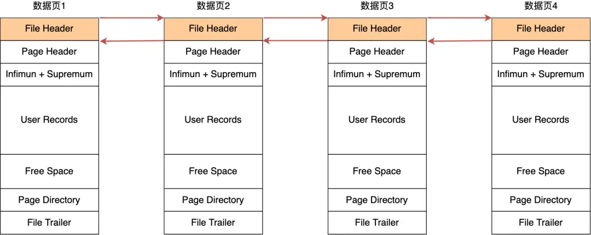

# 数据页和 B+Tree

**目录：**
- [InnoDB 是如何存储数据的？](#innodb-是如何存储数据的)
    - [数据页的结构](#数据页的结构)
    - [页目录与记录的关系](#页目录与记录的关系)
- [B+Tree 是如何进行查询的？](#btree-是如何进行查询的)
    - [B+Tree 的特点](#btree-的特点)
    - [B+Tree 查询记录](#btree-查询记录)
- [聚簇索引和二级索引？](#聚簇索引和二级索引)
    - [回表](#回表)
    - [索引覆盖](#索引覆盖)

## InnoDB 是如何存储数据的？
InnoDB 的数据是按数据页为单位来读写的，也就是，当需要读一条记录的时候，并不是将这个记录本身从磁盘读出来，而是以页为单位，将其整体读入内存。

数据库的 I/O 操作的最小单位是页，**InnoDB 数据页的默认大小是 16 KB**，意味着数据库每次读写都是以 16 KB 为单位的，一次最少从磁盘中读取 16 KB 的内容到内存中，一次最少把内存中的 16 KB 内容刷新到磁盘中。
### 数据页的结构
数据页包括七个结构：
- 文件头（38字节）
- 页头（56字节）
- 最大、最小记录（26字节）
- 用户记录（不确定）
- 空闲空间（不确定）
- 页目录（不确定）
- 文件尾（8字节）

**7 个部分的作用如下**：
|名称|说明|
|---|---|
|文件头|表示页的信息|
|页头|表示页的状态信息|
|最大、最小记录|两个虚拟的伪记录，分别表示页中的最小记录和最大记录|
|用户记录|存储行记录内容|
|空闲空间|页中还没被使用的空间|
|页目录|存储用户记录的相对位置，对记录起到索引作用|
|文件尾|校验页是否完整|

在文件头中有两个指针，分别指向上一个数据页和下一个数据页，连接起来的页相当于一个双向链表。

### 页目录与记录的关系

## B+Tree 是如何进行查询的？
### B+Tree 的特点
### B+Tree 查询记录
## 聚簇索引和二级索引？
### 回表
### 索引覆盖