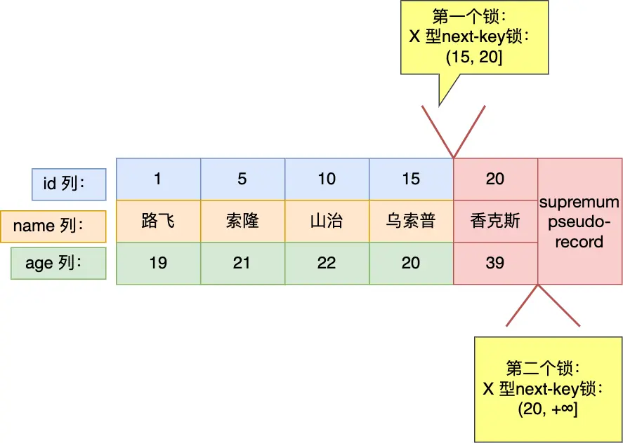
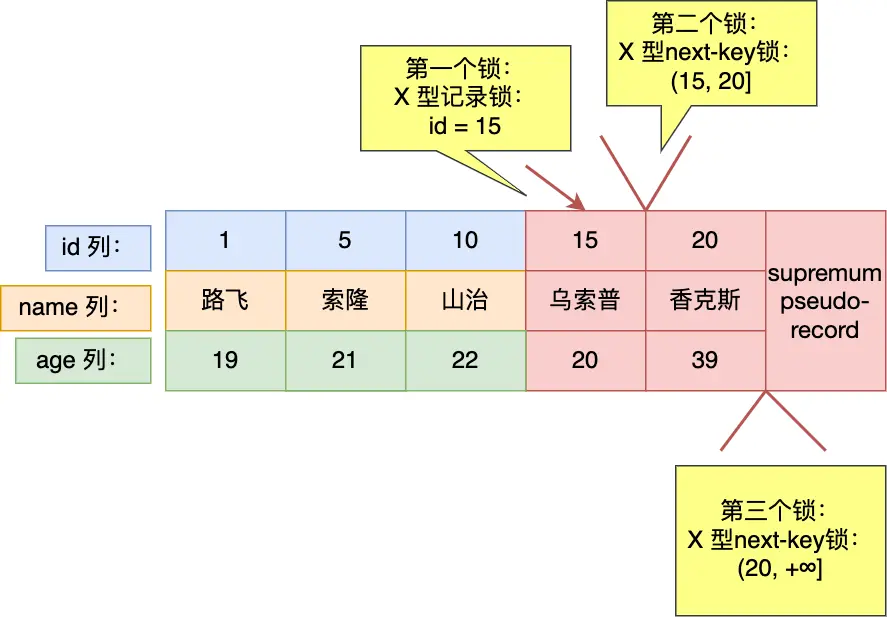
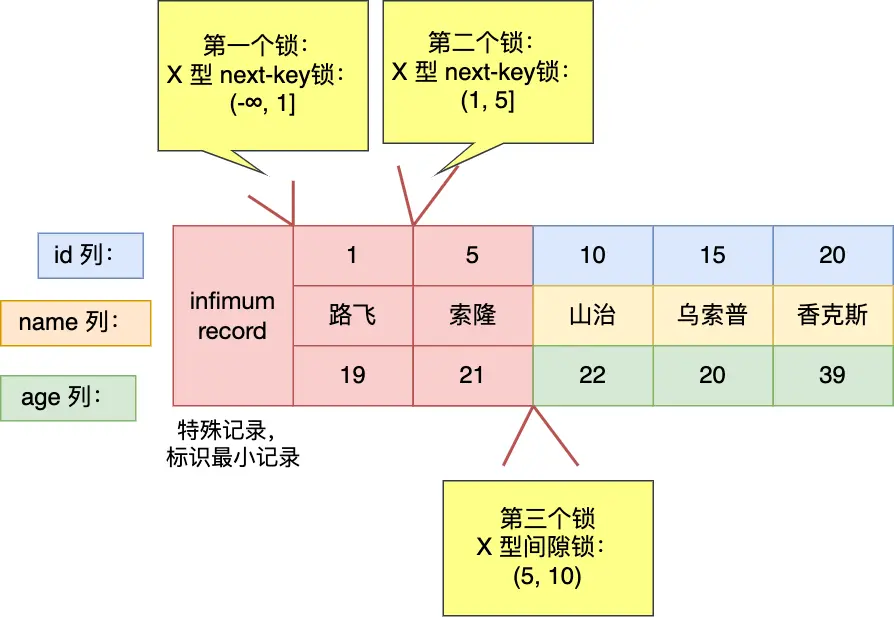
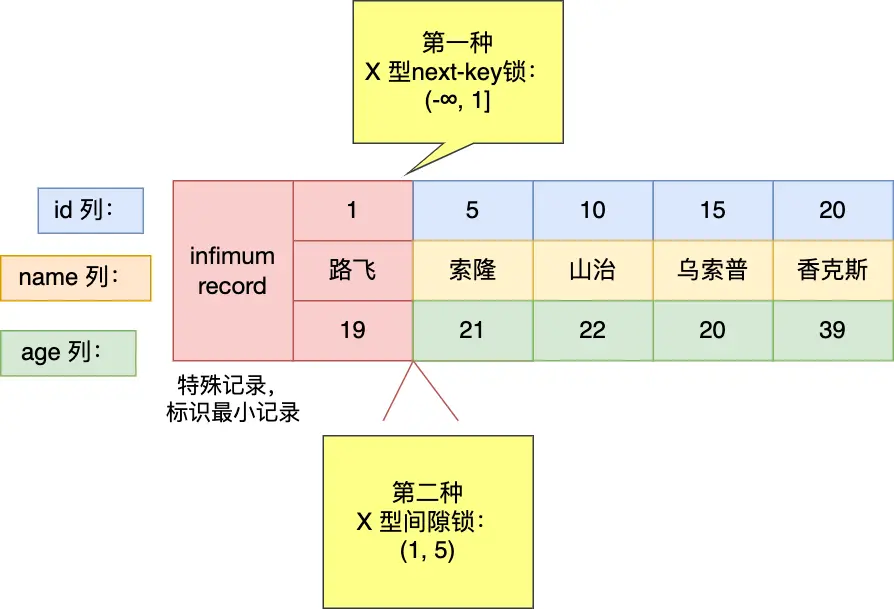
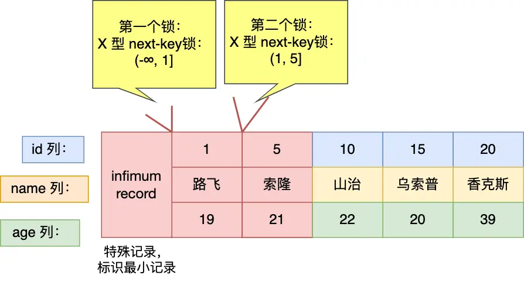
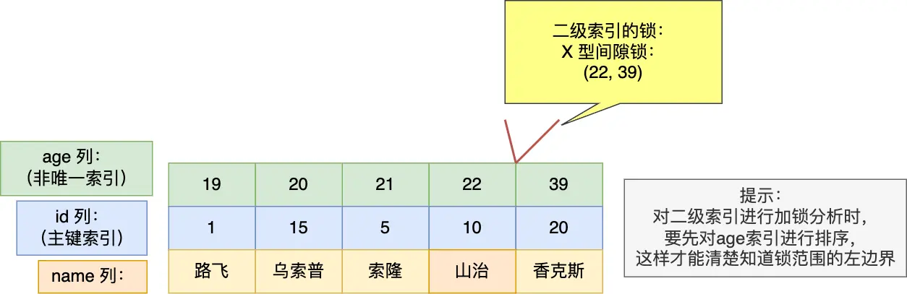
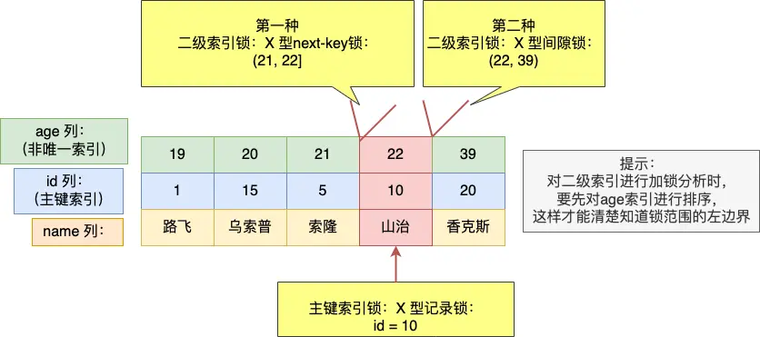
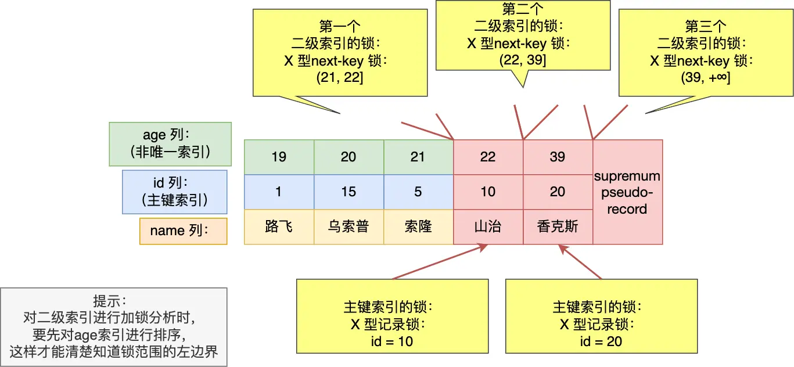

# 加行级锁的时机
## 目录
- [什么 sql 语句会加行级锁？](#什么-sql-语句会加行级锁)
    - [普通 select 语句不会对记录加锁](#普通-select-语句不会对记录加锁)
    - [锁定读加锁](#锁定读加锁)
    - [update 和 delete 操作](#update-和-delete-操作)
- [mysql 如何加行级锁](#mysql-如何加行级锁)
    - [唯一索引等值查询](#唯一索引等值查询)
    - [唯一索引范围查询](#唯一索引范围查询)
    - [非唯一索引等值查询](#非唯一索引等值查询)
    - [非唯一索引范围查询](#非唯一索引范围查询)
    - [无索引的查询](#无索引的查询)
    
## 什么 sql 语句会加行级锁？
### 普通 select 语句不会对记录加锁
普通的 select 语句是不会对记录加锁的（除了串行化隔离级别），因为它属于快照读，是通过 MVCC（多版本并发控制）实现的。
### 锁定读加锁
```sql
select ... lock in share mode;

select ... for update
```
### update 和 delete 操作
```sql
update table ... where id = 1;

delete from table where id = 1;
```

## mysql 如何加行级锁
**注意**，加锁的对象是索引，加锁的基本单位是 next-key lock，它是由记录锁和间隙锁组合而成的，next-key lock 是前开后闭区间，而间隙锁是前开后开区间。

但是，next-key lock 在一些场景下会退化成记录锁或间隙锁。

### 唯一索引等值查询
```sql
select * from user where id = 1 for update;
```
- 当查询的记录是存在时，在索引树上定位到这一条记录后，该记录的索引中的 next-key lock 会退化成**记录锁**。
- 当查询的记录时不存在时，在索引树找到第一条大于该查询记录的记录后，该记录的索引中的 next-key lock 会退化为**间隙锁**。

### 唯一索引范围查询
当唯一索引进行范围查询时，会对每一个扫描到的索引加 next-key 锁，然后如果遇到下面这些情况，会退化成记录锁或者间隙锁。
- 针对**大于或者大于等于**的范围查询，因为存在等值查询的条件，那么如果等值查询的记录是存在于表中，那么该记录的索引中的 next-key 锁会退化成记录锁。
- 针对**小于或者小于等于**的范围查询，要看条件值的记录是否存在于表中：
    - **当条件值的记录不在表中**，那么不管是小于还是小于等于条件的范围查询，扫描到终止范围查询的记录，该记录的索引的 next-key 锁会退化成间隙锁，其他扫描到的记录，都是在这些记录索引上加next-key 锁。
    - **当条件值的记录在表中**，如果是**小于**条件范围查询，扫描到终止范围查询的记录时，该记录的索引的 next-key 锁会退化成间隙锁，其他扫描到的记录，都是在这些记录的索引上加 next-key 锁；如果**小于等于**条件的范围查询，扫描到终止范围查询的记录时，该记录的索引 next-key 锁不会退化成间隙锁。其他扫描到的记录都是在这些记录的索引上加上 next-key 锁。

**大于时：**
```sql
select * from user where id > 15 for update;
```


**大于等于时：**
```sql
select * from user where id >= 15 for update;
```


**小于时：**
```sql
select * from user where id < 6 for update;
```


```sql
select * from user where id < 5 for update;
```

**小于等于时：**
```sql
select * from user where id <= 5 for update;
```


### 非唯一索引等值查询
当使用非唯一索引进行等值查询的时候，因为存在两个索引，一个是主键索引，一个是非唯一索引（二级索引），所以在加锁时，同时会对这两个索引都枷锁，但是对主键索引加锁的时候，只有满足查询条件的记录才会对它们的主键索引加锁。

针对非唯一索引等值查询时，查询的记录存不存在，加锁的规则也会不同：
- **当查询的记录存在时**，由于不是唯一索引，所以肯定存在索引值相同的记录，于是非唯一索引等值查询的过程是一个扫描的过程，直到扫描到第一个不符合条件的二级索引记录就停止扫描，然后在扫描的过程中，对扫描到的二级索引记录加的是 next-key 锁，而对于第一个不符合条件的二级索引记录，该二级索引的 next-key 锁会退化成间隙锁。同时，在符合查询条件的记录的主键索引上加记录锁。
- **当查询的记录不存在时**，扫描到第一条不符合条件的二级索引记录，该二级索引的 next-key 锁会退化成间隙锁。因为不存在满足查询条件的记录，所以不会对主键索引加锁。

**记录不存在时：**
```sql
select * from user where age = 25 for update;
```


> 当有一个事务持有二级索引的间隙锁 (22, 39) 时，什么情况下，可以让其他事务的插入 age = 22 或者 age = 39 记录的语句成功？又是什么情况下，插入 age = 22 或者 age = 39 记录时的语句会被阻塞？

二级索引树是按照二级索引值（age列）按顺序存放的，在相同的二级索引值情况下， 再按主键 id 的顺序存放。

- **当其他事务插入一条 age = 22，id = 3 的记录的时候**，在二级索引树上定位到插入的位置，而该位置的下一条是 id = 10、age = 22 的记录，该记录的二级索引上没有间隙锁，所以这条插入语句可以执行**成功**。
- **当其他事务插入一条 age = 22，id = 12 的记录的时候**，在二级索引树上定位到插入的位置，而该位置的下一条是 id = 20、age = 39 的记录，正好该记录的二级索引上有间隙锁，所以这条插入语句会被阻塞，插入**失败**。
- **当其他事务插入一条 age = 39，id = 3 的记录的时候**，在二级索引树上定位到插入的位置，而该位置的下一条是 id = 20、age = 39 的记录，正好该记录的二级索引上有间隙锁，所以这条插入语句会被阻塞，插入**失败**。
- **当其他事务插入一条 age = 39，id = 21 的记录的时候**，在二级索引树上定位到插入的位置，而该位置的下一条记录不存在，也就没有间隙锁了，所以这条插入语句可以插入**成功**。

**记录存在时：**
```sql
select * from user where age = 22 for update;
```


### 非唯一索引范围查询
非唯一索引和主键索引的范围查询的加锁也有所不同，不同之处在于非唯一索引范围查询，索引的 next-key lock 不会有退化为间隙锁和记录锁的情况，也就是非唯一索引进行范围查询时，对二级索引记录加锁都是加 next-key 锁。
```sql
select * from user where age >= 22  for update;
```

### 无索引的查询
如果锁定读查询语句，没有使用索引列作为查询条件，或者查询语句没有走索引查询，导致扫描是全表扫描。那么，每一条记录的索引上都会加 next-key 锁，这样就相当于锁住的全表，这时如果其他事务对该表进行增、删、改操作的时候，都会被阻塞。

不只是锁定读查询语句不加索引才会导致这种情况，update 和 delete 语句如果查询条件不加索引，那么由于扫描的方式是全表扫描，于是就会对每一条记录的索引上都会加 next-key 锁，这样就相当于锁住的全表。

因此，在线上在执行 update、delete、select ... for update 等具有加锁性质的语句，一定要检查语句是否走了索引，如果是全表扫描的话，会对每一个索引加 next-key 锁，相当于把整个表锁住了，这是挺严重的问题。
