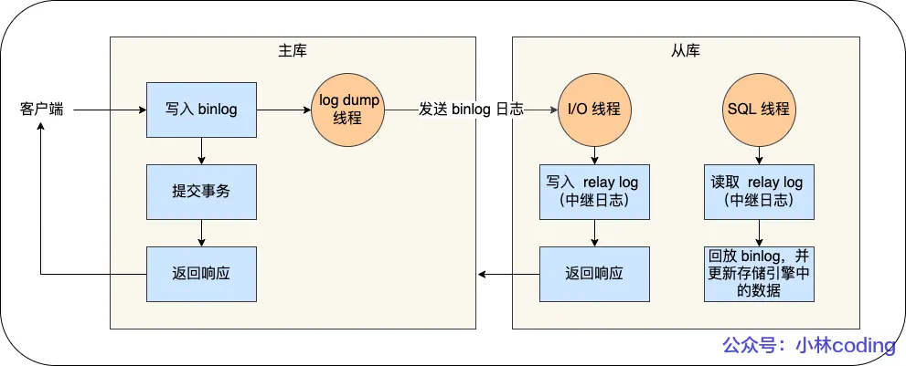

# binlog
**目录**
- [什么是 binlog？](#什么是-binlog)
- [为什么有了 binlog 还要有 redo log？](#为什么有了-binlog-还要有-redo-log)
- [redo log 和 binlog 的区别](#redo-log-和-binlog-的区别)
    - [适用对象不同](#适用对象不同)
    - [文件格式不同](#文件格式不同)
    - [写入方式不同](#写入方式不同)
    - [用途不同](#用途不同)

像 undo log 和 redo log 都是由 InnoDB 引擎生成的。但是 mysql 在完成一条更新操作后，Sercer 层还会生成一条 bin log，等之后事务提交的时候，会将该事务执行过程中产生的所有 binlog 统一写入 binlog 文件。

## 什么是 binlog？
binlog 文件是记录了所有数据库表结构变更和表数据修改的日志，不会记录查询类的操作，比如 select 和 show 等操作。

## 为什么有了 binlog 还要有 redo log？
这个属于历史问题。最开始 mysql 里并没有 InnoDB 引擎，mysql 自带的引擎是 MyISAM，但是 MyISAM 没有 crash-safe 的能力，binlog 只能用于归档。

而InnoDB 是另一个公司以插件的形式插入 mysql 的，通过 redo log 来实现了 crash-safe 的能力。

## redo log 和 binlog 的区别？

### 适用对象不同
- binlog 是 MySQL 的 Server 层实现的日志，所有存储引擎都可以适用；
- redo log 是 InnoDB 存储引擎实现的日志。
### 文件格式不同
- binlog 由三种格式类型，分别是 STATEMENT（默认格式）、ROW、MIXED，如下：
    - STATEMENT：每一条修改数据的 SQL 都会被记录到 binlog 中（相当于记录了操作逻辑），针对这种格式，binlog 可以被称为逻辑日志，主从复制中 slave 端再根据 SQL 语句重现。但是，**会出现动态函数（NOW）不一致的问题**。
    - ROW：记录最终行数据被修改成什么样子了，此时 binlog 就不能再被称为逻辑日志了，不会出现 STATEMENT 下动态函数的问题。但是，此时 ROW 的缺点是每行数据的变化结果都会被记录，从而导致 binlog **文件过大**。
    - MIXED：包含 STATEMENT 和 MIXED 模式，它会根据情况的不同自动适用 ROW 模式和 STATEMENT 模式。
### 写入方式不同
- binlog 是追加写。写满一个文件，就创建一个新的文件继续写，不会覆盖以前的日志，保存的是全量的日志
- redo log 是循环写。日志空间大小固定，全部写满就从头开始，保存未被刷入磁盘的脏页日志。
### 用途
不同
- binlog 主要用于备份恢复、主从复制
- redo log 用于掉电等故障恢复

### 不小心将整个数据库的数据删除后，适用哪种日志恢复？
适用 binlog 文件恢复，因为 redo log 文件是循环写，是会边写边擦除日志的，只是用于记录未被刷入磁盘的数据的物理日志，已经写入磁盘的数据都会被从 redo log 中删除。

binlog 保存是全量的日志，也就是保存了所有数据变更的情况，理论上只要记录在 binlog 上的数据都可以恢复。

## 主从复制

### 主从复制的实现流程

- 写入 Binlog：主库写 binlog 日志，提交事务，并更新本地存储数据。
    - MySQL 主库在收到客户端提交事务的请求之后，会先写入 binlog，再提交事务，更新存储引擎中的数据，事务提交完成后，返回给客户端“操作成功”的响应。
- 同步 Binlog：把 binlog 复制到所有从库上，每个从库把 binlog 写到暂存日志中。
    - 从库会创建一个专门的 I/O 线程，连接主库的 log dump 线程，来接收主库的 binlog 日志，再把 binlog 信息写入 relay log 的中继日志里，再返回给主库“复制成功”的响应。
- 回放 Binlog：回放 binlog，并更新存储引擎中的数据。
    - 从库会创建一个用于回放 binlog 的线程，去读 relay log 中继日志，然后回放 binlog 更新存储引擎中的数据，最终实现主从的数据一致性。