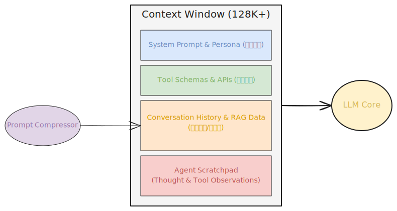

# 深度解析：AI Agent 上下文管理 (Context Management) 核心八股与学习指南

## 目录
1. [引言：什么是上下文 (Context)？为何它是 Agent 的“思考舞台”？](#1-引言什么是上下文-context为何它是-agent-的思考舞台)
2. [Context Window (上下文窗口) 的痛点与三大危机](#2-context-window-上下文窗口-的痛点与三大危机)
3. [大模型上下文的构成解剖](#3-大模型上下文的构成解剖)
4. [基础上下文截断与管理策略](#4-基础上下文截断与管理策略)
5. [进阶策略：上下文压缩技术 (Prompt Compression)](#5-进阶策略上下文压缩技术-prompt-compression)
6. [颠覆性基座技术：Prompt Caching (API 级 KV 缓存)](#6-颠覆性基座技术prompt-caching-api-级-kv-缓存)
7. [多智能体 (Multi-Agent) 间的上下文流转](#7-多智能体-multi-agent-间的上下文流转)
8. [大厂面试“拷问”真题 (八股系列)](#8-大厂面试拷问真题-八股系列)

---

## 1. 引言：什么是上下文 (Context)？为何它是 Agent 的“思考舞台”？

在 AI Agent 架构中，**上下文 (Context)** 是传递给大语言模型 (LLM) 的所有当前环境信息、历史对话、系统指令和可用工具列表的总和。如果说大模型是 Agent 的“大脑计算中枢”，那么上下文就是它的**“工作记忆区” (Working Memory) 或是“思考舞台”**。 

大模型本身是无状态的 (Stateless)，意味着每次调用它时，它都不记得上一次调用发生了什么。为了让 Agent 能够解决复杂、多步推理的问题，开发者必须通过精密设计的“上下文管理”机制，将所有必要的背景信息在一个请求 (Prompt) 内包装好，发送给大模型。

上下文管理的核心目标：**在有限的 Token 额度和成本下，最大化信息密度，避免信息过载或遗失，保障 Agent 持续且连贯的推理状态。**

## 2. Context Window (上下文窗口) 的痛点与三大危机

早期的 LLM 上下文窗口极小 (如 GPT-3 的 4K Token)，尽管现代模型 (如 GPT-4 Turbo, Claude 3 Opus) 已经支持 128K 到 1M 甚至 2M 的超大窗口，我们依然面临巨大的上下文管理痛点。这被称为上下文的**三大危机**：

1. **Lost in the Middle (迷失在中间) 效应**  
   根据多项学术研究表证，当提供给 LLM 的上下文极长时，模型对文章“开头”和“结尾”的信息提取准确率极高 (呈 U 型曲线)，但对“中间段落”的信息往往会“视而不见”。即便窗口扩大，简单粗暴地将所有历史塞入 prompt 依然会导致关键推理线索的丢失。这就催生了 NIAH (Needle In A Haystack，大海捞针) 测试。
2. **TTFT 延迟危机与计算成本 (首字生成时间)**  
   输入给模型的每一个 Token，LLM 都需要通过 Attention 机制来计算它们之间的关联矩阵。更长的上下文意味着更慢的 `Time-To-First-Token` (TTFT)。此外，云端 API 是按输入 Token 计费的，如果 Agent 每思考一步都要带上 10 万字的背景，成本将是指数级爆炸。
3. **指令稀释 (Prompt Dilution)**  
   如果在上下文中堆积了太多的冗余检索内容或非核心历史对话，原始的系统级行为指令 (System Prompt) 及其角色约束的权重将被稀释，导致 Agent “产生幻觉”、越狱 (Jailbreak) 或忘记原本的任务。

## 3. 大模型上下文的构成解剖

一个标准的高阶 Agent，其发送给 LLM 的 Context Window 内部，结构往往如下：

1. **System Prompt & Persona (系统提示与角色设定)**  
   这是最关键的部分，定义了 Agent 的角色、最终目标、禁止行为和输出格式。通常置于上下文的绝对最前端。
2. **Tool Schemas & APIs (可用工具定义)**  
   Agent 需要知道当前环境中有哪些 Function / Tool 可以调用。这些通常也是以特定格式 (如 JSON Schema 或 XML) 编码进上下文中。
3. **Conversation / Execution History (执行历史与对话)**  
   记录了之前的多轮 QA 对话，或者上一步 Agent 的 `Action` 和 `Observation`。这是占用 Token 大头的部分。
4. **Contextual Knowledge / RAG Data (环境补充知识)**  
   通过向量检索或其他方式动态获取的“外部世界”信息。
5. **Current Scratchpad / Thought Loop (便签本/思考链)**  
   存放当前正在进行中的链式思考 (Chain of Thought)，比如 ReAct 框架中的 `Thought: ...` 环节，直接影响下一次输出的前置条件。

## 4. 基础上下文截断与管理策略

当历史内容膨胀到触及上下文窗口边界，或者影响到推理能力时，大厂工程实践中最常用的**基础截断算法**如下：

### 4.1. 基于 Token 计数的滑动窗口 (Sliding Window)
最简单粗暴的方法。保留 System Prompt 和最新的 $N$ 轮对话，丢弃最早的对话记录。
- **优点**：极容易实现，保证不超出 Token 限制。
- **缺点**：会导致严重的“历史健忘症”。几天前的关键前置条件会被永久遗忘。

### 4.2. 记忆摘要缓冲 (Summary Buffer Memory)
为缓解滑动窗口的遗忘问题，引入了 Summary Buffer 机制：
1. 设置一个阈值（例如 2000 个 Token）。
2. 当历史积压超过阈值时，不直接丢弃，而是后台触发一次小型的 LLM 调用。
3. 让 LLM 将最老的一批对话（例如最早的 5 轮）“总结”成一段高密度摘要 (Summary)。
4. 将该摘要注入到 System Context 的后方。
- **结果结构**：`系统提示` + `历史摘要` + `最近的 N 轮对话`。

### 4.3. 动态 Token 预算管理 (Token Budget Routing)
给上下文的模块进行“额度配给制”。例如总窗口 8K，强制划分：System(1K) + Tools(2K) + History(2K) + Scratchpad(2K) + 预留输出(1K)。哪个模块爆满了，则在对应的模块内实施截断，保证不侵占核心指令区。

## 5. 进阶策略：上下文压缩技术 (Prompt Compression)

除了“丢弃”或“总结”，我们可不可以把一大堆文档原本的含义保留，但是大幅度**榨干其冗余单词**？这就是 2023-2024 年高度关注的 Prompt压缩技术。

1. **信息熵压缩 (如 LLMLingua 系列)**  
   原理：语言是高度冗余的。大模型对很多虚词（的、了、is、the）并不感冒。微软提出的 LLMLingua 利用一个小参数的语言模型（如 LLaMA-7B 或者专属的小模型）来计算句子中每个词的**困惑度 (Perplexity, PPL)**。
   - 困惑度高的词，说明它包含很高的信息量（在意料之外）。
   - 困惑度低的词，说明可以很容易预测，直接删掉。
   *效果*：可以在保留 90% 语义的前提下，把 prompt 压缩 5x 到 20x 级别，大幅度降低 cost。
   
2. **基于向量的句子级过滤 (Selective Context)**  
   并非把字数砍掉，而是将历史对话或 RAG 获取的文章切割为句子/段落粒度。针对当前的 Query 目标，计算各个段落的余弦相关度，只有相关度大于某个阈值的部分才被拼接进入 Prompt。这就是为什么在好的 Agent 架构中，搜索到的 10 个网页绝不会全文输入，而是经过严格截取。

## 6. 颠覆性基座技术：Prompt Caching (API 级 KV 缓存)

2024 年，Anthropic (Claude) 和 OpenAI 陆续推出了 **Prompt Caching** (上下文缓存) 机制，这从根本上颠覆了 Agent 的设计逻辑。

**原理简介**：
大模型在阅读文本时，会为所有的 Token 生成内部表示计算矩阵（即 KV Cache）。对于 Agent 来说，它的 `System Prompt`, `Tool Schemas` 乃至大量的静态知识文档在几个小时间、上百次多步迭代中是**完全不动**的。
- 传统做法：哪怕只有 1 个新字，模型也要把前面 10万字的 KV 重新过一遍 Attention（非常极其昂贵）。
- 缓存做法：LLM 厂商支持让开发者将静态的长文本标记上特定的字缀或者是前缀树 (Prefix Tree)。大模型在云端把这些静态前缀的计算结果（KV Cache）挂在内存里。当 Agent 推理“下一步”时，只需要基于这块内存（Cache Hit）进行续写增量。

**巨大收益**：
1. 输入成本骤降甚至免费 (成本降低 90% 以上)。
2. TTFT (首字延迟) 从 10秒 暴降到几百毫秒。这使得基于超级长上下文的 **无脑全记录记忆 Agent** 成为可能。

## 7. 多智能体 (Multi-Agent) 间的上下文流转

在单体 Agent 遇到瓶颈后，复杂系统通常采用 **Multi-Agent 架构**。但如果多个智能体互相聊天，历史上下文会呈爆炸式增长（指数膨胀）。怎么处理？

### 7.1. 小组群聊广播 (Broadcast Context) vs 集中式白板 (Blackboard)
- **广播机制** (类似 AutoGen 默认设置)：每个人说什么，大家都听见，整个聊天窗口不断堆叠并复制给下游节点。容易迅速触发 Token 极限。
- **白板模式 (Blackboard Architecture)**：不传递全量聊天。设立一块虚拟的“共享内存区”。Agent A 处理完资料，将“结果总结和核心逻辑”写到白板中；Agent B 并不是去读 A 的寒暄，而是只从白板抽取它的任务所需的关键数据。

### 7.2. 消息代理与路由 (Message Router)
复杂的 Agentic 流程图 (比如 LangGraph) 会利用图状态 (StateGraph) 管理上下文。
每一个节点 (Node) 都是一个 Agent。在这个大图中存在一个全局字典（或 Pydantic 对象）作为 `Context State`。
每当 Agent A 执行完，它返回的并不是一大段聊天语句，而是显式更新 Context State 的某几个 key (如 `{"code_written": "...代码...", "errors_found": "..."}`)。下游 Agent B 只调取它需要的 key，完全阻断了不必要上文的感染风险。

## 8. 大厂面试“拷问”真题 (八股系列)

以下是一些经典的 Agent Context 相关的面试题及核心踩分点：

*   **Q1: 在开发长线 Agent 时遇到 Context Limit 超限报错，你一般有哪几种解决思路？**  
    *踩分点*：不能只回答截断。回答应循序渐进：
    1. 使用 Sliding Window 保留最近的对话历史。
    2. 使用 Summary Buffer 让模型异步压缩陈旧历史的摘要作为补充。
    3. 引入长期记忆机制 (Vector DB)，将对话变成向量，需要时再 RAG 召回，释放直接上下文窗口。
    4. 采用 Prompt Compression 工具 (如 LLMLingua) 从信息熵角度降低 token 消耗。

*   **Q2: 如何缓解大模型面对超长上下文时的 “Lost in the Middle” 现象？**  
    *踩分点*：
    1. **排版重构 (Reordering)**：大模型对头尾敏感，因此在拼装 Prompt 时，应当确信将**最关键的指令和信息强行移到 Prompt 开头或最末尾**，把辅助资料放在中间。
    2. **提示词加强**：在末尾重复核心 System 逻辑。如：“注意，你必须同时回答上述三个步骤”。
    3. 结合 RAG 切块，绝不向模型提供几千字的整块文章，只提供高度关联的小段落。

*   **Q3: 了解大模型的 KV Cache 吗？它对构建基于复杂长文的 Agent 系统有何帮助？**  
    *踩分点*：
    1. KV Cache 用于缓存 Self-Attention 层中计算过的 Key 与 Value 矩阵，避免重算前缀文本。
    2. 对 Agent：使“一次性载入海量开发文档/API手册并且在后续多轮对话中近乎零成本、极低延迟（TTFT优化）提取”成为现实（即 Prompt Caching 机制）。

---
> 综上，优秀的 Agent 开发者可以被视为一名“**认知内存管理专家**”。熟练把握大模型的注意力特性与 API 层面的上下文流转机制，是突破单模型智力瓶颈、构建商用级 AI Agent 架构的关键核心能力。
