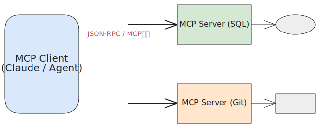

# 深度解析：Model Context Protocol (MCP) 核心八股与学习指南

**图解速览：MCP 核心交互架构**  
*(如果你在支持 Excalidraw 的环境中，请参考下图)*

## 📑 目录
1. [引言：大模型集成的“巴别塔”难题](#1-引言大模型集成的巴别塔难题)
2. [什么是 MCP (Model Context Protocol)？](#2-什么是-mcp-model-context-protocol)
3. [MCP 解决的核心痛点 (Why MCP)](#3-mcp-解决的核心痛点-why-mcp)
4. [MCP 的 3 大核心架构与原语](#4-mcp-的-3-大核心架构与原语)
5. [深度理解 MCP 工作流：基于 JSON-RPC](#5-深度理解-mcp-工作流基于-json-rpc)
6. [MCP 如何改变 Agent 开发范式？](#6-mcp-如何改变-agent-开发范式)
7. [MCP 常见高频面试题 (八股必备)](#7-mcp-常见高频面试题-八股必备)
8. [上手实践：如何使用与开发 MCP Server](#8-上手实践如何使用与开发-mcp-server)

---

## 1. 引言：大模型集成的“巴别塔”难题

在当今的大语言模型（LLM）开发生态中，我们希望 AI Agent 能够读取本地代码库、查询 MySQL 数据库、抓取网络新闻、控制 IoT 设备。
通常，我们会为每个数据源或系统写一套特定的“插件”或“API 对接代码”（类似 OpenAI Functions / Tools）。
但**这会面临严重的 N x M 爆炸问题**：
- 假设有 N 个基础大模型应用（Claude, ChatGPT客户端, Cursor, 本地 RAG 程序）。
- 假设有 M 种数据源（GitHub, Notion, MySQL, Jira, Slack）。
- 为了让所有系统能够互联，需要写  \times M$ 套对接代码。这不但碎片化严重，且极难维护和共享。

为了终结这种无序的状态，我们需要一个**统一的数据接入语言与连接标准**。

---

## 2. 什么是 MCP (Model Context Protocol)？

**Model Context Protocol (MCP)**（模型上下文协议）是由 Anthropic 首倡、并开源的一个标准化开源协议规范。
**它的核心定位是：“AI 时代的 USB-C 接口”**。

在官方定义中，MCP 是用于连接 AI 服务模型和外部数据源/工具的一套**标准化客户端-服务器 (Client-Server) 通信协议**。
它规范了任意 AI 应用应当如何向外部系统**注入上下文 (Context)**，以及如何安全地**请求外部节点执行工具/脚本 (Tools)**。

---

## 3. MCP 解决的核心痛点 (Why MCP)

使用 MCP，可以为 AI 和开发者解决以下三大痛点：

1. **终结 N x M 对接困境**：
   只需将各种外部服务封装为一个标准的 **MCP Server**（例如：Notion MCP Server）。开发完成后，任何支持 MCP 的客户端（例如 Claude Desktop 或 开源 Agent 框架），都可以**零配置**地立刻接入 Notion，获取其知识。
2. **安全隔离与最小权限**：
   过去的 Agent 需要在本地直接赋予文件读写权限；MCP 框架下，Agent 只能通过标准的 MCP 接口与 Server 交互。Server 可以安全地运行在本地的 Docker 容器中或防火墙后（通过 stdio 或 SSE 协议），大模型客户端只负责推理，从而大大降低了本地环境被破坏的风险。
3. **消除大模型的“信息孤岛”**：
   企业内部大量未对外公开的数据（数据库表、内部研发 wiki 等），可以通过架设内网 MCP Server 对无缝对接给云端推理模型，而无须上传所有数据进行微调（Fine-Tuning）。

---

## 4. MCP 的 3 大核心架构与原语

MCP 的架构十分简洁，分为 **MCP Client** 与 **MCP Server** 两大端，并通过 3 种极具表现力的原语 (Primitives) 对模型赋能：

### A. 架构模型
- **MCP Host (如 Claude / Cursor 等)**：发起上下文请求的宿主程序，内部包含了被驱动的大语言模型。
- **MCP Client (协议客户端)**：通常内聚在 Host 中，负责按照 MCP 协议向上游服务端发起请求。
- **MCP Server (协议服务端)**：包装了真实数据源（如 DB / API/ 本地文件）的独立程序。向客户端暴露标准的通信规范。

### B. 核心原语 (3 Core Primitives)
MCP 暴露给 AI 模型的能力分为三大类：

1. **Resources (资源读取)**：
   类似于 HTTP 里的 GET 请求。它是为了让模型**读取外部数据上下文**。
   - 特点：模型只读（Read-Only）。
   - 例子：ile:///workspace/app.py 或是 postgres://user:pass/db/table。模型可随时查阅。
2. **Prompts (提示词模板)**：
   服务器可以向客户端注如内置好的 prompt 模板。主要针对复杂的系统。
   - 例如：当用户问“如何使用这个内部库”，MCP Server 可以返回一组特定的说明 Prompt 和范例代码，供模型参考。
3. **Tools (动作工具)**：
   供模型触发外部系统状态变更的函数。
   - 特点：可带来副作用（Side Effects），即 Function Calling 的能力落地。
   - 例子：execute_sql，create_jira_ticket，git_commit。

---

## 5. 深度理解 MCP 工作流：基于 JSON-RPC

作为协议的具体底层实现，MCP 当前支持两大传输层信道（Transports）：
- **stdio（标准输入输出）**：适用于客户端与服务在同一台宿主机内的极低延迟本地调用。
- **SSE (Server-Sent Events) over HTTP**：适用于基于云端/远程服务之间的长期监听场景。

在传输信道之上，MCP 数据包使用的是 **JSON-RPC 2.0** 格式。当模型企图获取数据时，交互如下：
1. **Initialize (握手)**：Client 和 Server 互相通告彼此支持的能力（Capabilities），例如：Server 支持 Resource 监听。
2. **ListTools / ListResources (能力暴露)**：Client 发起 	ools/list，Server 用严格的 JSON Schema 响应它能执行的动作列表。
3. **CallTool (调用请求)**：当 Agent 需要抓取某个网页，Client 通过 	ools/call 下达带有特定参数 url 的指令。
4. **Respond**：Server 执行本地 Python 脚本/爬虫，将最终清洗好的 Markdown 以文本结构返回给 Client。

---

## 6. MCP 如何改变 Agent 开发范式？

在 MCP 出现前，如果你正在为公司开发智能运维 Agent：
- 你需要在 Python 的 LangChain 环境里，手写一大堆连接 k8s / GitLab / Logstash 的代码，耦合在你的项目中。
  
**有了 MCP 之后 (后 Agent 时代范式)**：
- 您或开源社区可以分别运行独立的 k8s-mcp-server, gitlab-mcp-server。
- 你的主控 Agent 只需要一行配置（通过 mcp.json 或环境变量）挂载这几个服务即可！
- **解耦（Decoupling）**：写大语言模型编排逻辑的工程师，与写对接第三方业务系统的工程师可以彻底分开工作，通过 MCP 协议交汇！

---

## 7. MCP 常见高频面试题 (八股必备)

作为前沿的 AI 技术，面试中对 MCP 的掌握将产生极高的“技术纵深”印象。

**Q1：MCP Server 中的 "Resources" 和 "Tools" 有什么本质区别？**
> **答：**
> * **Resources** 是用于只读的数据访问通道，它通常由 URI 定位，模型利用它像读文件一样阅读上下文，**无副作用**。
> * **Tools** 则是模型对外部采取的行动接口，通过 Function Calling 被触发，接收多维度参数执行特定任务，**会产生副作用并改变系统状态（如写文件/发消息）**。

**Q2：MCP 协议相较于传统的 OpenAI Functions (普通 API 接口) 优势在哪？**
> **答：**
> 1. **标准化发现机制**：MCP 统一了“如何让大模型发现你有哪些功能”的协议层，支持动态枚举，不需要开发者硬编码。
> 2. **更广的应用面**：除了函数动作，MCP 设计了内置的 Resources 乃至 Prompts 上下文下发体系，是一个全方位的注入。
> 3. **信道灵活**：原生涵盖 stdio 本地安全调用与 SSE 云端网络跨平台调用，兼顾了安全性与网络可达性。

**Q3：如何保障 MCP Server 的鉴权与安全性？**
> **答：**
> MCP 的最佳实践是将应用侧鉴权收敛：因为客户端与服务器通过清晰的 JSON-RPC 走标准输入输出或是 HTTP Theards，可以使用 API Keys 或 OAuth 进行。对于本地执行，可以通过诸如 Docker / WASM 沙箱严格限制外部 MCP 进程执行环境隔离（Sandbox），这限制了 MCP 被恶意 prompt prompt-injection 时“毁灭宿主机”的几率。

---

## 8. 上手实践：如何使用与开发 MCP Server

如果您已经安装了 Claude Desktop，可以在本地 claude_desktop_config.json 中配置以连接已有 MCP 服务器（例如读取 Git 历史的 Server）：

`json
{
  "mcpServers": {
    "local-git": {
      "command": "python",
      "args": ["-m", "mcp_git_server"]
    }
  }
}
`

**开发您自己的 Python MCP Server**：
生态中现在活跃着 mcp SDK 或 mcp-python 标准库。
1. pip install mcp
2. 实例化 server = Server("MyFirstMCP")
3. 使用装饰器 @server.tool() 将普通 Python 函数一键暴露：
   `python
   @server.tool()
   def get_stock_price(symbol: str) -> str:
       """根据股票代码获取当日股价"""
       return fetch_from_api(symbol)
   `
4. 运行 server.run_stdio_async()，该脚本当即可以无缝连接任何兼容 MCP 的本地 AI 客服端了！

---
*编者寄语：AI 代理基础建设正迈向模块化的大一统阶段，MCP 是必考的未来方向。掌握并深入理解其协议栈原理，将为你开发企业级通用 Agent 铺平道路。*
