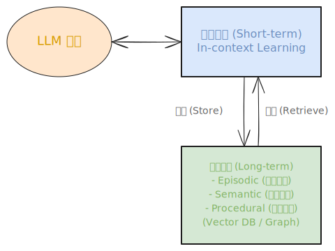

# 深度解析：AI Agent 记忆系统 (Memory System) 核心八股与进阶指南

**图解速览：Agent Memory 分层架构**  
*(此处展示了从大模型上下文、到短期记忆缓存、再到向量库与知识图谱构成的长程记忆池的读写生命周期)*  

---

## 📑 目录
1. [引言：为什么大模型需要“记忆”？(Amnesia vs Memory)](#1-引言为什么大模型需要记忆amnesia-vs-memory)
2. [宏观认知法则：人类记忆机制到 Agent 的映射](#2-宏观认知法则人类记忆机制到-agent-的映射)
3. [基础设施第一层：短期记忆 (Short-term Memory)](#3-基础设施第一层短期记忆-short-term-memory)
4. [基础设施第二层：长期记忆 (Long-term Memory) 与外挂存储](#4-基础设施第二层长期记忆-long-term-memory-与外挂存储)
5. [深度演进：从 Episodic (经验) 到 Semantic (语义) 的进化淬炼](#5-深度演进从-episodic-经验-到-semantic-语义的进化淬炼)
6. [业界标杆剖析：MemGPT 如何实现无限上下文？](#6-业界标杆剖析memgpt-如何实现无限上下文)
7. [业界标杆剖析：Generative Agents 小镇的记忆流架构](#7-业界标杆剖析generative-agents-小镇的记忆流架构)
8. [工程实践与挑战：Memory 的读写一致性与遗忘 (Forgetting)](#8-工程实践与挑战memory-的读写一致性与遗忘-forgetting)
9. [未来展望：多模态记忆体与图数据库 Graph RAG 融合](#9-未来展望多模态记忆体与图数据库-graph-rag-融合)
10. [🔥 大厂高频面试真题 (Agent Memory 必问连环炮)](#10--大厂高频面试真题-agent-memory-必问连环炮)

---

## 1. 引言：为什么大模型需要“记忆”？(Amnesia vs Memory)

无论是 ChatGPT，还是底层的 LLaMA、Claude，它们本质上是一个**基于统计学自回归（Auto-regressive）的无状态（Stateless）函数**：每次喂进去一个 Prompt，它吐出一个单词空间概率。它**完全没有状态的持续性**，像一个永远只拥有 3 秒记忆的失忆症（Amnesia）患者。

想要让这个无状态函数表现得像一个“陪伴了你多年的数字员工、管家或者《Her》里面的 AI 虚拟人”，就必须为其引入外部的 **Memory (记忆空间)**。
没有记忆的 Agent：
- 每重启一次终端，都要让你重新输入“我是一名 Java 程序员，我不吃香菜”。
- 在处理一条需要连续 20 步的复杂代码开发任务时，进行到第 15 步，会突然忘记第 1 步定义的变量规范。
- 永远无法“吃一堑长一智”，对于它未见过且每次都会犯错的代码库异常，它会永远掉入同样的死循环。

---

## 2. 宏观认知法则：人类记忆机制到 Agent 的映射

在世界级的神级论文（如 Lilian Weng 对 Agent 的综述）中，研究者通常把 Agent 记忆直接对偶到心理学上关于人类大脑的三层记忆模型。在面试八股里，这三大块（感觉记忆、短期、长期）是构建整个图景的金字塔。

1. **感觉记忆 (Sensory Memory)**：
   - *人类*：眼睛看一眼，0.5秒后消失的残影印象。
   - *Agent*：将外部数据（文本、图像）丢进 Embedding 模型转化为初始向量前的原始字节数据输入，或者尚未经过 Attention 筛选的第一层 API 返回的 JSON 报文。
2. **短期记忆 (Short-Term Memory / Working Memory)**：
   - *人类*：短期记一个手机号，做加减法时的脑力缓存，几分钟不背诵就会忘。
   - *Agent*：**In-Context Learning (上下文学习)**。就是放在 LLM 单次响应 Prompt Window (128K/200K) 里的最近十几个对话回合或者 Scratchpad（草稿本）。超过 Window 上限或是开启新 Session 时，就会被彻底刷掉。
3. **长期记忆 (Long-Term Memory)**：
   - *人类*：一辈子的知识，骑自行车的技能，童年的经历。
   - *Agent*：借助外部 RAG 系统（如 Vector Database）或者 Graph Database 存入硬盘的数据，支持在漫长的日子里不断提取复用。

---

## 3. 基础设施第一层：短期记忆 (Short-term Memory)

**Short-term Memory 就是当前上下文。**
在实现短时记忆时，并非简单的“将前面所有的话硬堆给模型”。如果一直这么堆（直到 10 万 Token），会面临可怕的费用灾难以及“中间丢失 (Lost in the middle)”难题。这就涉及几种主流的短期记忆滑动策略工程：

### 3.1 Sliding Window (滑动窗口)
最原始的手法，比如总是截断只保留最后的 N=10 轮聊天。这能省钱，但在长周期多轮流任务中，LLM 会忘记早期被交代的根本大纲目标，导致动作发生偏移。

### 3.2 Summary-Buffer (摘要缓存器)
使用类似 LangChain 的 ConversationSummaryMemory。策略是：不仅硬存最近 5 轮聊天作为高保真片段，每次滑动超出窗口的历史对话还会**由模型自己在后台总结为一句话（Summary）**，并一直粘在系统 Prompt 的头部：“（摘要：用户是一名会计，前不久讨论过发票报销格式）。[随后是最近 5 轮详情...]” 这是极高性价比的做法。

### 3.3 Scratchpad (思考草稿本)
在 Agentic ReAct 循环或多步协作时，短期记忆还有一种特化形式——agent_scratchpad。当 Agent 使用了 Tool 工具并拿到返回值后，这些调用历史不直接呈现给前端对话（用户不想看恶心的堆栈），而是塞在一个只有 Agent 自身可见的隐藏系统标签区作为本次任务状态机上下文。任务完结后，草稿本擦除。

---

## 4. 基础设施第二层：长期记忆 (Long-term Memory) 与外挂存储

长期记忆是将短期上下文“持久化”到硬盘的大工程。按照心理学隐喻，长记忆还被细分为不同的类别：

### 4.1 Episodic Memory (情景/片段记忆)
**“我记得过去发生过什么”**
它是基于按时间线（Timeline）序列发生的具体事件片段。
- *工程落地*：通常指对每一次 Agent 聊天的 Session、调用的一次复杂大函数生成的日志打上时间戳并切分为 Chunk，进行 Embedding 后存入向量库（如 Milvus, Pinecone）。
- *特征*：数据量最庞大，最无序，检索最容易出现“大海捞针”般的噪音。

### 4.2 Semantic Memory (语义记忆)
**“我知道世界的常识事实”**
它是经过提炼沉淀出来的系统级事实规则与知识。
- *工程落地*：类似于 Agent 经过 10 次调用某个 Github API 报错后，自我总结出了一句金科玉律：“在调用本公司的内部鉴权库时，参数不要用 userId 而是 uuid”，这段反思被写为了最高优先级的教训，形成知识网。或者从公司浩如烟海的合同 PDF 中直接导入向量库中的事实型 RAG 手册。

### 4.3 Procedural Memory (程序/过程记忆)
**“我怎么骑自行车、怎么做菜”**
它是“知道怎么做（Know-How）”的记忆。
- *工程落地*：在 Agent 范畴，这通常表现为向大模型注入了一堆 Python 脚本，或者存放于库中的“特定的 Few-shot 提示词代码范本”。当它遇到画图需求时，会从程序记忆脑区拉出别人写好的经典 matplotlib 绘图脚本作为母版直接执行。

---

## 5. 深度演进：从 Episodic (经验) 到 Semantic (语义) 的进化淬炼

长期记忆的“数据清洗问题”是当前高阶面试的大热领域。Agent 长期运行必然导致记忆库爆满甚至混杂，如果不干预，直接检索会导致系统陷入瘫痪。

高阶的记忆池必须具备“反刍”（Rumination / Reflection）机制：
1. **日暮整合 (Nightly Digest)**：Agent 闲置时，运行后台 CronJOB 把千万字的琐碎“交谈日志 (Episodic)”抽出；
2. **LLM 归纳法**：通过 LLM 去粗取精，提炼出包含具体信息的“结构化事实/行为偏好”，如 { "User.name": "Alice", "User.hobby": "Python 编程", "User.taboo": "讨厌冗长的废话" }；
3. **晋升语义库 (Semantic Promotion)**：把这些硬知识变成更高优先级的权重打入知识图谱（Graph）的节点进行融合！随后直接清理掉那些低效的情景文本片段。这就是模型进化的微缩。

---

## 6. 业界标杆剖析：MemGPT 如何实现无限上下文？

提到 Agent Memory 必然无法绕过伯克利等大学发表的重磅代表作 **MemGPT** (Teaching LLMs to Manage Their Own Memory)。

在传统架构里，何时“取”和“存”长记忆，都是程序员在外围拿 if...else 或者在 RAG 开头写死的。
**而 MemGPT 首创的思想是：把读写内存和硬盘的操作，包装为 Tool 交给 LLM 借由操作系统中断（OS Interrupts）自己决定去调用！**

- MemGPT 创造了一个类似操作系统的层次模型：
  - **Main Context (短期主内存)**：直接放在 Prompt 中；
  - **Archival Memory (无限长期库)**：相当于外挂数据库。
- 模型在执行回复前，它可以选择发出的行动不是回复用户（Yield），而是产出 rchival_memory_search(query="用户的狗叫什么") 给框架，框架把捞到的长记忆以系统视角塞回给它，它再结合这则信息思考。如果是极其重要的新事实，它发出的动作是 core_memory_append("他买了一只黄猫")。
- **划时代意义**：这让 Agent 真正像拥有操作系统的进程一样，具备了主动页表换页机制 (Paging Engine)。当有限的窗口放不下，它自己选择丢出暂不可用的页面，拉入深层记录，从而实现了“虚拟无限长下文”。

---

## 7. 业界标杆剖析：Generative Agents 小镇的记忆流架构

同样霸榜顶会的 Stanford/Google 的论文“Generative Agents”（也就是 25 个 AI 小镇居民沙盒）也是长效记忆流（Memory Stream）的祖师爷级实现。

为了让 NPC 小镇居民维持数百天的长线真实社交感：
1. **Memory Stream (绝对记忆流水线)**：存储角色所有看到的（"看到路边摆着凳子"）以及做过的（"刚吃完早饭"）一切感知记录，带有精确时空标记。
2. **Retrieve 三要素记分卡（重要面试必背公式）**：
   当 Agent 需要提取记忆去决策自己去哪，不能一股脑乱查，而必须计算一个总得分：Score = Recency (近因性：越近发生得分越高) + Importance (重要性：生离死别得10分，刷牙得1分) + Relevance (相关性：向量余弦语义匹配度)。按照聚合高分来调出回忆。
3. **Reflection (阶段性反思)**：由于 Stream 会迅速变得无比臃长无用，系统当积累 100 句普通记忆时，唤醒模型做归纳：“因为过去的10天里，你总是每天去买花、去看她、赞美她 -> 归纳反思：你喜欢她。”，并将这句至高语义打回记忆池，这就极大降低了后期 Agent 再去运算好感度的成本。

---

## 8. 工程实践与挑战：Memory 的读写一致性与遗忘 (Forgetting)

把记忆功能落地时，工程师通常会遇到难以跨越的“灾难”。

### 8.1 矛盾覆写问题 (Memory Clashing)
- 昨天用户说：“我对北京的天气感到非常厌恶”。数据库存入该结论。
- 今天用户因为去看了长城，说：“我觉得北京今天真是个完美的城市！” 存入结论。
- 明天如果 Agent 去查这个结果，它会同时抽到两个矛盾事实，直接导致精神分裂。
- **解法**: 业界需要在长记忆写入（Write机制）加上“事实冲突消解（Conflict Resolution）分类器”。提取相关新记录时，如果检测到过往节点相似度极高但态度对立，强制让判别器 LLM 决定是“追加时间戳修饰新感受”还是“彻底废弃旧观念并替换 (Update/Overwrite)”。

### 8.2 数据遗忘 (Forgetting / Memory Decay)
真正的智能是不需要也不可能记住一切废话的（人类会遗忘不重要的事才能保护脑容量）。
- 但普通向量库无法实现自动遗忘。工程师需要在数据库层外挂一套**遗忘曲线机制 (Ebbinghaus Forgetting Curve)**。为每一条 Memory 打上 Access_Count (访问次数) 标签。如果某个 Chunk 近 3 个月一次都没被检索过，或者它的 Importance Score 打分极低且年代久远，由系统主动“归档冷链”甚至定期“Garbage Collection 垃圾回收切断”，以保障整个智能核心查询时延不会雪崩且保持敏锐。

---

## 9. 未来展望：多模态记忆体与图数据库 Graph RAG 融合

当下的 Agent 记忆依然局限于基于字面意思切成豆腐块（Chunking）的单薄向量。
随着 2024 等前瞻模型时代的到来，下一代长记忆方案必定围绕如下两只翅膀演进：
1. **基于知识图谱 (Knowledge Graph) 的结构树融合**：这能够让记忆从离散的网格化文本变成一张复杂的全息星图（Graph RAG）。模型检索起“我与老板的关系”时能像抽藤蔓一般，牵扯出一整根长年累月的业务流，而非片面的词句。
2. **多模态时间戳串联记忆 (Multimodal Timeline)**：未来手机端的个人管家系统不仅记录文本对话，你的记忆流中会混着截屏照片、音频声纹。“当 Agent 回忆那个冬天的会议，不仅有纪要文档，还能拉出当时窗边的一张低沉白雪图并关联。”这种全景式的情景复刻是 AGI 服务人类的最终梦想。

---

## 10. 🔥 大厂高频面试真题 (Agent Memory 必问连环炮)

**Q1：当用户的 Prompt 序列无限变长导致 Token 即将超限，你会采取哪几种工程保底手段？**
> **答：**
> 1) 滑动截断 (Sliding window)：抛弃最远轮次的最硬核省钱操作；
> 2) 系统池压缩 (Summary-Buffer)：将尾部超出的窗口送给一个微小的 LLM 先提炼出要点，然后放置在长上下文的头部（Sys prompt）；
> 3) External Retrieval (RAG/内存页换出)：彻底放弃用 Token 硬抗长文对话，转为“只保留最近 3 问 3 答，剩下的历史对话进行向量 Embedding 落盘，当用户一旦又提到过去的特定知识，凭借 Query 去向量库捞回到主 Context 里补充（这是根治方案）。

**Q2：什么是斯坦福小镇论文里常常听到的 Importance Score (重要性记分) ？它对记忆的召回有何作用？**
> **答：** 这是建立在人类生物心理学的基础上的经典模型。因为传统 RAG 检索只看余弦相似度，也就是“字面长的像不像”。但是对 Agent 的记忆链中，它的一生可能见过无数次“吃早饭”，如果仅仅因为字面上提及了“早饭”就把昨天平凡的一餐调取回事实，极为浪费上下文导致废话。
> 所以需要在产生每一条记忆时，由内置小模型打上极其感性的“重要性评分（1~10 分）”。平时吃早饭打 1 分，“我父母发生车祸死去了”打 10 分。检索时，即便是时间很久远但重要性极高的痛心事件，也能冲破普通文本关联被模型重新召回，进而保证 Agent 做长情策略规划时保留住最珍贵的核心情感人设。

**Q3：如何防止你的 Agent “反复”记录早已知晓且重复的内容导致 Vector DB 撑爆？**
> **答：**
> 这个情况通常出现在日记模式。解法核心为 **“事实消重”与“倒排去冗”机制**。
> 可以设计写长记忆流水线 (Write Pipeline) 时的一套拦截策略：在真的存储一条长篇大论前，以这则长篇大论本身作为 Query，对数据库进行预检（Pre-check RAG）。如果拉出来发现一模一样的历史事实达到 0.96 的极高相似阈值，那么直接将其判定为重复认知（Redundancy），触发废弃写入或仅叠加出现频次计数器（Frequency+=1）机制。

**Q4：对比 MemGPT 的内存操作系统层理念和普通 Langchain 外挂死板大数据库的核心技术区别？**
> **答：**
> - **控制权翻转 (IoC: Inversion of Control)**：这是灵魂区别。Langchain 等早期的机制是写死的长短链路（由 Python 代码控制 if 上下文太长 then 执行清洗库操作）；而 MemGPT 把内存读和移等复杂机制封装成 Tool。
> - **无感管理**：MemGPT 下，触发清洗以及拿什么东西的最高调度器（Scheduler）就是 LLM 自己本身（就像操作系统把换页的指令权放给拥有极强判断力的核心本身而非外部程序硬塞）。当 LLM 感知到眼前的东西不够作答，它不生成胡编的回答，而是发一个翻页函数的动作告诉系统。这真正打通了长期记忆到无限的边界。

---
*编者结语：从无记忆的鹦鹉学舌，到通过 Short-to-Long 甚至带有反射机制的小镇架构。Agent Memory 的发展代表了当今从工具迈向虚拟数字人格最动听的故事，它是决定大模型具备持久商业黏性（User Retention）的核心壁垒！*
