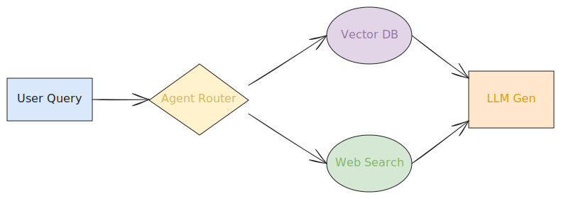

# 深度解析：Agentic RAG (检索增强生成) 核心八股与学习指南

**图解速览：Agentic RAG 核心路由架构**  
*(本图展示了基于 Agent 路由判断的 RAG 工作流)*

---

## 📑 目录
1. [引言：从 RAG 到 Agentic RAG 的演进](#1-引言从-rag-到-agentic-rag-的演进)
2. [为什么需要 RAG？(微调 Fine-tuning vs RAG 的终极对决)](#2-为什么需要-rag微调-fine-tuning-vs-rag-的终极对决)
3. [Naive RAG (基础 RAG) 的核心架构与痛点](#3-naive-rag-基础-rag-的核心架构与痛点)
4. [Advanced RAG (进阶 RAG) 的三大优化方向](#4-advanced-rag-进阶-rag-的三大优化方向)
5. [范式转移：什么是 Agentic RAG (智能体检索)？](#5-范式转移什么是-agentic-rag-智能体检索)
6. [Agentic RAG 的核心设计模式 (Router, Fallback, Sub-Agents)](#6-agentic-rag-的核心设计模式-router-fallback-sub-agents)
7. [基于图谱的新维：GraphRAG (知识图谱与 RAG)](#7-基于图谱的新维graphrag-知识图谱与-rag)
8. [工业级 RAG 关键：Chunking (切分) 与 Embedding (向量化)](#8-工业级-rag-关键chunking-切分-与-embedding-向量化)
9. [指标与评估：如何利用 RAGAS 与 TruLens 衡量 RAG 系统？](#9-指标与评估如何利用-ragas-与-trulens-衡量-rag-系统)
10. [面试真题八股：大厂高频连环问](#10-面试真题八股大厂高频连环问)

---

## 1. 引言：从 RAG 到 Agentic RAG 的演进

**RAG (Retrieval-Augmented Generation，检索增强生成)** 自 2020 年被提出以来，已成为大模型落地企业级应用的最核心技术。它通过在模型生成答案前，先去外部数据库（如企业知识库）中检索相关信息，从而极大地缓解了大模型的 **幻觉 (Hallucination)** 并弥补了 **知识截断 (Knowledge Cutoff)**。

然而，传统的 RAG 是“线性且死板的”：用户提问 -> 检索 5 段文本 -> 填充 Prompt -> 模型作答。这种单向流无法处理复杂对比、无法纠错，甚至会因为检索到垃圾信息而输出错误答案。

于是衍生出了 **Agentic RAG (智能体 RAG)**。Agentic RAG 赋予了系统“思考与决策”的能力。模型不再是被动接受检索结果，而是可以主动：决定要不要检索、选择去哪个库检索、评估检索结果好不好、甚至决定重新检索。这是从**“开卷考试”**到**“拥有个人研究助理”**的颠覆。

---

## 2. 为什么需要 RAG？(微调 Fine-tuning vs RAG 的终极对决)

在面试中，这是一个极其高频的问题：“你的业务场景为什么选 RAG 而不选微调？”

| 维度 | RAG (检索增强) | Fine-Tuning (微调) |
| --- | --- | --- |
| **知识更新机制** | **极快**：只需更新数据库，即刻生效 | **慢**：需要重新跑训练任务，耗时耗力 |
| **知识幻觉应对** | **强**：答案可追溯至具体文档，有依有据 | **弱**：模型凭参数黑盒记忆，极易一本正经地胡说八道 |
| **开发成本** | **低**：无需算力训练，依赖优秀的工程流水线 | **高**：需要昂贵的 GPU 算力与高质量标注数据 |
| **擅长的场景** | 垂直领域问答、内部文档客服、动态数据查询 | 风格模仿、特殊语言/格式输出学习 (如写诗、转特定代码) |

**💡 八股金句**：**“微调是培养模型的气质与肌肉记忆，而 RAG 则是借给模型一本最新的百科全书。”** 只有当模型不仅缺知识，还听不懂特定术语黑话或无法掌握输出格式时，才考虑微调，否则 RAG 永远是首选底座。

---

## 3. Naive RAG (基础 RAG) 的核心架构与痛点

基础的 RAG  pipeline 被称为 Naive RAG，它仅仅包含三大步骤：**Indexing (索引)、Retrieval (检索)、Generation (生成)**。

1. **Indexing**：将本地 PDF/Word 解析并切分为一个个 Chunk（块），使用 Embedding 模型将文本块转化为多维向量，存入 Vector DB (如 Milvus, Qdrant)。
2. **Retrieval**：将 User Query 也转化为向量，在 Vector DB 中计算 Cosine Similarity (余弦相似度)，捞出 Top-K 个最相关的 Chunk。
3. **Generation**：组合 Prompt："根据以下内容：{上下文}，回答问题：{提问}"，扔给 LLM 生成回答。

### ☠️ Naive RAG 面临的致命痛点：
- **Bad Retrieval (检索差)**：Top-K 没召回真正相关的文档，或者召回了包含关键矛盾的干扰文档。
- **Lost in the Middle (中间迷失)**：假如把 20 个 Chunk 塞给 LLM，它由于注意力机制的缺陷，往往注意不到放在中间的重要信息。
- **No Synergies (缺乏协同)**：无法处理需多次关联拉取的提问，如：“比较 2023 年第二季度 A 财报中提到的营收与 B 公司的异同”。（传统算法一次只能查一种向量匹配）。

---

## 4. Advanced RAG (进阶 RAG) 的三大优化方向

为了解决 Naive RAG 的问题，业界演进出了极其丰富的 Engineering 策略，我们称为 Advanced RAG。主要分为 3 个阶段的深度优化：

### A. Pre-Retrieval (检索前优化) - Query Optimization
在去查数据库之前，先对用户的 Query 动手术！
- **查询重写 (Query Rewrite)**：大模型把用户词不达意的请求重写为更精确的搜索词。
- **假设性文档提问 (HyDE)**：让 LLM 先“裸答”猜一个虚拟答案，然后拿这个虚拟答案的 Embedding 去向量数据库里强匹配。

### B. Retrieval (检索中优化) - Hybrid & Hierarchy
- **混合检索 (Hybrid Search)**：结合传统的 BM25 关键词匹配检索（捕捉准确词汇）和 Embedding 向量检索（捕捉语义关联），通过 RRF (Reciprocal Rank Fusion) 算法做并集。
- **父子节点检索 (Parent-Child / Auto-merging Retriver)**：切分文本时存在父节点与子节点，检索时匹配细粒度的子 Chunk 但在塞给 LLM 时喂给它粗粒度的父 Chunk，以保留完整的上下文。

### C. Post-Retrieval (检索后优化) - Re-ranking
- **重排序 (Re-ranking)**：初始向量检索速度快但精度粗糙（例如召回 50 篇）。接着使用专用的交叉编码器训练的重排模型 (如 Cohere Rerank, BGE-Reranker)，对这 50 篇进行逐一对冲打分并掐掉不要的噪音，只选最相关的 Top-5 喂给生成模型。

---

## 5. 范式转移：什么是 Agentic RAG (智能体检索)？

当 RAG 系统中引入了 **Agentic workflow (智能体工作流)** 时，检索就不再是单向的“一顿操作猛如虎”了，它由 LLM 主管“做决策”。

**Agentic RAG 的核心区别在于**：
Agent 具备一套工具集（如 search_vector_db, search_internet, execute_sql），在面对复杂问题时，它能够自主规划。它不需要开发者去手写 if...else... 来决定何时从何处取数据。

**工作展示**：
用户问：“帮我总结一下内部知识库里关于项目 X 的文档，然后结合网上的最新新闻给我写个分析报告”。
Agent 会：
1. Thought：我要先查询内部知识库。 Action: search_vector_db(query="项目X")
2. Observation：获取到了项目 X 的基本情况。
3. Thought：信息不够，题目要求结合最新新闻。 Action: search_internet(query="项目X 最新进展 2024")
4. Observation：获取到两篇新闻。
5. Synthesis：结合生成最终分析。

---

## 6. Agentic RAG 的核心设计模式 (Router, Fallback, Sub-Agents)

在 Agentic RAG 实际落地中，常见的拓扑架构有以下几种成熟模式：

1. **Router 模式 (智能路由)**：
   利用 LLM 判断用户的问题意图，如果在问技术文档 -> 路由给 Vector DB 工具；如果问图表数据 -> 路由给 SQL Agent；如果完全闲聊 -> 跳过检索直接回答。有效省去不需要检索浪费的时延。
   
2. **Self-RAG (自我反思 RAG)**：
   这是学术界高引的模式设计。在每次检索后，系统内置一个“反思/判别机制”（通常由一个特化的 Critic LLM 实现）：
   - *"检索出来的长篇大论对回答问题有相关性吗？"* -> 若不相关，丢弃并换个查询词重新检索。
   - *"生成的回答有幻觉吗？能够被检索到的 Chunk 证实吗？"* -> 若发现幻觉，打回重写。

3. **Multi-Agent 协作体系**：
   引入不同分工的 Agents。如 Research Agent 专门把一个宏大的问题拆分为 3 项子检索任务齐发并发；拿到资料后传给 Summary Agent 专门做信息降噪拼接；最后交由 Writer Agent 撰写输出。

---

## 7. 基于图谱的新维：GraphRAG (知识图谱与 RAG)

2024 年，由微软主推的 **GraphRAG** 技术架构引起了疯狂围观。这是目前针对长文本、跨文档实体探究的最高阶解法。

**痛点背景：** 传统 Vector DB 是“把文本剁成肉酱”，丧失了实体之间的网络关联。假如提问：“这两本 100 万字宏大科幻小说的世界观中，关于人工智能的灾难有何共通之处？”传统的 RAG 根本找不到单一的匹配 Chunk，直接瘫痪。

**GraphRAG 解法：**
1. **抽取阶段**：用 LLM 将所有文档读取一遍，抽取结构化的节点（Entity）与边（Relationship），形成一个**实体关系图谱网络**，同时划分不同的“社区集群 (Community)”。
2. **查询阶段**：对于全局性问题，GraphRAG 不是去查文本 Chunk，而是从知识图谱的底层（如：包含特定的实体节点）、再上卷到上层的“社会集群摘要”进行全景式的扫描生成，能够应对高度复杂的全局关联问题发现。

---

## 8. 工业级 RAG 关键：Chunking (切分) 与 Embedding (向量化)

如果说 Agent 负责 RAG 的高层大脑，那 Chunking (切片) 就是决定 RAG 下层地基的最脏活累活的工程：

*   **固定长度切分 (Fixed-size Chunking)**：最无脑，如按 512 Tokens 一刀切，加 50 词的 overlap 防止关键信息被劈散。缺点：容易劈断有明确前后文意群的段落。
*   **语义切分 (Semantic Chunking)**：通过分析标点符号的 Embedding 距离差异，在语义发生“跳变”的地方进行自动切分。
*   **Markdown / 语法特征切分**：识别标题 #，在每一章节结构层切分，确保 Chunk 是完整的段落大意。

**关于 Embedding 模型**：
目前业界标杆为 OpenAI 的 	ext-embedding-3 系、开源有阿里的 BGE、智源的 Jina 等。向量模型的能力决定了“能否跨越语言的文字表象去找到内在一致性”。

---

## 9. 指标与评估：如何利用 RAGAS 与 TruLens 衡量 RAG 系统？

如何向老板证明：“我这套 RAG 架构比上一套牛逼？”
业界目前公认的最成熟大模型系统自动化评估框架为 **RAGAS (RAG Assessment)** 和 **TruLens**，俗称 "RAG Triad (评估铁三角)"：

这些评估并不依赖人工标注，而是利用强大的 LLM 充当“裁判（LLM-as-a-Judge）”，对三个维度进行评分：
1. **Context Relevance (提问-上下文相关度)**：也就是看检索算法拉出来的材料（Context），里面有没有能回答用户提问（Query）的信息。指标低说明检索稀碎。
2. **Faithfulness (回答忠实度)**：也就是看最后的大模型回答（Response）是否在提供给它的（Context）之中均能找到确切依据。指标低说明大模型严重“幻觉”。
3. **Answer Relevance (回答-提问相关度)**：也就是看生成的这句闲聊（Response）是不是到底解决了用户的提问（Query），还是只是背书。

---

## 10. 面试真题八股：大厂高频连环问

**Q1：你的 RAG 系统如何处理包含大量图片、表格的 PDF 文档？**
> **答：** 这是个工程痛点（多模态RAG）。
> 1. 表格处理：传统 OCR 经常会把表格切碎。应当使用特定的工具（如 Camelot、Unstructured 库）提取 HTML 或 Markdown 原生表格结构，甚至将整张表格送入 LLM 提取出一个纯文本 Summary 结合表格文本一同 Embed 入库。
> 2. 图片处理：提取出图片，送入 VLM (如 GPT-4o Vision 或 Qwen-VL) 生成图片的 Caption (详细描述)，将 Caption 转化为向量存入库配合检索。

**Q2：如果现在用户提出了一个历史上下文追问（比如：“那第一点该怎么落实在刚才提到的项目里？”），直接抛给 Vector DB 还能匹配得到结果吗？**
> **答：** 不能，因为“那第一点”指代不明，缺乏实体，向量库匹配度极低。
> 这里必须在 Pipeline 起始位置加入一个 **Query Condensation / Contextualizer** (上下文历史改写器)。利用 LLM 将“用户的原提问”加上“之前的数轮对话记录”，重写提炼成一条 standalone 的、全实体无残缺的独立查询语句（例如改写为：“RAG的第一点预处理技术如何落实在A公司的营收知识系统内？”），再将该语句做 Embedding 去查询库。

**Q3：BM25 (关键词) 与 Dense Retrieval (向量) 到底为什么要结合成 Hybrid Search？只用高级向量不好吗？**
> **答：** 
> 向量擅长深层“语义联想”。比如搜索“iPhone”，向量也许会关联“智能手机、苹果生态”。
> 但向量往往是一个高维均值代表，对于某些 **精准词、专业型号（如 "CX340 芯片报错 Error-512"）** 或者 **人名缩写**，向量的相似度可能极其模糊找错重点。
> 此时 BM25 基于 TF-IDF 词频统计能做到最高效的“字符字面量硬匹配”。通过 Reciprocal Rank Fusion (RRF) 算法把两者的召回排序列表重组，即可兼得语义灵活性与词汇绝对精确。

---
*本文档不仅覆盖了常见的 LLM 与 Agent RAG 技术栈核心知识点，也结合了工业级生产环境下的最佳业务实践，请结合实际项目将上述知识化为己用，祝求职顺利。*
