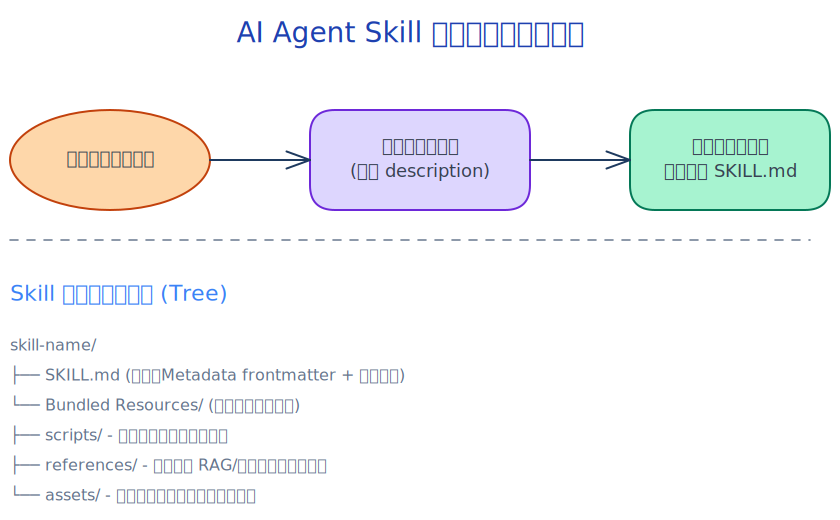

# AI Agent Skills (工具/技能) 面试必备八股指南

**图解速览：Agent Skill 工作流与核心架构**

## 📑 目录
1. [什么是 AI Agent 技能 (Skills/Tools)?](#1-什么是-ai-agent-技能-skillstools)
2. [为什么大模型需要引入 Skill？(解决的痛点)](#2-为什么大模型需要引入-skill解决的痛点)
3. [大语言模型如何调用 Skill？(Function Calling 机制解析)](#3-大语言模型如何调用-skillfunction-calling-机制解析)
4. [编写优秀 SKILL 的核心要素 (Best Practices)](#4-编写优秀-skill-的核心要素-best-practices)
5. [常见 Agent 的 Skill 协同策略 (工作流模式)](#5-常见-agent-的-skill-协同策略-工作流模式)
6. [关于 Agent Skill 的高频面试题解析](#6-关于-agent-skill-的高频面试题解析)

---

## 1. 什么是 AI Agent 技能 (Skills/Tools)?

在 AI Agent（智能体）的语境下，**技能（Skill）或工具（Tool）是大语言模型（LLM）与外部真实世界互动的接口**。
LLM 本质上是一个“缸中之脑”，它擅长文本生成、逻辑推理和格式转换，但无法主动获取实时的外部信息或改变物理世界/软件系统的状态。而 SKILL 为其赋予了“五官”和“手脚”：
- **感知类技能 (Sensors)**：搜索引擎搜索（Google/Bing）、网页内容读取、本地文件读取、数据库 SQL 查询。
- **操作类技能 (Actuators)**：发送邮件、执行本地 Python/Shell 代码、修改代码文件、调用第三方业务服务 API（如订票、查询天气、操作智能家居）。

> **💡 面试一句话总结**：
> Skill 是一种规范化的接口（通常体现为带有详细描述和参数定义的 API），它允许 LLM 将自然语言意图转化为结构化的调用指令，从而与外部环境进行信息交互和状态变更。

---

## 2. 为什么大模型需要引入 Skill？(解决的痛点)

大模型虽然强大，但存在难以逾越的先天限制。引入技能机制主要解决以下三大痛点：

1. **应对知识截断与时效性问题**：
   - *问题*：模型的参数在训练完成后就固定了，无法知道今天的新闻或刚刚发生的事件。
   - *Skill 解决*：通过赋予“搜索新闻”或“查阅实时数据库”的 Skill，让模型现查现用，打破知识护城河。
2. **克服“幻觉 (Hallucination)”与逻辑缺陷**：
   - *问题*：LLM 在面对复杂的数学计算或具体的物理常数时，容易一本正经地胡说八道。
   - *Skill 解决*：通过“代码解释器 (Code Interpreter)”或“计算器”技能，将精确的逻辑运算外包给确定的程序，模型只负责调度和总结，确保结果的 100% 准确。
3. **实现真正意义的行动力 (Agentic Actuation)**：
   - *问题*：过去的 LLM 只能帮用户写好一封邮件草稿，用户还需要自己复制、粘贴、发送。
   - *Skill 解决*：赋予其“发送邮件”的 Skill 后，模型可以直接向邮件服务器发起请求，真正完成了“任务闭环”。

---

## 3. 大语言模型如何调用 Skill？(Function Calling 机制解析)

这是面试中最核心的考点。目前业界主流的方案是 **Function Calling（函数调用）**。整个链路分为 5 个经典的步骤：

1. **注册与定义 (Registration)**：
   开发者在系统层面定义好 Skill。这个定义一般包含：**函数名**、**能力描述 (Description)**、以及输入参数的 **JSON Schema**。
2. **感知与决策 (Thought)**：
   系统将用户的 Prompt 与所有可用的 Skill 描述一起发送给 LLM。LLM 内部进行推理（Reasoning），判断自身的固有知识能否解答：如果不能，且现有某个 Skill 恰好对口，LLM 会决定触发该 Skill。
3. **参数生成 (Action/Generation)**：
   LLM 停止生成普通文本，而是严格按照该 Skill 的 JSON Schema 约定，生成一段 JSON 格式的参数串（例如：{"location": "Beijing", "format": "celsius"}）。
4. **本地执行 (Observation/Execution)**：
   LLM 返回这个特定的 JSON 给应用层代码。应用层拦截到该信号，在本地（或沙箱中）真正执行这段代码或请求第三方 API，并获得真实的运行结果（如 {"temperature": 25, "condition": "Sunny"}）。
5. **反思与汇总 (Synthesis)**：
   应用层将刚才拿到的“执行结果 (Observation)”以特定的角色（如 
ole: "tool" 或是 
ole: "function"）追加到对话历史中，再次发给 LLM。LLM 看到结果后，将其融合为自然语言，生成最终呈现给用户的回答。

---

## 4. 编写优秀 SKILL 的核心要素 (Best Practices)

写一个大模型用得好的 Skill 和写一段普通的传统代码有着极大的区别。优秀的 Skill 必须充分考虑“LLM 作为调用者”的特殊性：

*   **把 Description 当作灵魂来写**：
    *   LLM *完全* 依靠 Description 来判断何时该调用该工具，以及调用的前提条件。
    *   *Bad Case*：“获取天气信息。”
    *   *Good Case*：“获取指定城市的当前实时天气。当用户询问某一地区的天气状况、温度或是否需要带伞时，强制调用此工具。必须传入具体的城市名称，不能是省份。”
*   **强类型声明与提示 (Typed Parameters & Hints)**：
    *   利用 JSON Schema 限制参数类型。对于可选范围，必须使用 enum。必要时可以在属性的 description 中告诉大模型“如何获取该参数”，降低幻觉概率。
*   **友好的错误返回 (Graceful Error Handing)**：
    *   如果在执行 Skill 时报错（例如“ID 不存在”），绝不能让程序直接崩溃。而是要 catch 住这个 Error，转化为类似 {"error": "ID 不存在，请尝试使用 search_id 技能重新查询后再试"} 的文本返回给模型，**引导模型进行自我纠正 (Self-Correction)**。
*   **设计具有幂等性 (Idempotency)**：
    *   LLM 可能会因为重试机制多次触发同一个动作。设计改变系统状态的 Skill 时（如“删除文件”、“付款”），需保证多次重复调用的副作用与一次调用相同，避免造成破坏。

---

## 5. 常见 Agent 的 Skill 协同策略 (工作流模式)

在复杂的业务场景下，单个 Skill 往往无法解决问题，模型需要搭配特定的工作流策略来协同使用多个 Skill：

1. **ReAct 模式 (Reason + Act)**：
   最为经典。要求模型在每执行一个动作前，必须先输出 Thought (我要做什么及为什么)，接着输出 Action (调用什么技能和参数)，收到 Observation (结果) 后再进入下一个循环，直到任务完成。
2. **Plan-and-Solve (规划与解决)**：
   对于长链路任务，Agent 优先调用“思考引擎”将大目标拆解为 5 个子步骤（Plan），然后再按顺序去调用相关的 Skill（Solve），这能有效避免长周期任务中模型“迷失方向”。
3. **多智能体协作 (Multi-Agent Sub-contracting)**：
   为了防止一次性给模型塞入 100 个 Skill 导致其“无所适从”或超长上下文，主流架构会将 Skill 分组。例如：设定一个“代码 Agent”只拥有读写运行代码的 Skill，“搜索 Agent”只拥有搜索和爬虫 Skill，由一个“主控 Agent”来分发任务。

---

## 6. 关于 Agent Skill 的高频面试题解析

**Q1：如何防止大语言模型陷入技能调用的“死循环”（Looping）？**
> **答：**
> 1. 工程层面：强行设置 max_iterations 或 max_tokens，达到阈值强制中断并让人类介入。
> 2. 提示词层面：在 System Prompt 或 Skill 错误返回值中明确警告模型：“如果你连续两次尝试该方法均失败，请立即停止尝试，并将当前错误情况总结后向人类求助。”
> 3. 记忆层面：引入局部记忆（Scratchpad），让模型在调用前能看到自己前几次失败的参数，避免用相同的错误参数反复请求。

**Q2：如果系统里有 1000 个 Skill，受限于模型的 Context Window 放不下，或者影响模型判断的精准度，该如何解决？**
> **答：**
> 核心是引入 **工具检索 (Tool Retrieval / Dynamic Tool Allocation)**。
> 将所有 1000 个 Skill 的 Description 转化为向量向量化并存入向量数据库（Vector DB）。当用户输入 prompt 时，先将用户的 query 进行 Embedding，并在向量库中做 Similarity Search，召回最相关的 Top-5 或 Top-10 的 Skill。最后只将这几个精选出来的 Skill 的 Schema 发送给 LLM 供其挑选即可。

**Q3：LLM 生成的函数参数不符合约定的 JSON Schema，少字段或者类型错，该如何处理？**
> **答：**
> 1. 拦截与重试：在代码层使用 Pydantic 或 JSON Schema Validator。如果校验失败，将具体的报错信息（如 Validation Error: "age" field is missing object）作为一段系统提示再度抛给 LLM，让 LLM 结合错误信息进行重新生成（Self-Refine）。
> 2. 约束解码 (Constrained Decoding)：在模型推理底层（如使用 vLLM、llama.cpp 搭配 Outlines 或 JSON Mode），强制在生成 token 时屏蔽掉不符合 Schema 语法树的概率分支，从底层物理消灭格式错误。

---
*本文档不仅覆盖了常见的面试流派，也结合了生产环境下面向实际系统开发的最佳实践。掌握好以上六部分即可从容应对绝大部分与 LLM Assistant/Agent Tools/Skills 相关的面试考核。*
