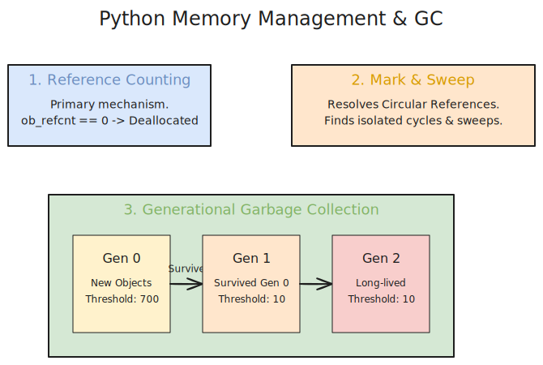

# 深度解析：Python 面试核心八股与进阶指南

## 目录
1. [引言：Python 面试的核心考点地图](#1-引言python-面试的核心考点地图)
2. [Python 内存管理与垃圾回收 (GC) 机制](#2-python-内存管理与垃圾回收-gc-机制)
3. [全局解释器锁 (GIL) 深度剖析](#3-全局解释器锁-gil-深度剖析)
4. [核心语法与数据结构底层结构](#4-核心语法与数据结构底层结构)
5. [进阶特性：迭代器、生成器与装饰器](#5-进阶特性迭代器生成器与装饰器)
6. [面向对象特性与魔术方法](#6-面向对象特性与魔术方法)
7. [并发编程：多线程、多进程与协程](#7-并发编程多线程多进程与协程)
8. [高频大厂面试真题Q&A](#8-高频大厂面试真题qa)

---



## 1. 引言：Python 面试的核心考点地图

如果你准备在后台开发、数据挖掘、人工智能或自动化测试领域面试 Python 技术岗，"八股文"是绕不开的门槛。不同于 C++ 侧重内存细节或 Java 侧重 JVM 与 Spring 框架，Python 的面试核心非常集中，主要分为**语言底层机制**（如 GIL、内存池、垃圾回收）、**进阶语法**（闭包、装饰器、生成器）、**数据结构底座**（哈希表冲突、可变/不可变对象）以及**并发模型**（协程 Asyncio、多线程、多进程）。

这份指南基于全网阅读量与收藏量最高的数篇 Python 面试文章总结提炼，用最通俗易懂的语言为你还原真正的“考察逻辑”。

## 2. Python 内存管理与垃圾回收 (GC) 机制

Python 中万物皆对象，而 CPython (最广泛使用的 Python 解释器) 是用 C 语言编写的结构体。了解其内存管理机制，是进阶高级工程师的第一步。

Python 的内存管理主要通过**三个支柱**来实现：

### 2.1 引用计数 (Reference Counting) - 核心机制
这是 Python 最原始也是最主要的垃圾回收机制。
每个对象都有一个 `ob_refcnt`（引用计数器）。
- **导致计数 +1 的情况**：对象被创建 (`a = 23`)、对象被另一个变量引用 (`b = a`)、对象作为参数传入函数、对象作为元素存储进容器（如列表、字典中）。
- **导致计数 -1 的情况**：对象的别名被显式销毁 (`del a`)、对象的别名被赋予新值 (`a = 24`)、对象离开作用域（如函数执行完毕，局部变量销毁）、对象从容器中被移除。
- **释放**：当一个对象的引用计数归零时，它在内存中的空间会被立刻释放。

*痛点*：引用计数无法解决**循环引用**的问题（例如 A 包含 B，B 包含 A，两者计数永远为 1，导致内存泄漏）。

### 2.2 标记-清除 (Mark and Sweep) - 辅助机制
为了解决循环引用，Python 引入了标记-清除算法。
此算法主要针对**容器对象**（如 List, Dict, Tuple, Set，因为数字和字符串不可能引起循环引用）。
GC 模块会遍历所有的容器对象，构建一张图（以对象为节点，指针为边）。从“根对象”（Root）开始做可达性分析，所有不能到达的对象被“标记”为垃圾，随后被统一“清除”。

### 2.3 分代回收 (Generational GC) - 性能优化机制
如果每次都扫描所有对象进行标记-清除，会极大地影响程序性能。因此 Python 引入了分代机制。
核心思想：**"对象存活的时间越长，它就越不可能是垃圾。"**
Python 将对象分为三代（Generation 0, 1, 2）：
- 新创建的对象被放入第 0 代。
- 当第 0 代的链表长度达到阈值（默认 700）时，触发针对第 0 代的 GC 扫描。依然存活的对象会被“晋升”到第 1 代。
- 同理，当第 1 代的阈值超标（默认 10）时，触发扫描并将存活者送入第 2 代（阈值也是 10）。
*这种机制极大地减少了遍历全量的停顿卡顿现象。*

### 2.4 内存池机制 (Memory Pool)
为了避免频繁调用底层的 `malloc`/`free` 带来的系统开销，Python 引入了内存池（Pymalloc 机制）。
专门为小对象（<= 512 Bytes）维护内存池。如果释放小对象，内存并不会交还给系统，而是留在池中以便下次直接复用。

## 3. 全局解释器锁 (GIL) 深度剖析

**什么是 GIL？**
GIL (Global Interpreter Lock，全局解释器锁) 并非 Python 语言的特性，而是 CPython 解释器引入的一个历史遗留问题。
它的本质是一个**互斥锁** (Mutex)，同一时刻只允许一个线程执行 Python 字节码。

**为什么 CPython 要引入 GIL？**
早期的 CPython 在管理内存时（如前面提到的引用计数），其机制是**非线程安全**的。如果多线程同时修改一个对象的引用计数，会导致内存泄漏或直接将未释放的对象当垃圾清理掉。给每个对象单独加锁开销太大且极易死锁，所以 CPython 的作者一刀切，给解释器上了一把“超级大锁”（GIL）。

**GIL 导致了什么问题？**
在多核 CPU 时代，Python 的多线程**无法真正并行执行计算密集型**（CPU-bound）的任务。因为无论你有多少个核心，你的多线程同一时间只能有一个线程在跑。这是一个伪并行。

**面试重点：如何在有 GIL 的情况下提升并发能力？**
1. **CPU 密集型任务**（如复杂的矩阵运算、图像处理）：使用 `multiprocessing`（多进程模块）。每个进程都有独立的内存空间和自己独立的 GIL，由此实现真正的多核并行。
2. **I/O 密集型任务**（如网络请求、数据库查询、文件读写）：使用 `threading`（多线程模块）或 `asyncio`（异步协程）。由于线程在等待 I/O 时会**主动释放 GIL**，其它线程就可以趁机执行，所以多线程在 I/O 场景下依然能极大提升效率。
3. **更换底层实现**：用 C 拓展（如 Numpy，C语言里可以释放 GIL），或者更换解释器（如 Jython, IronPython，但实际生产极少）。*（注：PEP 703 已经提出在 Python 3.13 以后将可选移除 GIL，即 free-threaded Python）*。

## 4. 核心语法与数据结构底层结构

### 4.1 列表 (List) vs 元组 (Tuple)
- **List (列表)**: 动态数组（Dynamic Array），可变数据类型。支持尾部追加 `append` (摊还复杂度 O(1))，但如果在头部插入或删除 `insert(0, val)`，时间复杂度是 O(n)。列表在申请内存时会过度分配（Over-allocation）以应对频繁的扩容。
- **Tuple (元组)**: 静态数组，**不可变数据类型**。一旦建立，元素不可更改（但如果元组里装了一个列表，该列表本身的内容是可以修改的）。由于不可变，Tuple 的内存分配更紧凑，且可以通过静态缓存机制进行优化提升性能。

### 4.2 字典 (Dict) 与哈希冲突
字典是 Python 中最为核心的基础数据结构（甚至 Python 对象的属性本身也是存在底层的 `__dict__` 里）。
底层实现：**哈希表 (Hash Table)**。
- 检索、插入、删除的时间复杂度理论上都是 `O(1)`。
- **哈希冲突解决**：不同于 Java HashMap 使用链地址法 (拉链法)，Python 字典底层使用的是**开放寻址法 (Open Addressing) - 二次探查 (Quadratic Probing)**。发生冲突时，通过一定的伪随机算法跳跃寻找下一个空槽。
- **有序性变化**：在 Python 3.6 之前，字典是无序的。3.6 以后，底层的字典结构拆分成了 `Indices` 数组和 `Entries` 数组。元素按照插入顺序保存在 Entries 中，Indices 仅保存元素的索引。这不仅减少了大量内存占用（省了约20%-25%），还使得字典变成了**保持插入顺序**的结构。

### 4.3 为什么只有不可变类型才能作为字典的键？
因为字典需要计算键的 `hash()` 值来确定储存位置。如果对象可变（比如列表），当对象内容发生变动时，其 hash 值也会变，这会导致即便字典里存着这个键，你也无法在同一个哈希地址上找到它。所以 List / Dict / Set 这种可变类型都会抛出 `TypeError: unhashable type`异常。

## 5. 进阶特性：迭代器、生成器与装饰器

### 5.1 迭代器 (Iterator) 与可迭代对象 (Iterable)
- 可迭代对象只是实现了 `__iter__` 方法，比如 `list`, `str`, `dict`。
- 迭代器不但实现了 `__iter__`，还实现了 `__next__` 方法。当我们对其调用 `next(it)` 时，它会在每一次被请求时才吐出一个元素，并在耗尽时抛出 `StopIteration` 异常。

### 5.2 生成器 (Generator) 与 Yield
生成器是迭代器的一种优雅实现。任何包含了 `yield` 关键字的函数，都会返回一个生成器对象。
- **作用与优势**：惰性计算（Lazy Evaluation）。不需要一次性将所有数据装入内存，比如要处理一个 10GB 的大文件，如果是列表强读，系统会直接 OOM (Out Of Memory)。如果是 `yield` 逐行读取，在内存里只保存当前的一行，对内存非常友好。
- *底层其实是保存了函数的堆栈状态，使得它可以被挂起 (suspend) 和恢复 (resume)。*

### 5.3 装饰器 (Decorator) 与闭包 (Closure)
**闭包**：如果一个内层函数引用了外层函数的局部变量，并且外层函数的返回值是这个内层函数，那么这个内层函数和它所引用的局部环境合起来就被称为闭包。这是装饰器的物理基础。

**装饰器**：在不修改原函数代码、不改变原函数调用方式的前提下，给函数动态增加功能（如日志记录、鉴权、性能计时）。
标准写法八股：
```python
import functools

def timer_decorator(func):
    @functools.wraps(func)  # 保持原函数的元数据 (如 __name__, __doc__) 没有这句会丢分数！
    def wrapper(*args, **kwargs):
        print(f"开始执行 {func.__name__}...")
        result = func(*args, **kwargs)
        print("执行结束。")
        return result
    return wrapper

@timer_decorator
def my_func():
    pass
```

## 6. 面向对象特性与魔术方法

### 6.1 鸭子类型 (Duck Typing)
“如果它走起路来像鸭子，叫起来像鸭子，那它就是鸭子。”
Python 是动态强类型语言。你在传入参数时不需要限制它是哪个类，只要这个传入的对象实现了你需要调用的同名方法，程序就不会抛错。这赋予了 Python 极高的灵活性。

### 6.2 经典魔术方法 (Magic Methods 或 Dunder Methods)
- `__init__`：初始化实例属性。
- `__new__`：极其重要！真正的构造函数，它在 `__init__` *之前*执行，负责开辟空间的。常用于实现**单例模式**。
- `__call__`：让你的实例对象像函数一样可以被 `obj()` 直接调用。
- `__enter__` 和 `__exit__`：为了支持 `with` 语法（上下文管理器，防止文件未关闭或死锁）。

## 7. 并发编程：多线程、多进程与协程

### 7.1 多进程 (Multiprocessing)
由于 GIL，CPU 密集任务需要多进程。
优点是稳定（不互相干扰），缺点是创建和销毁开销大，以及**进程间通信 (IPC)** 非常麻烦（通常需要使用 `Queue`, `Pipe`, 共享内存 `Value` 或外部 Redis/MQ）。

### 7.2 协程 (Coroutine) 与 Asyncio
协程是存在于**单线程**内部的。它的切换属于**用户态切换**，不经过操作系统的内核开销，所以切换极快。
- **关键字**: `async` / `await`。
- 本质是遇到了 IO 操作（比如 `await asyncio.sleep(1)` 或者网络请求）时，该协程会把控制权交还给**事件循环 (Event Loop)**，事件循环在这个空隙去唤醒并执行其他协程。这在爬虫、高并发 Web 框架（如 FastAPI, Sanic）中性能表现尤为炸裂。

## 8. 高频大厂面试真题Q&A

*   **Q1: `is` 和 `==` 的区别是什么？**
    *答*: `is` 比较的是两个对象的**内存地址**（即 `id(a) == id(b)`），同一性判断。而 `==` 比较的是两个对象的**值**。这里要注意 Python 的常量池机制（小整数缓存池 [-5, 256] 和字符串驻留），在这区间内的对象通常内存地址也相同。

*   **Q2: 什么是深拷贝 (Deepcopy) 和浅拷贝 (Shallow copy)？**
    *答*: 浅拷贝：如 `copy.copy(obj)` 或切片 `a[:]`。它仅仅创建了一个新的最外层容器，内部存放的依然是子对象的引用。一旦原数据中包含可变类型的嵌套（如列表里套列表），修改嵌套的内层列表也会影响新拷贝的对象。深拷贝：`copy.deepcopy(obj)`。递归地把所有层次的对象全部拷贝一份放置到新内存，二者之后完全脱离干系。

*   **Q3: 如何在 Python 中手写一个单例模式 (Singleton)?**
    *答*: 可以通过重写类的 `__new__` 方法来实现：
    ```python
    class Singleton:
        _instance = None
        def __new__(cls, *args, **kwargs):
            if not cls._instance:
                cls._instance = super(Singleton, cls).__new__(cls, *args, **kwargs)
            return cls._instance
    ```
    另一个更现代的推荐做法是直接创建一个文件 `singleton.py`，由于 Python 模块导入本身天然单例，直接导入其中的实例即可。

*   **Q4: 请简述 @classmethod 和 @staticmethod 的区别？**
    *答*: `@classmethod` 需要接收类对象作为第一个参数 (通常为 `cls`)，它可以访问类属性或修改类级别的状态；`@staticmethod` 是完全独立的函数，不需要传 `self` 或 `cls`，被放在类里仅仅是为了逻辑上的归类隔离。

---

> 总结：掌握 Python 从不是仅仅记住语法。你需要理解底层的内存怎么流转，字典的碰撞如何解决，以及如何拿着一堆有锁的线程和事件循环(Event Loop)把性能逼出极限。愿这份八股能成为你通往大厂的通行证。
